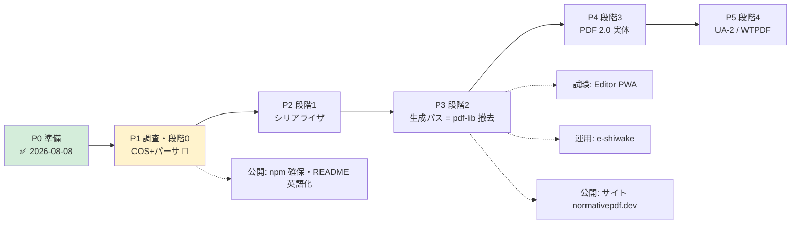

# ROADMAP — 全体地図と進捗

> **進捗の正典はこのファイル。** チェックボックスの更新のみで進捗を表す（詳細は各正典文書へ）。
> 設計の中身は [`DESIGN.md`](DESIGN.md)、公開面は [`PUBLISHING.md`](PUBLISHING.md)、規律は [`GUARDS.md`](GUARDS.md)。
>
> 現在地: **Phase 1（調査・段階 0）** — 2026-08-09 開始

---

## Phase 0: 準備 — ✅ 完了（2026-08-08）

- [x] 設計文書一式（DESIGN / GUARDS / PRIOR-ART / NAMING）
- [x] 着手前チェック全消化（ADR-0001 = TypeScript / API 粒度 / パーサ範囲 / コーパス実在・ライセンス / 置き場所）
- [x] ADR-0002 型の厳格性ポリシー（Accepted）
- [x] 公開計画（PUBLISHING.md = 看板・書ける/書けない・競合監視）
- [x] CLAUDE.md + プロジェクトスキル雛形（`.claude/skills/normativepdf-dev/`）
- [x] リポジトリ・ドメイン確保（GitHub / normativepdf.dev）

## Phase 1: 調査・段階 0 — COS モデル + レキサ + パーサ 🚧

**受入: コーパス全件パース + 既存テスト全緑維持**（DESIGN §5.1）

- [x] 条文調査（§7.2 字句規約・§7.3 オブジェクト・Table 1/2/3）→ COS 型ユニオンに写した（2026-08-11・条項 ID を JSDoc に記載）
- [x] 条文調査（§7.5.2/7.5.4/7.5.5 = header・xref テーブル・trailer）— オフセット原点 = %PDF- の PERCENT SIGN・20 バイト固定エントリ・EOL 3 形を条文で確定（2026-08-11）
- [x] ファイル構造パーサ（header / xref テーブル / trailer / startxref / Prev チェーン。offset-start 対応・R-7.3.10-13 の null 解決・間接 Length を xref 経由で解決。smoke 7/7 + T-3 実測。2026-08-11）
- [x] 条文調査（§7.5.7/7.5.8.1-3 + §7.4.4/Table 8-10）— 2026-08-11 取得。実装を縛る要点: objstm は**オフセット駆動**で読む（2020 訂正: オブジェクト間空白不要）・objstm 内は「参照のみ」禁止（int int R 誤判別を防ぐ）・xref ストリームは stream 辞書 = trailer 兼務・W 幅 0 = 既定値（type 既定 1）・Index 既定 [0 Size]・**未知 type は null 扱い（エラー禁止）**・Predictor ≥ 10 は行タグで復号（10-15 の区別は復号側で無意味）
- [x] フィルタ層（decodeStream 境界 + FlateDecode 暫定 = DecompressionStream・parsePdf/getObject async 化 + PNG Predictor 全 5 タグ・TIFF 2 は 8bit のみ・未対応フィルタは名指しエラー。2026-08-11）
- [x] xref ストリーム読み（W/Index 検証・未知 type = null・stream 辞書 = trailer 兼務）+ オブジェクトストリーム読み（オフセット駆動・XrefEntry に compressed/unknown 追加。Flate+Predictor12 end-to-end smoke + T-3 実測。2026-08-11。**残: hybrid XRefStm は未読・自前 inflate は ADR-0003 のトリガー待ち**）
- [ ] 自前 inflate（純 TS・**正**。着手トリガーは ADR-0003 = 回復パースの部分回収要求 / 書き側 deflate 要求 / 段階 2 完了のいずれか先着。native は差分オラクルに降格して test に残す）
- [x] プロジェクト初期化（tsconfig = ADR-0002 §1・biome・vitest・ESM。2026-08-11）
- [x] ByteCursor（境界検査を 1 箇所に閉じる）+ レキサ（2026-08-11・条文実例の smoke 12/12 PASS）
- [x] オブジェクトパーサ（8 種 + 間接参照 + obj/endobj + stream 本体。§7.3.10 補完取得済み・Length 間接は resolver フック・smoke 8/8 + T-3 実測 = 検査を外すと落ちる、を確認。2026-08-11）
- [ ] ファイル構造パーサ（header / xref テーブル / trailer）
- [ ] xref ストリーム・オブジェクトストリームの読み
- [ ] 回復パース（壊れた xref・嘘の startxref）
- [ ] コーパス取り込み（pdf20examples / veraPDF-corpus・取得方法とライセンス表記）
- [ ] **受入: コーパス全件パース通過**
- [ ] reader / verify から使わせる（最初の 2 消費者・既存テスト全緑）
- [ ] SKILL.md の TODO を実測で埋める（ビルド/テストコマンド・コーパス実行手順）

## Phase 2: 段階 1 — シリアライザ・増分更新

**受入: 署名付き検体で verify が VALID を維持**

- [ ] シリアライザ(xref テーブル / xref ストリーム / オブジェクトストリーム)
- [ ] 増分更新（字句規則の規格準拠 = GUARDS G-C）
- [ ] writer の増分パスのみ移行
- [ ] **受入: 実署名検体で verify_signatures VALID 維持**

## Phase 3: 段階 2 — 生成パス移行（pdf-lib 撤去）

**受入: pdf-lib 完全撤去・PDF/A-3b COMPLIANT 維持・リリースごと veraPDF レポート開始**

- [ ] フィルタ・コンテンツストリームビルダ
- [ ] フォント辞書（W-2 = サブセット結果と辞書型の整合を構造的に解く）
- [ ] 構造木・タグ・MarkInfo（PDF/UA-1 系）
- [ ] XMP・OutputIntent・catalog（適合宣言は要件検査と同関数に = DESIGN §3）
- [ ] pdf-lib 差分オラクル運用（compare_structure）
- [ ] **受入: pdf-lib 撤去 + UC 回帰全緑 + PDF/A-3b COMPLIANT**
- [ ] PDF family へ取り込み（writer が第一利用者・自身でコントリビュート）

## Phase 4: 段階 3 — PDF 2.0 の実体

**受入: veraPDF flavour `4` COMPLIANT**

- [ ] TS 32003（AES-GCM）/ 32004（完全性保護）/ 32005（構造名前空間）
- [ ] **受入: flavour `4` COMPLIANT**

## Phase 5: 段階 4 — PDF/UA-2 + WTPDF

**受入: veraPDF `ua2` / `wt1a`**

- [ ] UA-2 要件実装（32000-2 + TS 32005 ベース）
- [ ] **受入: `ua2` / `wt1a` PASS**

---

## 公開トラック（Phase と並走・詳細は PUBLISHING.md）

- [ ] npm `normativepdf` 確保（時期・プレースホルダの是非は未決 → 決めたら PUBLISHING §4 に記録）
- [ ] README 英語主・日本語従へ転換（公開露出前）
- [ ] normativepdf.dev DNS 設定（HTTPS 必須 = GitHub Pages）
- [ ] 初回 npm 公開（Phase 1 完了が目安）
- [ ] **リリースごとの veraPDF レポート同梱を開始**（Phase 3 以降・看板の裏付け）
- [ ] サイト構築（マニュアル・チュートリアル・リファレンス・family との関係。雛形 = pdf-family-site。**着手は API 確定後**。「family との関係」の節のみ先行可）

## 試験トラック

- [x] 単体テスト（vitest・T-1〜T-4 の規律）— 56/56 緑 + biome クリーン（2026-08-11・ホスト実走）。T-3「修正を戻すと落ちる」は R-7.3.8.1-6 で実測済み。以後、新モジュールごとに T-3 を 1 件以上実測する
- [ ] コーパス回帰（CI 化・合格率をリリース判定の門番に）
- [ ] 独立実装読み戻し（qpdf --check / poppler / veraPDF）
- [ ] 実地試験 1: PDF エディタ PWA（normativepdf を使って作成）
- [ ] 実地試験 2: e-shiwake の請求書発行（デジタル署名・証明書/鍵/TSA は利用者設定）

## 運用トラック

- [ ] リリース運用ルール（veraPDF 合格率が下がったらリリースしない・署名は push 前）
- [ ] 競合監視の定期実行（@cantoo / @pdfme / pdfkit — PUBLISHING §2）
- [ ] コントリビューション受け入れの仕組み(CONTRIBUTING・Issue テンプレート)
- [ ] 拡張領域の受け皿（「作らない（当面）」= レンダリング・抽出等は、コントリビューションで拓く。
      受入規律 = 条文に紐づく・測ってある、を CONTRIBUTING に明文化）
- [ ] 週間 DL 数の記録開始（認知の客観指標）

---

## 更新規則

1. 進捗はこのファイルのチェックボックスのみで表す（説明を膨らませない）
2. 受入基準を変えるときは DESIGN §5.1 側を先に直し、本書は追従する
3. Phase の順序変更・スコープ変更は ADR に起こす
