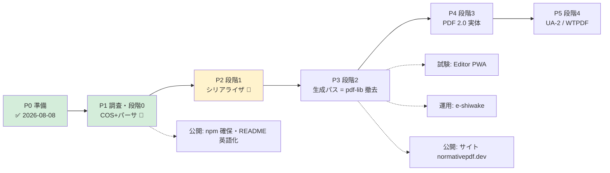

# ROADMAP — 全体地図と進捗

> **進捗の正典はこのファイル。** チェックボックスの更新のみで進捗を表す（詳細は各正典文書へ）。
> 設計の中身は [`DESIGN.md`](DESIGN.md)、公開面は [`PUBLISHING.md`](PUBLISHING.md)、規律は [`GUARDS.md`](GUARDS.md)。
>
> 現在地: **Phase 2（段階 1・シリアライザ）** — 2026-08-13 着手。Phase 1 は受入充足（自前 inflate のみ ADR-0003 のトリガー待ちで残置）

---

## Phase 0: 準備 — ✅ 完了（2026-08-08）

- [x] 設計文書一式（DESIGN / GUARDS / PRIOR-ART / NAMING）
- [x] 着手前チェック全消化（ADR-0001 = TypeScript / API 粒度 / パーサ範囲 / コーパス実在・ライセンス / 置き場所）
- [x] ADR-0002 型の厳格性ポリシー（Accepted）
- [x] 公開計画（PUBLISHING.md = 看板・書ける/書けない・競合監視）
- [x] CLAUDE.md + プロジェクトスキル雛形（`.claude/skills/normativepdf-dev/`）
- [x] リポジトリ・ドメイン確保（GitHub / normativepdf.dev）

## Phase 1: 調査・段階 0 — COS モデル + レキサ + パーサ ✅（受入充足・2026-08-13）

**受入: コーパス全件パース + 既存テスト全緑維持**（DESIGN §5.1）

- [x] 条文調査（§7.2 字句規約・§7.3 オブジェクト・Table 1/2/3）→ COS 型ユニオンに写した（2026-08-11・条項 ID を JSDoc に記載）
- [x] 条文調査（§7.5.2/7.5.4/7.5.5 = header・xref テーブル・trailer）— オフセット原点 = %PDF- の PERCENT SIGN・20 バイト固定エントリ・EOL 3 形を条文で確定（2026-08-11）
- [x] ファイル構造パーサ（header / xref テーブル / trailer / startxref / Prev チェーン。offset-start 対応・R-7.3.10-13 の null 解決・間接 Length を xref 経由で解決。smoke 7/7 + T-3 実測。2026-08-11）
- [x] 条文調査（§7.5.7/7.5.8.1-3 + §7.4.4/Table 8-10）— 2026-08-11 取得。実装を縛る要点: objstm は**オフセット駆動**で読む（2020 訂正: オブジェクト間空白不要）・objstm 内は「参照のみ」禁止（int int R 誤判別を防ぐ）・xref ストリームは stream 辞書 = trailer 兼務・W 幅 0 = 既定値（type 既定 1）・Index 既定 [0 Size]・**未知 type は null 扱い（エラー禁止）**・Predictor ≥ 10 は行タグで復号（10-15 の区別は復号側で無意味）
- [x] フィルタ層（decodeStream 境界 + FlateDecode 暫定 = DecompressionStream・parsePdf/getObject async 化 + PNG Predictor 全 5 タグ・TIFF 2 は 8bit のみ・未対応フィルタは名指しエラー。2026-08-11）
- [x] xref ストリーム読み（W/Index 検証・未知 type = null・stream 辞書 = trailer 兼務）+ オブジェクトストリーム読み（オフセット駆動・XrefEntry に compressed/unknown 追加。Flate+Predictor12 end-to-end smoke + T-3 実測。2026-08-11。**残: hybrid XRefStm は未読・自前 inflate は ADR-0003 のトリガー待ち**）
- [ ] 自前 inflate（純 TS・**正**。着手トリガーは ADR-0003 = 回復パースの部分回収要求 / 書き側 deflate 要求 / 段階 2 完了のいずれか先着。native は差分オラクルに降格して test に残す）
- [x] プロジェクト初期化（tsconfig = ADR-0002 §1・biome・vitest・ESM。2026-08-11）
- [x] ByteCursor（境界検査を 1 箇所に閉じる）+ レキサ（2026-08-11・条文実例の smoke 12/12 PASS）
- [x] オブジェクトパーサ（8 種 + 間接参照 + obj/endobj + stream 本体。§7.3.10 補完取得済み・Length 間接は resolver フック・smoke 8/8 + T-3 実測 = 検査を外すと落ちる、を確認。2026-08-11）
- [x] 回復パース（壊れた xref・嘘の startxref）— **実測駆動**: veraPDF-corpus 全 2907 検体で要求が立った分のみ実装（2026-08-11）。(1) xref ストリームの W 幅 0 = 世代既定 0（§7.5.8.2 Table 17 / Table 18。493 検体・当初 §7.5.4 の 65535 検査を誤適用していた）(2) R-7.5.4-31（free 先頭 = 世代 65535）はエラーから受理へ降格 — 機能でなく適合の規則（TWG pass 検体 2 件が実測根拠・検査は verify の仕事 = DESIGN §4.2）(3) 嘘の startxref 第 1 号 = xref 直前の EOL を指す pass 検体 → 先頭空白スキップのみの最小回復 (4) 暗号化 PDF は「FlateDecode failed」でなく名指しエラー（§7.5.5 Table 15 Encrypt。復号は未実装のまま）。以後の回復要求は実の壊れ検体で立てる
- [x] コーパス取り込み（pdf20examples + **veraPDF-corpus（CC BY 4.0・Isartor 同梱・2907 検体）**・`scripts/fetch-corpus.mjs` = 出所/ライセンス明記・corpus/ は gitignore）。**2026-08-13: commit で pin（`corpus.lock.json` = `49de56cd…`）** — それまでは `staging` ブランチを clone しており、しかも手元の展開物から `.git` が消えていて**どの版で測った数字なのか特定できなかった**。動くコーパスとパーサの後退は、どちらも「合格率が下がる」という同じ形で出るので区別がつかない。取得は codeload の tarball（SHA 指定・136MB・実測 18 秒・再取得は 0.25 秒の no-op）に変更し、展開した SHA を `corpus/.veraPDF-corpus.sha` に記録して survey が照合する
- [x] **受入: pdf20examples 全 7 検体パース通過（2026-08-11・`scripts/parse-corpus.mjs`。全 in-use/compressed オブジェクトの getObject + catalog 解決まで）**。実測が直させた 1 件 = xref エントリと trailer の間の空白は合法（§7.2.3。禁止はコメントのみ = §7.5.4）— PDF Association 純正検体が空行を持っていた。既知の残だった catalog /Version の版格上げは解消（次項）
- [x] **受入: veraPDF-corpus 2881/2907（99.1%）・pass 検体は全件パース通過（2026-08-11・`npm run corpus:survey` = pass 検体の失敗のみ exit 1 の門番）**。落ちる 26 件は全て fail 検体 = 意図的破損 23（うち 3 は catalog /Version `/2,0` の 6.1.12 検体 = 下記の格上げ実装が正しく拒否）+ 暗号化 2 + Isartor の壊れ xref エントリ 1。hybrid XRefStm の要求は立たず（§7.5.8.4: 非対応リーダーは古典テーブル側を読む、で全検体通過）
- [x] catalog /Version による版の格上げ（2026-08-11）: §7.7.2 Table 29「ヘッダより後の版なら格上げ・ヘッダが後ならヘッダが正・値は name であること」を parsePdf に実装（`headerVersion` = 観測 / `version` = 実効、の 2 面持ち）。incremental save 検体が v2.0 と報告されるようになり既知の残が解消。非 name / 形式外は Table 29 引用の strict エラー（veraPDF-corpus の 6.1.12 fail 検体 3 件が実測根拠）
- [x] hybrid XRefStm（§7.5.8.4）+ per-section 公開 API（2026-08-11）: **要求はコーパスでなく最初の消費者から立った** — verify の revision-diff は「マージしないセクション列」と hybrid 読みを自前実装しており（890 行）、その置き換えに必要な形を API にした。`XrefSection` に offset/kind('table'|'stream'|'hybrid')/selfObjectNumber を追加・`readXrefChain`（newest first・strict）・`readXrefSectionAt`（回復方針は消費者側に残す = 単一セクション読み）。hybrid の探索順は条文どおり「セクション → XRefStm → Prev」（テーブル勝ち・stream の Prev は無視 = Table 17）。§7.5.8.4 EXAMPLE 縮約のフィクスチャで隠しオブジェクト解決を実測・門番 2 種緑維持 → **0.2.0**
- [x] **verify から使わせる（第 1 消費者・2026-08-13）**: `revision-diff.ts` の歩行層（古典テーブル / xref ストリーム / hybrid XRefStm / PNG predictor / inflate = 自前 366 行）を `readXrefSectionAt` に置換。890 → 713 行。回復方針は verify 側に温存（古い startxref への後退・MAX_REVISIONS・巡回検出・linearized の嘘対策）＝ `readXrefSectionAt` の doc コメントが宣言した役割分担がそのまま成立した。`parsePdf`/`getObject` の async 化が `diffRevisions` → `analyzeIntegrity` まで波及。**A/B 実測 = リポジトリ内 PDF 2987 件で旧実装と出力比較 → 2973 件同一・差 14 件**（内訳は下記）
  - **獲得 1 件**: `PDF 2.0 with offset start.pdf`（§7.5.2 の origin > 0）— 旧実装は null、新実装は歩けた。オフセット原点を条文どおり扱った効果
  - **獲得 1 件**: `dss-pades-5sigs-doctimestamp.pdf` — trailer が `/Prev 0` を持つ 8 リビジョンの 5 署名検体。旧実装は `0` を「Prev なし」として飲み込み `truncated: false`（＝完全に歩けた）と報告していた。**署名 5 本の文書について「古いリビジョンは無い」と断言していた**ことになる。新実装は追えない `/Prev` を truncated として報告 → DocMDP は `indeterminate` になる（[[revision-diff-lies-linearized-and-full-save]] の 3 例目）
  - **後退 9 件（全て veraPDF-corpus の fail 検体 = 意図的破損の xref）**: §7.5.4 の厳格さで normativepdf が拒否 → 「歩けた」から「判定不能」へ落ちる。理由の内訳 = subsection ヘッダの空白 2 個 (3)・`xref` が行独立でない (3)・エントリが 19 バイト（`f\n`）(1)・xref でも xref ストリームでもない (1)・オブジェクト番号が非正 (1)。**落ちる向きは常に indeterminate 側で、誤った pass は生まない**が、19 バイトエントリは実世界の緩いプロデューサにも出る形なので、実の壊れ検体で要求が立ったら回復方針として verify 側に足す（library は strict のまま）
- [ ] reader から使わせる（第 2 消費者）— **版数報告だけの部分移行は取り下げた（2026-08-13）**。reader の版数経路は pdf-lib 依存であり、1 フィールドのために normativepdf でもう一度フルパースして strict throw を pdf-lib で受けるフォールバック二重構造になる。版数は面が小さく API 適合性の計器としても割に合わない（[[saturated-faces-cannot-carry-a-difference]]）。**Phase 3 の pdf-lib 撤去と一括で移行する**
- [x] SKILL.md の TODO を実測で埋める（2026-08-11: コマンド表 = sandbox/ホストの区別・コーパス門番 2 種の合格基準・頻出条項索引 9 件。pdf-lib オラクル / 独立実装読み戻しは段階 1〜2 の TODO として残置）

## Phase 2: 段階 1 — シリアライザ・増分更新 🚧

**受入: 署名付き検体で verify が VALID を維持**

- [x] **受入基準を先に決めた = [ADR-0004](adr/0004-roundtrip-acceptance.md)（2026-08-13）**: 往復（read → write → read）を段階 1 の受入にする。**ただし単独では受入にしない** — 両側が同じパーサを共有するので読みの誤りと書きの誤りが打ち消し合う。**二面で取る**（自己一貫性 = 往復 / 他者可読性 = qpdf）。「一致」の定義・意図的な差分 3 つ・測れない検体の扱いも同 ADR
- [x] **COS シリアライザ（2026-08-13）** — 8 種 + 間接参照 + stream。名前のエスケープ（R-7.3.5-5/-7/-8）・リテラル文字列（R-7.3.4.2-15・`\ddd` は常に 3 桁）・`stream` の後は LF（R-7.3.8.1-6 が CR 単独を禁じる）。**実数は最短往復の位置記法へ展開**（R-7.3.3-8 が指数表記を禁じている）
- [x] **ファイル層シリアライザ（2026-08-13）** — header（§7.5.2・バイナリコメント行つき）/ body / 古典 xref テーブル（20 バイト固定・§7.5.4）/ trailer（§7.5.5・`/Size` 再計算・`/Prev` 削除・xref ストリーム固有キーの除去）。**出力は 1 リビジョン・全オブジェクト非圧縮**
- [x] **受入 1: コーパス往復 2879/2879**（`npm run roundtrip:survey`・`corpus.lock.json` の `baselineRoundTrip`）+ **qpdf が 2879/2879 で新しい苦情を出さない**。分母の外は「ファイルが読めない 18 / オブジェクトが読めない 6 / 測定不能（暗号化）4」で、**測れなかったものは緑に数えない**
- [ ] xref ストリーム / オブジェクトストリームの**書き**（今は読むだけ・出力は古典テーブル）
- [x] **増分更新（2026-08-13・§7.5.6）** — 受入基準は先に [ADR-0005](adr/0005-incremental-update-acceptance.md)（3 段: ①元バイト列の完全一致 ②チェーンが正しく読める ③他者が読み署名を検証できる）。`appendUpdate` / `appendUpdateTo` を実装。変更オブジェクトのみのセクション（非連続なので subsection に分割）・前 trailer の全エントリ引き継ぎ（`/Prev` は差し替え・`/XRefStm` は削除）・各 trailer に `%%EOF`・**オフセットは origin 相対**。元バイト列の不変は**モジュール自身が出力前に検査して投げる**（呼び出し側にはバイト比較以外の検知手段が無いため）
- [x] **受入到達: 実署名検体で `verify_signatures` VALID 維持（2026-08-13）** — `selfmade-pades-lta.pdf`（CAdES 署名 + DocTimeStamp）に増分更新を掛け、pdf-verify-mcp で**署名 2 本とも VALID・digest 一致を維持**（差は `Bytes after signed range` が +346 のみ）。`dss-pades-lta.pdf`（4.2MB・DSS 付き）でも同様で、verify の revision-diff が追記したリビジョンを「obj 26 0: added — annotation (Text)」と正しく読んだ。4 検体（署名 2 + pdf20examples 2、うち 1 つは origin > 0）で 3 段すべて緑・qpdf も新しい苦情を出さない
  - **T-3 実測 5 通り**: origin を引かない = origin>0 のテストが落ちる / subsection をまとめる = 分割のテストが落ちる / `/Prev` を書かない = チェーンが伸びない / `/XRefStm` を残す = 検知 / **元バイト列を 1 バイト書き換える = 3 件落ちる**（モジュール自身の guard も発火）
  - 測っていないこと = **PDF/A 適合の維持**（元が xref ストリームのファイルに古典テーブルを追記する形になるため。xref ストリームの書きが入ってから測る。ADR-0005「測らないと決めたこと」）
- [ ] writer の増分パスのみ移行

### 段階 1 で実測した「門番が本当に落ちるか」（T-3）

| 壊した箇所 | 往復の面 | qpdf の面 |
|---|---|---|
| 実数の PERIOD を落とす | ✅ 2258/2879 に低下 | 検知せず |
| `/Length` を +1 | ✅ 0/2879 | （往復が先に落ちる） |
| **trailer の `/Size` を +5** | **❌ 2879/2879 のまま緑** | **✅ 2543 件で検知** |
| free リスト先頭の世代 65535 → 0 | 検知せず | 検知せず |

**3 行目が「二面で測る」ことの実測**。往復だけなら緑のまま通っていた。

4 行目は**どちらの面も見ていない盲点**。パーサが R-7.5.4-31 を適合規則として意図的に検査しておらず（`file-parser.ts` に理由つきで記載）、writer 側も検査していないため。適合検査は pdf-verify-mcp の仕事という切り分け（DESIGN §4.2）どおりではあるが、**自分の出力について何を測っていないかは書いておく**。

🔴 **実装中にコーパスが writer のバグを 1 件捕まえた**: 実数を `toFixed(20)` で書いていたため `/YStep -1.175e-38` が `0` になっていた（TWG A018）。元ファイルは 38 桁の位置記法で、Annex C が定める最小の非ゼロ実数の境界を狙った検体。ユニットテストには無く、コーパスにしか無かった。

## Phase 3: 段階 2 — 生成パス移行（pdf-lib 撤去）

**受入: pdf-lib 完全撤去・PDF/A-3b COMPLIANT 維持・リリースごと veraPDF レポート開始**

- [ ] フィルタ・コンテンツストリームビルダ
- [ ] フォント辞書（W-2 = サブセット結果と辞書型の整合を構造的に解く）
- [ ] 構造木・タグ・MarkInfo（PDF/UA-1 系）
- [ ] XMP・OutputIntent・catalog（適合宣言は要件検査と同関数に = DESIGN §3）
- [ ] pdf-lib 差分オラクル運用（compare_structure）
- [ ] **受入: pdf-lib 撤去 + UC 回帰全緑 + PDF/A-3b COMPLIANT**
- [ ] PDF family へ取り込み（writer が第一利用者・自身でコントリビュート）

## Phase 4: 段階 3 — PDF 2.0 の実体

**受入: veraPDF flavour `4` COMPLIANT**

- [ ] TS 32003（AES-GCM）/ 32004（完全性保護）/ 32005（構造名前空間）
- [ ] **受入: flavour `4` COMPLIANT**

## Phase 5: 段階 4 — PDF/UA-2 + WTPDF

**受入: veraPDF `ua2` / `wt1a`**

- [ ] UA-2 要件実装（32000-2 + TS 32005 ベース）
- [ ] **受入: `ua2` / `wt1a` PASS**

---

## 公開トラック（Phase と並走・詳細は PUBLISHING.md）

- [x] npm `normativepdf` 確保 = **0.1.0 を静かに公開（2026-08-11）**。告知なし・名前確保 + 依存解決のみ。お披露目は v1.0 + サイト + veraPDF レポートで（PUBLISHING §4）
- [x] README 英語主・日本語従へ転換（2026-08-11。現在地 = コーパス門番の数字も記載・非公開パス参照を削除）
- [ ] normativepdf.dev DNS 設定（HTTPS 必須 = GitHub Pages）
- [x] 初回 npm 公開（2026-08-11・0.1.0。**公開版検証 PASS** = 31 エクスポート一致・実パース OK・/Version 格上げ動作・`npm view` で 0.1.0 確認）
- [ ] **リリースごとの veraPDF レポート同梱を開始**（Phase 3 以降・看板の裏付け）
- [ ] サイト構築（マニュアル・チュートリアル・リファレンス・family との関係。雛形 = pdf-family-site。**着手は API 確定後**。「family との関係」の節のみ先行可）

## 試験トラック

- [x] 単体テスト（vitest・T-1〜T-4 の規律）— 56/56 緑 + biome クリーン（2026-08-11・ホスト実走）。T-3「修正を戻すと落ちる」は R-7.3.8.1-6 で実測済み。以後、新モジュールごとに T-3 を 1 件以上実測する
- [x] **コーパス回帰の CI 化（2026-08-13）** — `.github/workflows/ci.yml` に 2 job（typecheck/test/check と corpus）。コーパスは pin した SHA をキャッシュ鍵にするので、**pin を上げたときだけ意図的にキャッシュを外す**。門番は `corpus:survey` の中に 2 つ:
  - **pass 検体は全件パースする**（veraPDF が COMPLIANT と判定したファイルを読めないのは欠陥）
  - **全体合格率が記録した baseline と一致する**。下回れば後退。**上回っても赤にする** — floor を改善に置き去りにすると、その後 baseline まで滑り戻っても黙って通る。改善と同じコミットで `corpus.lock.json` を上げさせるのが唯一のコスト
  - **T-3 実測（6 通り）**: 正常 = exit 0 / pin 不一致 = 1 / sha ファイル無し = 1 / **パーサを壊す**（xref エントリの EOL から合法形 SP LF を落とす）= 1（pass 検体 2 件 + 2756/2907 で 2 門番とも発火）/ baseline 置き去り = 1 / 戻して緑
- [ ] 実装と pin の同時更新を禁じる仕組み（今は `corpus.lock.json` の `$comment` に「pin 更新と code 変更を同じコミットに入れない」と書いてあるだけで、機械で止めていない）
- [ ] 独立実装読み戻し（qpdf --check / poppler / veraPDF）
- [ ] 実地試験 1: PDF エディタ PWA（normativepdf を使って作成）
- [ ] 実地試験 2: e-shiwake の請求書発行（デジタル署名・証明書/鍵/TSA は利用者設定）

## 運用トラック

- [x] **リリース運用ルール（2026-08-13 に機械化）** — 「合格率が下がったらリリースしない」は CI の corpus job が門番（`corpus.lock.json` の baseline と一致しなければ赤）。**数字は `corpus.lock.json` が正典**で、README / ROADMAP の記載はその写し。「署名は push 前・後から amend しない」は引き続き人間側の規律
- [ ] 公開そのものの門番（`prepublishOnly` は typecheck/test/check/build/parse-corpus を回すが、**`corpus:survey` は入っていない** = pdf20examples 7 件のゲートだけ。2907 件の門番を publish 経路にも入れるか、CI 必須チェックで代替するかを決める）
- [ ] 競合監視の定期実行（@cantoo / @pdfme / pdfkit — PUBLISHING §2）
- [ ] コントリビューション受け入れの仕組み(CONTRIBUTING・Issue テンプレート)
- [ ] 拡張領域の受け皿（「作らない（当面）」= レンダリング・抽出等は、コントリビューションで拓く。
      受入規律 = 条文に紐づく・測ってある、を CONTRIBUTING に明文化）
- [ ] 週間 DL 数の記録開始（認知の客観指標）

---

## 更新規則

1. 進捗はこのファイルのチェックボックスのみで表す（説明を膨らませない）
2. 受入基準を変えるときは DESIGN §5.1 側を先に直し、本書は追従する
3. Phase の順序変更・スコープ変更は ADR に起こす
