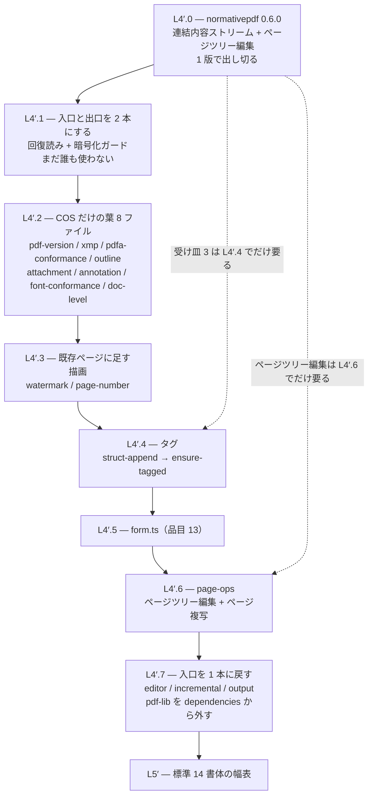

# 引き継ぎ: Phase 3（段階 2）— 生成パスの移行 = pdf-lib 撤去

- 対象リポジトリ: `normativepdf`（実装）+ `pdf-writer-mcp`（第一利用者）
- 根拠: [`../ROADMAP.md`](../ROADMAP.md) Phase 3 / [`../DESIGN.md`](../DESIGN.md)
- **これが今いちばん大きい。他の 2 件（自前 inflate / reader 移行）の着手条件がここに繋がっている**
- この文書だけで着手できる。他の引き継ぎを読む必要は無い

> **次に着手するもの = L4′.2。ただし移す単位は「ファイル」ではなく「ツール」だった → [§3.11](#311-l42-着手--移す単位はファイルではなくツールだった2026-08-15)。**
> 1 本目（`rotate_pages`）は完了 → §3.11.8。2 本目の出口（`appendOpened`）も完了 → **§3.13**。
> 次は **`set_metadata`**（§3.16.6）。`add_bookmarks` は完了 → §3.16。新経路を通るツールは 17 本中 2 本。
> 読む順は [§3.10](#310-l41-着手--入口と出口を-2-本にした2026-08-15) → [§3.9.6](#396-段取りの更新383-の差し替え) → §4。
> 受け皿の実測は [§3.7](#37-l4-の受け皿を数えた2026-08-15-実測)、帰属と段取りは [§3.8](#38-l4-の段取り案2026-08-15)。
> L3′（生成パス）は完了している（§3.6 末尾）。
> L2（文書モデル）は完了しており、詳細は [`l2-document-model.md`](l2-document-model.md) にある。
> **着手前に §3.6 末尾の「数えること」を先に済ませること。**

---

## 1. どこまで来たか（2026-08-14 実測）

| Phase | 内容 | 状態 |
|---|---|---|
| 0 | 準備 | ✅ 2026-08-08 |
| 1 | 段階 0 = COS モデル + レキサ + パーサ | ✅ 受入充足（自前 inflate のみ残置） |
| 2 | 段階 1 = シリアライザ + 増分更新 | ✅ 受入充足 2026-08-13（npm 0.3.1 公開） |
| **3** | **段階 2 = 生成パス移行（pdf-lib 撤去）** | **⬅ ここ。部品 4 + 文書モデル（L2）完了。writer は L1 + L1.5 まで。次は L3' = 生成パスを器ごと載せ替え（§3.6）** |
| 4 | 段階 3 = PDF 2.0 の実体（後に [ADR-0008](../adr/0008-phase4-encryption.md) で「暗号化」に再定義・2026-08-24） | — |
| 5 | 段階 4 = PDF/UA-2 + WTPDF | — |

段階 1 までで、normativepdf は**読めて・書けて・追記できる**。
`writeFile` / `appendUpdate` / `buildObjectStream` / `buildXrefStream` が揃い、
往復はコーパス 2,881/2,881、qpdf は元ファイルに無い苦情を出さない。

**writer が normativepdf に移したのは、増分更新の「直前 xref セクションを読む」ところだけ**である
（0.19.0 = `readXrefSectionAt`。チェーンは歩かない・位置の特定と回復方針は writer に残る・
**直列化は pdf-lib のまま**）。読み側全般が移ったわけではない。

**2026-08-14 に normativepdf 側の部品が 4 つ入った**（§3）。ただし **writer は 1 行も載せ替えていない**。
`grep -rn "from 'pdf-lib'" src/` は依然 24 行である。「部品ができた」と「移行が進んだ」は別の数字なので、
進捗はこの grep の行数で見る。

## 1.5 受入の計器は立った（2026-08-13・ADR-0006）

**撤去に着手する前に、旧実装（pdf-lib 版 0.19.0）の出力をゴールデンとして採取した。**
根拠と決定は [`../adr/0006-phase3-differential-acceptance.md`](../adr/0006-phase3-differential-acceptance.md)、
実装は `pdf-writer-mcp/scripts/uc-oracle/`（`npm run oracle`）。

- 検体 24 本を**軸**（pdfVersion / フォント / tagged / origin / 署名 / 添付 / フォーム）で並べ、**23 本を採取**
- ダイジェストは **qpdf `--json`（独立実装）**から作る。family 内のパーサは撤去後に
  全部 normativepdf の上に乗るのでオラクルになれない（T-2）
- **T-3 を 3 面で実測**（演算子 / フォント辞書型 / ツール応答）。壊すと落ち、戻すと緑に戻る
- **AcroForm の入力検体を凍結した**（`inputs/form-basic.pdf`）。テストは検体を pdf-lib で
  組み立てているので、撤去すると**検体を作る手段ごと消える**

**ホスト実走で 4 面とも判定が付いた（2026-08-13・qpdf 12.4.0 + veraPDF）**:
`pdfa-3b` **146/146** / `pdfa-4f` **109/109** / `pdfua-1` **106/106**（2 本）/
素の `pdfa-4` は **108/109 NOT COMPLIANT**（`6.9-3` = 落ちることが正しい検体）/ 署名 2-2・6-5。
**受入基準の数字（§4）は、これでファイルに固定された。**

🔴 **ホスト初走で 1 件出たが writer の後退ではなかった** — qpdf 12.4.0 が 5 署名検体の追記出力を
`unable to find page tree` で拒否した（qpdf 10.6.3 は読めていた）。**入力の時点で**同じ苦情が出る
（page tree ノードに `/Type /Page` が無い・obj 56 が null）。→ 構造の面だけ `unreadable` にして
**入力も同じ読み手に通した結果を記録する**形にした。この検体の構造面は今後も qpdf 12 では測れない
（署名の面のための検体として残す）。

⚠️ **`compare_structure` はオラクルにならない**（ADR-0006 §3 で実測）。下記 §4 の記述は訂正済み。

### 片側しか無い軸を埋めた（2026-08-14・L2 の直前）

オラクルは毎回 `! 1 形しか無い軸: attachment, origin, signed, revisions` を出していた。
**L2 は load → 編集 → save の器そのもの**なので、`origin` と `revisions` が片側のままだと
そこの後退を検出できない。数え直したところ、2 軸は事情が違った:

- **`revisions` は検体が既にあり、ラベルだけ無かった。** 入力の実測は 1 / 2 / 4 / 8 の
  4 形あるのに、`axes` に書いてあるのは `8` の 1 本だけだった。
  **軸が閉じていたのではなく、閉じているように見えていただけ**である → ラベルを付けた
- **`origin` は本当に `>0` しか無かった** → corpus に**ほぼ同じ文書の対**がある。
  `Simple PDF 2.0 file.pdf`（origin=0・5,211 bytes）と
  `PDF 2.0 with offset start.pdf`（origin=656・5,264 bytes）は、どちらも 1 リビジョン・
  古典 xref テーブル・`%PDF-2.0`・同じ catalog / Pages / Page / Font 構成。同じ
  `add_annotation` を両方に掛ける `input-origin-zero` を足した（検体 25 → 26）

  ⚠️ **「違うのは先頭の詰め物だけ」ではない**（採取後に実測）。`Simple` には
  もう 1 本ストリーム（obj 5・`/Length 746`）があり、`offset start` には無い。
  そのため lock の `objectCount` は **14 対 13** になる。**この 1 の差は入力から来ていて、
  origin > 0 の経路が作ったものではない** — 将来この差分を読む人が欠陥と取り違えないよう
  ここに残す。対として使う分にはこの差は無害である（各々が自分の基準値と比べられる）。

結果: `origin` 2 形 / `revisions` 4 形。残る片側は `attachment` と `signed` で、
これらは L2 の関心から遠いので後回しにした。

⚠️ **ゴールデンの採り直しが要る**（`npm run oracle:update`）。新しい検体の基準値は
**旧実装（pdf-lib 版）から採る**必要があるが、L1 / L1.5 は 25 検体すべてで差 0 と
実測済みなので、今の作業ツリーから採って構わない。**測っていなければこの判断はできない。**
lock の更新は ADR-0006 §7 のとおり**単独のコミット**で。

## 2. 撤去の対象（2026-08-13 実測）

`pdf-writer-mcp/src/` の **`.ts` 39 ファイル中、24 ファイルが `pdf-lib` を import している**
（`from 'pdf-lib'` が 24 行・**合計 7,178 行**）。

**加えて `tests/` の 21 ファイル・5,475 行**が pdf-lib に依存している（当初は数えていなかった）。
**判断は済んでいる（ADR-0006 §9・2026-08-14 実測）**:

| 用途 | ファイル数 | 撤去後 |
|---|---|---|
| 検体を書いて writer に食わせる（入力の生産者） | 14 | 残す |
| 出力を読んで検査する（独立した読み手） | 5 + 混在 | 残す |
| 凍結済み検体 | **0** | 欠陥クラスを守る入力だけ順次凍結 |

受入は**実行時依存 0**（`dependencies` から消える）であって、`devDependencies` の pdf-lib は
撤去の失敗ではない。**`tests/` に凍結された PDF が 1 つも無い**ため、完全に消すと 14 ファイルは
検査対象ではなく**入力を失って**落ちる。落とすのは同じ面を qpdf で覆えたときで、今は覆えていない。

```
services/{incremental,ensure-tagged,font-conformance,output,pdfa-conformance,
editor,page-ops,attachment,outline,form,builder,page-number,xmp,font-manager,
layout,struct-tree,annotation,doc-level,pdf-version,struct-append,watermark}.ts
services/renderers/{table,text,markdown}.ts
```

> `constants.ts` は import を持たない（コメントで言及しているだけ）。
> **数え直すときは `grep -rn "from 'pdf-lib'" src/` で取る** — コメントを数えると多く出る。

**「pdf-lib を消す」ではなく「生成パスを normativepdf の上に建て直す」作業**である。

## 3. やること（ROADMAP Phase 3 の 7 項目）— 4 つ済み

- [x] **フィルタ・コンテンツストリームビルダ**（2026-08-14・`src/content/content-stream.ts` +
      `src/filter/encode.ts`）。書き側 deflate は非圧縮の膨張が **×1.28** と実測できたので見送り
- [x] **フォント辞書**（`src/font/embedded-font.ts`）— 辞書を**バイト列から導いて** W-2 を表現不能にした
- [x] **構造木・タグ・MarkInfo**（`src/struct/struct-tree.ts`）— MCID の出所を 1 つに畳んだ
- [x] **XMP・OutputIntent・catalog**（`src/conformance/declare.ts`）— 宣言と検査を同じ関数に（DESIGN §3）
- [ ] **文書モデル**（グラフ容器 + ページツリーの意味規定）— ROADMAP には項目が無いが、
      §3.5 の実測で「これが無いと他が動かない」ことが分かったので L2 として立てる。
      範囲と受入は [ADR-0007](../adr/0007-document-model-scope.md)、着手手順は
      [`l2-document-model.md`](l2-document-model.md)。**DESIGN §5 との線引きを先に決めた**
      （オーサリング API は作らず writer に残す）
- [ ] pdf-lib 差分オラクル運用 → **計器は稼働中**（`uc-oracle` 25 検体・4 面）。残るのは「移行の各段で回す」運用
- [ ] 受入: pdf-lib 撤去 + UC 回帰全緑 + PDF/A-3b COMPLIANT
- [ ] PDF family へ取り込み（writer が第一利用者・自身でコントリビュート）

**部品は揃った。ここから先は writer を載せ替える作業で、性質が違う。**

## 3.5 載せ替えの順序（2026-08-14 実測）

「どのサービスから引き剥がすか」は好みではなく、**依存の形が決める**。
`src/` の pdf-lib 依存を「型として使っているか・実体を呼んでいるか」で数え直した:

- **型としてだけ使うファイル: 1**（`output.ts`）/ **実体を呼ぶファイル: 23**
- 実体として呼ばれている識別子の出現ファイル数（多い順）:
  `PDFName` 15 / `PDFArray` 10 / `PDFDict` 9 / `PDFRef` 9 / `rgb` 8 /
  `PDFNumber` 7 / `PDFHexString` 7 / `PDFString` 4 / `PDFRawStream` 4 /
  `degrees` 3 / `decodePDFRawStream` 3 / **`PDFDocument` 3** / …
- 文書の寿命の境界は **4 箇所しかない**: `PDFDocument.load` は **`editor.ts:137` の 1 箇所**、
  `PDFDocument.create` は `builder.ts` と `page-ops.ts`（2 回）。出口は `output.ts` の 3 関数
- ページツリー / リソースに触るのは `getPages` 6・`addPage` 4・`.node.` 14・
  `context.register` 18・`context.lookup` 11

**この形が言っていること**: 上位に出てくるのは `PDFName` / `PDFArray` / `PDFDict` / `PDFRef` で、
これらは **normativepdf の COS 型と 1 対 1** に対応する。つまり難所は COS ではない。
難所は、それらが**生きた `PDFDocument.context` に対して register / lookup される**ことで、
そこを置き換えるには**文書モデルが要る**。

🔴 **そして normativepdf には文書モデルがまだ無かった。**（L2 で作った → [`l2-document-model.md`](l2-document-model.md)）
順序を間違えると、器が無いままサービスを 1 つずつ移そうとして
pdf-lib → COS の変換層を書くことになる（§6 で作らないと決めたもの）。

### 🔴 段取りを組み直した（2026-08-14・L2 完了後の実測）

**当初の L3 =「COS プリミティブの 1 対 1 の機械的な置換」は成立しない。**
L2 が終わったあとに writer を数え直して分かった:

- COS 型を含む **532 行のうち 302 行が、生きた pdf-lib 文書に触る文脈にある**
- 作り方が `context.obj({}) as PDFDict` → `dict.set(PDFName.of('Type'), …)` である。
  中身だけ normativepdf の COS に替えても、**入れる先が pdf-lib の `PDFDict` なので直列化されない**
- pdf-lib から**実体で import している識別子は 37 種**あり、COS プリミティブはそのうち 8 種にすぎない

**つまり COS は器に従属していて、器は writer が pdf-lib の
オーサリング API（`addPage` / `drawText` / `getForm` / `embedFont` / `copyPages`）越しに持っている。**
ADR-0007 は「オーサリング API は writer に残す」と決めたが、
**writer は自前のオーサリング層を持っていない** — pdf-lib のものを使っている。
だから「writer に残す」の実際の意味は
**「writer が normativepdf の上に自前のオーサリング層を作る」**である。

### 受け皿の有無（2026-08-14 実測）

| 面 | writer 側 | normativepdf の受け皿 |
|---|---|---|
| 描画演算子（10 個） | `annotation.ts` 221 行 | ✅ `ContentStreamBuilder` |
| 構造木・タグ | `struct-tree` / `struct-append` / `ensure-tagged` 860 行 | ✅ `StructTreeBuilder` |
| フォント辞書 | `font-conformance.ts` | ✅ `buildType0Font` |
| XMP・適合宣言 | `xmp.ts` / `pdfa-conformance.ts` | ✅ `declareConformance` |
| COS・直列化・増分更新 | `incremental.ts` 587 行 | ✅ `writeFile` / `appendUpdate` |
| 文書・ページツリー | `editor` / `builder` / `page-ops` | ✅ **`PdfDocumentEditor`（L2）** |
| **ページ生成・サイズ** | `addPage` 4 / `getSize` 2 | ❌ **無い**（器の上で数十行） |
| **描画の高レベル** | `drawText` 5 / `drawRectangle` 3 / `drawLine` 1 | ❌ **無い**（演算子は揃っている） |
| **フォント埋め込みの入口** | `embedFont` 2 + メトリクス | ❌ **無い**（L1.5 で writer の関心と決定済み） |
| **フォーム 7 クラス** | `form.ts` 546 行 | ❌ **無い** |
| **ページ複写** | `copyPages` 2 / `PDFObjectCopier` | ❌ **無い** |

### 段取り

| 段 | 中身 | 状態 |
|---|---|---|
| **L1** | `rgb` / `degrees` / `StandardFonts` の置き換え | ✅ 完了（2026-08-14）。実体呼び出し 23 → 19 ファイル |
| **L1.5** | **文字幅**（`TextMetrics` = `metrics.ts`） | ✅ 完了。🔴 当初この表に無かった段（下記） |
| **L2** | **文書モデル**（グラフ容器 + ページツリーの意味規定）→ [`l2-document-model.md`](l2-document-model.md) | ✅ 完了（ADR-0007・受入 4 面すべて充足・テスト 382） |
| **L3'.0** | **normativepdf 0.4.0 の公開** — 部品 4 + L2 + `create()` + MCR。writer の dep を 0.3.1 → 0.4.0 | ⬅ ここで止まっている。**公開されるまで L3' は 1 行も型検査を通らない** |
| **L3'** | **生成パスを器ごと載せ替える** — ページ生成 + 描画 3 種 + ページ複写を writer に自前化し、`PDFDocument` を `PdfDocumentEditor` に差し替える。**COS もここで一緒に置き換わる**。着手済み = `cos.ts` / `writer-doc.ts` / `font-embed.ts`（下記） | L3'.0 の後。§3.6 |
| **L4'** | **`form.ts`（546 行）** — AcroForm の外観生成を含む独立した部分系 | L3' の後 |
| **L5'** | **メトリクス自前化** — 標準 14 書体の幅表（L1.5 で帰属だけ決めて実装は残してある） | 最後 |

**各段の後に `npm run oracle` を回す。** 差が出たら「意図した差か」を人が判断し、
意図した差なら **lock を単独のコミットで**更新する（ADR-0006 §7）。

⚠️ **L1 を「軽いから」で飛ばさないこと。** 計器を**実際の移行**で 1 度通してから先へ行く。

⚠️ **writer の pdf-lib 依存は L2 完了時点でまだ 1 行も減っていない**（実体呼び出し 19 ファイルのまま）。
L2 はライブラリ側の前進であって、撤去の進捗ではない。**この 2 つを同じ数字で語らないこと。**

## 3.6 L3' の中身（次に着手するもの）

**生成パス（`builder.ts`）と編集パス（`editor.ts`）は分けられる。生成パスが先。**
入力 PDF が無いぶん器の差し替えが素直で、`PDFDocument.create` は
`builder.ts` と `page-ops.ts` の 2 箇所しかない（`load` は `editor.ts:137` の 1 箇所）。

自前化するもの（受け皿が無い 3 つのうち小さい方）:

1. **ページ生成** — ページ辞書を作って `Kids` に足す。`/Count` は `PdfDocumentEditor` が再計算する
2. **描画 3 種** — `drawText` / `drawRectangle` / `drawLine` を `ContentStreamBuilder` の上に。
   合計 9 呼び出し。演算子の文脈検査はビルダが持っているので、**書けない形は書けない**
3. **ページ複写** — オブジェクトグラフを辿って番号を振り直す。2 呼び出し。
   ⚠️ **`allocate` の採番規則がそのまま効く**（`/Size` を下限にする = [[read-range-is-not-the-whole-file]]）

### 数えた（2026-08-14・着手直前）

生成パス = `builder.ts` の到達閉包 + **コールバックで注入される `renderers/{text,table,markdown}.ts`**
（静的な import グラフには出ない — `RenderFn` として `handlers.ts` から渡る）。
そこが `PDFPage` に対して呼んでいるもの:

| 呼び出し | 回数 | 場所 |
|---|---|---|
| `drawText` | 3 | `layout.ts:253` / `renderers/markdown.ts:148` / `renderers/table.ts:91` |
| `drawRectangle` | 3 | `renderers/table.ts:69,77` / `renderers/markdown.ts:138` |
| `drawLine` | 1 | `layout.ts:279` |
| **`pushOperators`** | **4** | `struct-tree.ts:169,176,185,187`（BDC / EMC） |
| **`page.ref`** | **3** | `struct-tree.ts:196,289,302`（`/Pg`・MCR の `/Pg`） |
| **`page.node.set`** | **1** | `struct-tree.ts:239`（`/StructParents`） |
| **`PDFPage` を `Map` の鍵に** | **3 つの Map** | `struct-tree.ts:92,94,96` |

🔴 **`getSize` は生成パスに 1 つも無い。** 上の「`getSize` 以外に何があるか」は
getSize が生成パスにあるという前提で書いてあったが、実測 2 件は `page-number.ts` と
`watermark.ts` = **どちらも編集パス**。生成パスはページ寸法を `opts` から持っていて、
ページに訊き返さない。**器を差し替えるとき、ページから読み戻す経路は無い。**

🔴 **描画 3 種の外に 4 種目があった。** `pushOperators` / `page.ref` / `page.node` と、
**ページオブジェクトの同一性**（`StructTreeBuilder` が `PDFPage` を `Map` の鍵にしている）。
差し替える器は**ページに安定した同一性**を持たせる必要がある。

`grep -rn "from 'pdf-lib'" src/` は **23 行 / 23 ファイル**（L1 で 24 → 23）。

### この段で分かった、段取り表が持っていなかったもの

1. 🔴 **`PdfDocumentEditor` に「空から作る」入口が無かった。** 構築子は `open(bytes)` と
   `of(base)` だけで、`save()` も `collectObjects(this.base)` と `base.trailer` を土台にする。
   生成パスは入力バイト列が無いので**そのままでは載らない**。§3.5 の受け皿表の
   「文書・ページツリー ✅ `PdfDocumentEditor`」は **load → 編集 → save の面についてで、
   create の面は測られていなかった**。→ **`PdfDocumentEditor.create()` を足した**
   （ADR-0007 §6.5 で改訂・`appendUpdate` は断る・`opened` が 2 つの入口を区別する）
2. 🔴 **「一度に建て直す」を選ぶと L5'（メトリクス自前化）が前に来る。** 段取り表は
   L5' を最後に置いているが、器が pdf-lib の `PDFDocument` でなくなると
   `doc.embedFont('Helvetica')` が呼べない。標準 14 の幅は `@pdf-lib/standard-fonts` の
   AFM から直接取ることになる（同梱済み・`Font.load(FontNames.Helvetica)` で
   `getWidthOfGlyph` / `Ascender` / `FontBBox` が取れることを実測）。
   **L1.5 の決定「メトリクスは writer の関心」はそのままだが、着手時期が動く。**
3. 🔴 **受け皿は「リポジトリにある」だけで、writer からは届いていない。** §3.5 の
   受け皿表の ✅ 6 個（`ContentStreamBuilder` / `StructTreeBuilder` / `TaggedStream` /
   `buildType0Font` / `sniffFontProgram` / `PdfDocumentEditor`）は、**writer が
   依存している `normativepdf@0.3.1` の公開表面に 1 つも無い**（`node_modules/normativepdf/dist/index.d.ts`
   は 30 行・COS / パーサ / シリアライザ / 増分更新まで）。部品 4 と L2 は 2026-08-14 に
   入ったが、0.3.1 の公開は 2026-08-13 で、**まだ載っていない**。
   `lib/normativepdf/package.json` の版も 0.3.1 のまま上がっていない。

   ⚠️ **表の ✅ は「作った」であって「使える」ではない**（[[shipped-is-not-used]]）。
   L3' の型検査は現在この 5 件だけで落ちていた = **書いたコードの誤りではなく、
   依存の順序**である。

   **決定（2026-08-14）: normativepdf 0.4.0 を先に公開し、writer の dep を上げる。**
   ローカル参照（`file:` / `npm link`）にしないのは、戻し忘れると
   **公開版で壊れる**ため（家の作法 = リリース後は npx で公開版を叩く）。
   0.4.0 に載せるのは 部品 4 + L2 + `PdfDocumentEditor.create()` + 下記 MCR で、
   **L3' が要求する表面を 1 度に出し切る**（2 回目のリリースを挟まないため、
   公開前に「L3' が何を呼ぶか」を数え終えてから版を切った）。

4. ⚠️ **生成検体 9 本はすべて 1 ページ**（lock の `pageCount` 実測）。つまり
   **構造要素がページをまたぐ経路（MCR 辞書・旧 `struct-tree.ts:299-305`）はオラクルが測っていない**。
   normativepdf の `StructTreeBuilder` は 2 ページにまたがる要素を**投げて**いた
   （エラー文が Table 357 を名指していた）ので、そのまま載せ替えると
   **測れない面で挙動が静かに変わる**（[[saturated-faces-cannot-carry-a-difference]]）。

   → **normativepdf 側に MCR（Table 357）を入れた**（0.4.0）。要素の内容項目が
   2 ページ以上にまたがるかを**書く直前に走査して**形を決める（`/Pg` + 素の整数 /
   MCR 辞書）ので、オーサリング層は「段落がページで割れた」ことを知らなくてよい。
   MCR は**直接オブジェクト**で書く（Table 357 は辞書を要求しており、
   内容項目 1 つに番号を 1 つ使う理由が無い）。合わせて `TaggedStream.artifact()` の
   subtype 無しを **`BDC <<>>` から `BMC` へ**（Table 352 が 2 つの演算子を持つのは
   プロパティリストの有無を分けるためで、空辞書は「何も持たないリスト」を宣言してしまう）。
   コーパスに素材が無い面なので、テストは合成した検体で取ってある。

   🔴 **この変更で 3 か所を踏んだ。同じ罠が下の L1 の ⚠️ に書いてあるのに踏んだ。**
   `artifact|BMC|Artifact` で grep して「テストは subtype 付きの 1 本だけ」と判断したが、
   拒否のほうを固定していたテスト（`what the builder refuses` の
   "refuses content items of one element on two pages"）は**その語のどれにも当たらない**。
   ホストの `npm test` で 1 件落ちて発覚した。さらに:

   - `docs/ROADMAP.md` に「2 ページにまたがる要素は Table 357 を使えと言って拒否」という
     **文**があった
   - `src/struct/struct-tree.ts` の冒頭の「何を強制するか」一覧にも同じ趣旨が書いてあった

   **教訓は「`tests/` も grep に含める」では足りない。** 変えるのは *挙動* なので、
   探すべきは実装の語ではなく**旧挙動を述べているもの全部**（テスト名・拒否のメッセージ・
   ROADMAP・モジュール冒頭のコメント）である。**文はテストが落ちないので、
   放っておくと嘘が残る**。挙動を変えるときは「これは何を約束していたか」を先に列挙し、
   その約束の文言で grep すること

### L3' の着手分（2026-08-14・**未完・型検査は L3'.0 待ち**）

`pdf-writer-mcp/src/services/` に 3 ファイル。**まだどこからも呼ばれていない**ので、
`grep -rn "from 'pdf-lib'" src/` は 23 行のまま動いていない（[[shipped-is-not-used]] を
自分で踏まないよう明記する）。

| ファイル | 中身 |
|---|---|
| `cos.ts` | COS 値の短縮記法。判断は 1 つも入っていない。`textString` は ASCII ならリテラル・そうでなければ UTF-16BE + BOM（§7.9.2.2）で、**呼び出し側に選ばせない** |
| `writer-doc.ts` | `WriterDocument`（ADR-0007 の (c)）+ `WriterPage`。描画 3 種 = `drawText` / `drawRectangle` / `drawLine` |
| `font-embed.ts` | 標準 14（`@pdf-lib/standard-fonts` の AFM 直読み）と埋め込み Type0（`buildType0Font` + fontkit）。`/W`・記述子・`/ToUnicode` はここで作る |

**旧実装の演算子列は実測してある**（`qpdf --filtered-stream-data`）。テキストは
`q BT r g b rg /F n Tf 24 TL 1 0 0 1 x y Tm <hex> Tj T* ET Q` で、これは踏襲した。

**意図して変えたもの（オラクルに差として出る。出たら「これ」と照合する）**:

1. 🔴 **フォントのリソース名を 1 フォント 1 エントリにする。** 旧実装は `drawText` の
   たびに pdf-lib の `setFont` を通り、**そのたびに乱数サフィックス付きの新しい鍵**を
   作っていた（実測: 1 ページの見出し + 本文で `/NotoSansJP-Regular-7098480789` と
   `-9742682568` の 2 エントリが同じフォントを指す）。同じものに違う名前を配ると、
   読み手にはそれが同じフォントだとファイルから分からない
2. **矩形を `re` で書く。** 旧実装は `translate → rotate(0) → skew(0)` の `cm` を 3 つ
   書いてから `m`/`l` を 4 本並べていた。回転も傾斜も無い矩形に単位行列の `cm` を
   2 つ書くのは**何もしない演算子**である（Table 58 の `re` が同じ図形を 1 つで表す）
3. `/ExtGState` の空辞書と `/Annots` の空配列を書かない（旧実装は常に置いていた）
4. `/Contents` を 1 要素の配列で包まない（Table 31 はストリームそのものを許す）
5. `/ToUnicode` の CMap を自前で組む。**ダイジェストは sha256 しか見ない**ので、
   ここの差は「正しいかどうか」を運ばない → 抽出結果を pdf-reader で読み戻して測ること

⚠️ **記述子の数値は旧実装と一致することを先に確かめた**（Noto Sans JP のサブセットで
`Ascent 1160 / Descent -288 / CapHeight 733 / XHeight 543 / FontBBox [-1002,-1048,2928,1808]`）。
式（`値 × 1000 / unitsPerEm`）は推測ではなく、この照合で決めてある。

### L3' 完了（2026-08-14）— 生成パスから pdf-lib が消えた

`grep -rn "from 'pdf-lib'" src/` = **23 → 20**。生成パスのファイルは全部 0 件:
`builder` / `layout` / `color` / `struct-tree` / `font-embed` / `output-created` /
`writer-doc` / `cos` / `renderers` × 3。

⚠️ **20 行が残っているのは編集パス**（`editor` / `form` / `incremental` / `page-ops` /
`annotation` / `attachment` / `outline` / `watermark` / `page-number` / `ensure-tagged` /
`struct-append` / `doc-level` / `output` / `xmp` / `pdf-version` / `pdfa-conformance` /
`rotation` / `font-conformance`）と、境界を明示するために切り出した 2 ファイル
（`color-pdflib.ts` / `font-manager-pdflib.ts`）。

⚠️ **「生成パスのファイルが 0 件」は「生成パスが pdf-lib を引かない」ではない。**
`xmp.ts`（`buildXmpPacket`）・`pdf-version.ts`（`DEFAULT_PDF_VERSION`）・
`font-conformance.ts`（`makeSubsetCharsetIdentity`）は編集パスと共有しており、
それらのファイル自体はまだ pdf-lib を import している。実行時依存 0（受入 §4 の 1 番）は
**編集パスを移すまで達成されない**。

🔴 **「差 19 件」は検体数であって差の数ではなかった。** 実測は **26 検体 / 383 行**。
そのうち **123 行以上が表示されていなかった**（`run.mjs` が `slice(0, 12)` で黙って切っていた）。
さらに `diffTrees` の収集上限 40 で、`edit-page-numbers` は 46 行あるうち 40 で切れていた。

**3 回続けて「全部帰属した」と誤って報告した。** 見えている行を直すたびに次が現れる:
記述子の丸め → `/W` → `xmp/shape` → まだ 123 行。毎回「見えている行が全部」と読んだ。
⚠️ **表示行数から隠れ件数は推測できない。** `diffTrees` は途中で打ち切って返すので、
11 行しか表示されていない検体に 17 件あることが実際に起きた。

計器を直した（`fix(gate)`）: 省略件数を申告する / 収集上限を外す /
**全件を JSON に落としてパスを出す**（端末は 12 行しか出さないので、
出力を読んだだけでは帰属を終えられない）/ 見出しを `N 検体 / M 行` に。

**383 行すべてを帰属できた**（`npm test` 387 緑・型検査 0 件・`grep` 23 → 20）:

| 件数 | 経路 |
|---|---|
| 107 | フォント資源の重複解消 |
| 69 | サブセットタグ |
| 46 | ToUnicode |
| 34 | 空辞書（`/ExtGState` `/XObject`） |
| 24 | `/Contents`（配列 → ストリーム / ops のフォント番号） |
| 16 | `/Annots` の空配列 |
| 12 | `/Creator` |
| 75 | 編集パスのフォントの番号ずれ（`FontFile3` 6 + `/W` 69・`edit-page-numbers` 46 / `edit-watermark` 23） |

以下は経路ごとの内訳:

| 差 | 帰属 |
|---|---|
| フォント資源の重複解消（`Font#1..#4 → <absent>` / ops の番号ずれ） | 意図。旧実装は `drawText` ごとに乱数鍵を作っていた |
| `/ExtGState` `/XObject` の空辞書・`/Annots` の空配列を書かない | 意図 |
| `/Contents` を 1 要素の配列で包まない（Table 31） | 意図 |
| `/ToUnicode` の bytes / sha256 | 意図（CMap を自前で組んだ） |
| `BaseFont` のサブセットタグ | 意図（normativepdf の `subsetTag`。算法が違う） |
| `/info//Creator` が消える | 意図（pdf-lib が自分の名前を入れていた） |
| **`edit-page-numbers` の `FontFile3` 4648 → 2200** | **上の重複解消の帰結**。ops 行が証拠 = スタンプが `/Font#3` → `/Font#1` に移り、正規化名がずれて**別のフォント同士を並べていた** |

🔴 **この段で自分の欠陥を 3 件出した。いずれも「移し忘れ」である。**

1. **`/ID` を版に関係なく書いた。** Table 15 は PDF 2.0 で Required だが、
   **1.7 では `/Encrypt` があるときだけ**。旧実装も 2.0 の分岐でしか呼んでいなかった
2. **CFF charset を identity に書き換える処理を落とした**（R-9.7.4.2-4）。
   CID-keyed CFF を harfbuzz でサブセットすると charset は「新 GID → 元の CID」のまま
3. **`refreshSfntChecksums` を落とした**（2 と 1 組）。差の形が
   「長さは同じで sha256 だけ違う」だったのが手がかりだった

**2 と 3 は同じ関数から連続して落とした。** `normalizeEmbeddedFonts` を
「pdf-lib が書いた辞書を後から是正するもの」という**表題で捉え**、
その中に**プログラムのバイト列に対する仕事が混ざっている**ことを 2 回とも見落とした。
`makeSubsetCharsetIdentity` が 2 つを 1 組で持つ形にしたので、次に移すときは一緒に動く。

🔴 **2 について「poppler が正しく描画したので欠陥ではない」と一度報告した。**
poppler は CID → charset → GID を辿らない実装かもしれず、**寛容な消費者 1 つで
結論を出していた**。W-2 が長く生き延びたのと同じ死角に、同じ形で入った。
テストのほうが厳しい計器だった。

⚠️ **オラクルはこのうち 2 を検出できない。** `digest.mjs` は文字列リテラルを
`<str:${length}>` に畳むので、グリフ番号を取り違えても長さが同じなら差が 0 になる。
フォントの面は poppler で測ること（`pdftoppm` の PNG サイズ / `pdftotext` の抽出）。

⚠️ **テストヘルパが 3 本、非圧縮化で空振りしていた**（`inflateSync` に失敗したストリームを
黙って捨てていた）。**赤くならずに何も測らなくなる形**で、
「グリフの外形が残っているか」「CID と ToUnicode が一致するか」「BDC の marking」が
丸ごと止まっていた。解けたら解いた側を・解けなければ生バイトを見るように直した。

### 🔴 ページ複写は L3′ に収まらない（2026-08-14 実測）

§3.6 は L3′ の 3 つ目に「ページ複写 — オブジェクトグラフを辿って番号を振り直す。2 呼び出し」を
入れていたが、**複写元が pdf-lib の文書である**ため成立しない:

- `page-ops.ts` は複写元を `loadForEdit`（`editor.ts`）から得る。返るのは pdf-lib の `PDFDocument`
- 複写先だけを `PdfDocumentEditor` にすると、**pdf-lib のオブジェクトグラフを COS へ移す層**を
  書くことになる = §6「pdf-lib → COS の変換層を作らない」に正面から反する
- `loadForEdit` の呼び出し元は **editor 13 / page-ops 8 / incremental 1**。
  つまりページ複写は「読み側を移す」と同じ作業であり、生成パスの一部ではない

→ **ページ複写は L4′（編集パス）へ送る。L3′ は生成パスで完了。**
「2 呼び出しだから小さい」は呼び出し回数の数字で、**依存の向きを数えていなかった**。

### 段取り（L3′ 完了時点で更新）

| 段 | 中身 | 状態 |
|---|---|---|
| L1 / L1.5 / L2 / L3′.0 | 色・回転・標準 14 の名前 / 文字幅 / 文書モデル / normativepdf 0.4.0・0.5.0 の公開 | ✅ |
| **L3′** | **生成パスを器ごと載せ替える** | ✅ 完了。import 23 → 20・生成パスのファイルは 0 件 |
| **L4′** | **編集パス** — 読み側（`loadForEdit`）・ページ複写・`form.ts`（546 行）・注釈・添付・しおり・透かし・ページ番号・増分更新 | ⬅ 次。pdf-lib を import する 20 ファイル・**合計 5,981 行** |
| **L5′** | **標準 14 書体の幅表** — `@pdf-lib/standard-fonts` の AFM 直読みをやめる | 最後 |

⚠️ **L4′ の入口は `loadForEdit` 1 本**（~~呼び出し元 22 箇所~~ → **実測 17 箇所**・
[§3.7.1](#371-数え直した現在地) で訂正。22 は grep の行数だった）。ここを
`PdfDocumentEditor.open` に替えると、下流の 20 ファイルが一斉に型で落ちる。
生成パスのときと同じく、**受け皿の欠落を先に数えてから**着手すること ——
L3′ では受け皿表の ✅ が 4 回続けて「L2 の受入から見た ✅」だった。
編集パスで要るのに無いものの候補: 既存ページの読み書き・注釈配列の更新・
AcroForm の外観生成・`copyPages` 相当のグラフ複写・`/ID` の更新（§14.4）・
DocMDP 判定・dirty 参照追跡（後ろ 3 つは §6 のとおり writer に残るもの）。

✅ **2026-08-15 に数えた → [§3.7](#37-l4-の受け皿を数えた2026-08-15-実測)。**
候補として挙げていなかった面が 4 つ出た（ページツリー編集 / 既存内容を BDC・EMC で挟む /
既存構造木への追記 / 書き側 FlateDecode）。決定的な欠落は 4 件。

**撤去し切るときに消えるもの**: `color-pdflib.ts` / `font-manager-pdflib.ts`
（境界を数えられるように切り出した 2 ファイル）・`normalizeEmbeddedFonts` の
辞書是正部分（`buildType0Font` が表現不能にしたので、編集パスが移れば要らなくなる）。

### 🔴 L3' が止まった 4 つ目の欠落 — トレーラを編集する経路が無い（2026-08-14）

`/Info` と `/ID` は**トレーラに載る**（§7.5.5 Table 15）。ところが 0.4.0 の公開表面に
トレーラを編集する経路が無い:

- `WriteFileOptions` は `version` / `xref` / `objectStreams` の 3 つだけ
- `PdfDocumentEditor.save()` は `writeFile(objects, this.base.trailer, …)` と、
  **読んだ（= create が作った）トレーラをそのまま**渡す
- ADR-0007 §3.1 が**意図的に見送っている**:
  「トレーラの編集はこの段では持たない。受入（無編集の往復）には要らず、
  中途半端に入れると `appendUpdate` 側だけ効かない形になるため」

L2 の受入（load → 無編集 save）には要らなかったが、**生成パスには要る** ——
何も無いところから作る文書は `/Info` も `/ID` も自分で書く以外に無い。
`/ID` は PDF 2.0 では Table 15 で **Required** なので、`create-text-cff-20` と
`conformance-attach-pdfa4*` はこれ無しには成立しない。

⚠️ **`base.trailer.entries` は `Map` なので実行時には書き換えられる。** これはやらない ——
`PdfDocument` は読み取り専用として reader / verify も使っている型で、
「readonly と書いてある入れ物を、可変だから書き換える」のは
[[prose-pins-behaviour-and-never-fails]] を逆向きにやることになる。

→ **normativepdf 0.5.0 で `setTrailerEntry` / `trailer()` を入れた**（ADR-0007 §6.6）。
**両方の出口で効かせる** —— 見送りの理由だった「`appendUpdate` 側だけ効かない」形を
作らないため、`appendUpdateTo` に `trailer` を受け取る口を足した。
`/Size` と `/Prev` は断る。トレーラだけ触った場合も `dirty` は真。

⚠️ **これで受け皿の欠落は 4 回連続で「L2 の受入から見た ✅」だった。**
`create()` / メトリクスの前倒し / MCR / トレーラ —— どれも受け皿表には ✅ が付いていて、
生成パスから呼ぼうとすると無かった。**表を作るときは「誰から見た ✅ か」を書くこと。**

🔴 **着手前に `TEST_FONT_PATH` を立てて基線を取ること。** 素の `npm test` は
**53 テストをスキップして緑になる**（実測 2026-08-14: 336 passed / 53 skipped）。
スキップの条件は `describe.skipIf(!process.env.TEST_FONT_PATH)` で、対象は
`tagged` 9 / `render` 3 / `glyph` 6 / `attachment` / `form` / `font-conformance` /
`generate` / `extract` —— **L3' がいちばん大きく変える面（埋め込みフォントと
タグ付き PDF）そのもの**である。フォントはリポジトリに同梱されていて
（`NotoSansJP-Regular.otf` = オラクルの `FONT_CFF` と同じ実体）、外部の用意は要らない:

```
TEST_FONT_PATH=$PWD/NotoSansJP-Regular.otf npm test
```

設定せずに回すと `font-embed.ts` と `struct-tree.ts` の後退が緑のまま通る
（[[undecided-is-not-innocent]] = 測れなかったものを合格に数えない）。
実測: `TEST_FONT_PATH` を立てると **336 passed / 53 skipped → 387 passed / 2 skipped**。

### 🔴 オラクルは L3' のフォント欠陥を検出できない（2026-08-14 実測）

`scripts/uc-oracle/digest.mjs` は、コンテンツストリームの**文字列リテラルを
`<str:${t.length}>` に畳む**（「中身でなく長さと種別だけ」= 符号化の違いを差にしない、
という設計）。オラクルの目的からは正しいが、その結果:

**グリフ番号の対応付けを取り違えても、グリフ数が同じなら差が 0 になる。**
`<0011 0012 0013>` と `<0021 0022 0023>` はどちらも `<str:14>` である。
これは `font-embed.ts` がいちばん作りやすい欠陥そのもの（サブセット後の GID と
`layout()` の返す GID がずれる = 豆腐化）。`/ToUnicode` も sha256 しか見ないので、
**差が出ても正しさを運ばない・差が出なくても正しさを保証しない**。

→ **L3' のフォントの面は poppler で測る。** 別実装（C++）なので T-2 を満たす。
サンドボックスにも `/usr/bin/pdftoppm` と `/usr/bin/pdftotext` がある:

| 面 | 測り方 | 何を捕まえるか |
|---|---|---|
| グリフが引けている | `pdftoppm -r 100 -png` → PNG が 3,000 バイト超 | 豆腐・空白（GID の取り違え） |
| 辞書と実体が一致 | `pdftoppm` の stderr に `Mismatch between font type` が出ない | W-2 の症状 |
| 抽出が成り立つ | `pdftotext` → 入力テキストと突き合わせ | `/ToUnicode` の誤り |

前 2 つは `tests/font-conformance.test.ts` に既にあり、`it.skipIf(!havePoppler)` で
**ホストに poppler が無いためスキップされている 2 件**がそれである
（`TEST_FONT_PATH` を立てても残る 2 件の正体）。3 つ目は未実装。

### L1 の第 1 手（色）の実測 — 2026-08-14

`src/services/color.ts` を置き、`Rgb` = DeviceRGB の 3 成分（§8.6.4.3）を自前の値にした。
**`renderers/{markdown,table,text}.ts` から pdf-lib の import が消えた**（24 → **22**）。

🔴 **想定が実測で否定された 1 件**: 「描画境界は `layout.ts` だけ」と踏んで変換関数をそこに置いたが、
**型検査が `renderers/{markdown,table}.ts` も `engine.page.drawRectangle` / `drawText` を
直接呼んでいる**ことを突き付けた（境界は 4 箇所）。変換は `color.ts` に移し、
**pdf-lib の色の形を知るファイルを 1 つに**した。撤去が進めば、この関数の中身が
`ContentStreamBuilder` に `rg` を書く実装に変わるだけになる。

**ホスト実走で確定 = 差なし**（25 検体・4 面すべて一致・veraPDF 判定も署名も込み）。
pdf-lib への依存だけが減った。**計器が実際の移行を採点した初回**。

⚠️ **訂正（2026-08-14 実測）**: ここに「出力は 1 バイトも変わらず」と書いていたが、**それは測っていない**。
writer の出力は**バイト単位では決定論的でない** — 同じ dist で 2 回回すと 8 検体すべてが差になる。
差は `/CreationDate` / `/ModDate` / `/ID` の 3 箇所だけで、生バイトでは 585 バイト動く。
だから計器は qpdf の意味的ダイジェストで測っている。**言える主張は「ダイジェストが一致」**であって、
バイト同一ではない。（normativepdf の DESIGN §4.1 の決定論的出力はライブラリ側の保証で、
pdf-lib 版の writer の話ではない。）

🔴 **その過程で計器の欠陥をもう 1 件直した**: ゴールデンを `--verify` 付きで採ってあるのに
素の `npm run oracle` は判定面を測らないため、**毎回 7 件差が出て決して緑にならない**状態だった。
実装の差 0 がその 7 件に埋もれる — **緑にならない検査は読まれなくなる**。
lock が `verifyRan: true` かつ verify サーバがあるときは**既定で判定面も測る**ようにした。

### L1 の残り（回転角・標準 14 書体）— 2026-08-14

`src/services/rotation.ts` を同じ形で置いた（`/Rotate` は 90 の倍数 = §7.7.3.3 Table 31 を
`normalizeRotation` が検査する）。併せて `annotation.ts` の `parseHexColor` を
`color.ts` の `rgbFromHex` に吸収し、**色の表現をコードベースに 1 つ**にした
（`{red,green,blue}` と `{r,g,b}` が並存していた）。`StandardFonts.Helvetica` は
素の名前に（列挙は型の飾りで、実体は PostScript 名の文字列）。

⚠️ **関数を動かすときは `tests/` も同じ grep に含める。** `parseHexColor` を `color.ts` へ吸収したとき、
**呼び出し元は `src/` を全部追ったのに、テストが直接その関数を叩いていることを見落として 2 件落ちた**。
ADR-0006 §9 の用途分類（入力の生産者 14 / 独立した読み手 5）にも、この
**「実装関数そのものを単体で叩くテスト」という第 3 の用途が数えられていない**。
L3（COS プリミティブの置換）では同じ形が何度も出る。

⚠️ **数え方を決めておくこと。** `grep -rl "from 'pdf-lib'" src/` の**ファイル数は 24 → 23 にしか
減らない** — 変換関数を置いた `color.ts` / `rotation.ts` が新たな import 元になるからで、
**依存が減っても数字が動かない**ことがある。進捗は
**「実体（値）を呼ぶファイル数」= 23 → 19** で見る。最終受入（`src/` から 0 件）は、
変換関数の中身が normativepdf の演算子書き込みに変わったときに達成される。

### L1.5 = 文字幅 — 🔴 段取りに無かった第 2 の欠落（2026-08-14）

**L2（文書モデル）を建てても、それだけでは writer は移せない。**
上の §3.5 は「難所は `PDFDocument.context` への register / lookup」と書いており、それは実測どおりだが、
**「この文字列は何 pt 幅か」に答える経路が normativepdf に無い**（実測）:

- normativepdf は `dependencies: {}`。メトリクスの概念がコードベースに 1 行も無い
- `buildType0Font` の `Type0FontSpec.widths` は **呼び出し側が用意する入力**である。
  `/W`（§9.7.4.3）について仕様が決めるのは「辞書にどう書くか」だけで、
  グリフが何 unit 進むかは仕様ではなくフォントプログラム（AFM / hmtx / CFF）が持つ

この穴は L3 にも L4 にも書かれていなかった。見つけずに L2 へ進むと、
**器はできたのに `drawText` を外せない**状態で止まる。

**決定: メトリクスは writer の関心に残す。** normativepdf に AFM を抱えさせると
「仕様が要求する形を書く自前依存 0 のライブラリ」という性格が変わる。writer は既に
`@pdf-lib/fontkit` と `subset-font` を直接の依存に持つので、**埋め込みフォントの
advance の出所はこちら側にある**。残る穴は**標準 14 書体（§9.6.2.2）だけ**で、
その幅は今なお pdf-lib の `PDFFont`（`@pdf-lib/standard-fonts` の AFM）から来ている。

`src/services/metrics.ts` に `TextMetrics` を置き、幅を測る 6 箇所
（`layout.ts` 3 / `table.ts` / `watermark.ts` / `page-number.ts`）をこの型経由にした。
**メソッド名を pdf-lib の `PDFFont` と揃えてある**ので `PDFFont` が構造的にこの型を満たし、
変換関数もアダプタも要らない（§6「変換層を作らない」に触れない）。
`LayoutEngine` は `defaultFont`（描画・pdf-lib のまま）と `defaultMetrics`（測定・自前の型）に
**用途で分けた** — 分けないと、描画が外れる L4 まで測定も動かせない形になる。

⚠️ **この段は依存数を 1 も動かさない**（実体呼び出し 19 → 19）。動くのは
**「pdf-lib の値に直接 `widthOfTextAtSize` を呼ぶ箇所」= 6 → 0**（全 6 箇所が
`TextMetrics` 型の値を経由するようになった）のほう。該当 4 ファイルは今も `PDFFont` を
**描画のために**名指しているので、`grep PDFFont` では動かない。**進捗を 1 本の数字で見ていると
「何もしていない段」に見える**ので、段ごとに何を数えるかを先に決めること。

✅ 実走（サンドボックス・qpdf 10.6.3 + verify）: `create-` 8 検体・`edit-` 9 検体とも**差なし**。
`tests/layout.test.ts` は `PDFFont` を `wrapText` に直接渡しているが、構造的に満たすので**無修正で通る**
（§「関数を動かすときは tests/ も同じ grep に含める」の罠を、型を構造的にすることで回避した形）。

⚠️ **writer は TypeScript 7（プラットフォーム依存バイナリ）なのでサンドボックスで `tsc` が動かない。**
`node ../../lib/normativepdf/node_modules/typescript/bin/tsc -p tsconfig.json` で
normativepdf 側の TS 5.9（純 JS）を借りると型検査もビルドも通る。**借りずに dist を古いまま
オラクルに掛けると、移行していないバイナリを採点して緑になる。**

## 3.7 L4′ の受け皿を数えた（2026-08-15 実測）

**この節の ✅ / ❌ は「writer が依存している `normativepdf@0.5.0` を、writer の
`node_modules` から実際に import して呼んだ結果」である。**作業木ではない。
L3′ で受け皿表の ✅ が 4 回続けて「L2 の受入から見た ✅」だったので、
各行に**誰の何を満たすか**を書いてある。判定に使った実行スクリプトは §3.7.6 に置いた。

### 3.7.1 数え直した現在地

| 数えたもの | これまでの記載 | 実測（2026-08-15） |
|---|---|---|
| `grep -rn "from 'pdf-lib'" src/` | 20 行 | **20 行 / 20 ファイル**（一致） |
| その 20 ファイルの合計行数 | 5,981 行 | **5,981 行**（一致） |
| `loadForEdit` の呼び出し元 | 22 箇所 | **17 箇所**（editor 11 / page-ops 6 / incremental 0） |
| writer が依存する normativepdf | 0.5.0 | 0.5.0（`node_modules` も 0.5.0・`dist/index.d.ts` 43 行） |

🔴 **「呼び出し元 22 箇所」は grep の行数であって呼び出し箇所ではなかった。**
`grep -rn loadForEdit src/` は 23 行出るが、内訳は **呼び出し 17 + コメント 4 + 定義 1 + import 1**。
数え直す手順: `grep -c "await loadForEdit(" src/services/{editor,page-ops,incremental}.ts` → **11 / 6 / 0**。
17 と 22 では「下流がどれだけ一斉に落ちるか」の見積もりが変わる。

### 3.7.2 入口をコーパス 2,917 本で測った

同じバイト列に `PDFDocument.load(bytes, {updateMetadata:false})` と
`PdfDocumentEditor.open(bytes)` → `save()` を掛けて数えた。
⚠️ **測ったのは「例外が出ないこと」だけである。** 出力が正しいかは qpdf の面で、ここでは見ていない。

| | 本数 |
|---|---|
| pdf-lib が load できた | 2,912 / 2,917 |
| ↳ `PdfDocumentEditor.open` が落ちる | **14** |
| ↳ `open` は通るが `save()` が落ちる | **8** |
| ↳ `open` + `save` とも通る | 2,890 |
| 逆に normativepdf だけ通る（pdf-lib は暗号化で拒否） | 2 |

落ちる 22 本の拒否理由（すべて条文を名指している）:
ヘッダ直後の EOL 4 / `xref` が行頭に無い 3 / catalog `/Version` の形 3 /
部分表の個数 2 / `stream` の後の EOL 3 / `endstream` が来ない 3 /
xref エントリの EOL 1 / xref 開始語が無い 1 / `/Prev` チェーンの打ち切り 2。

**このうち 21 本は veraPDF / isartor の意図的破損検体である。**
⚠️ **「破損検体だから落ちて当然」で片づけないこと**（[[fail-specimens-classified-by-name]]）。
今の writer は 21 本とも編集して保存できている。入口を差し替えると
**受け付ける入力の範囲が狭くなる**。決めるのは「狭めてよいか」であって、「無害か」ではない。

残る 1 本は破損検体ではない → 3.7.3。

### 3.7.3 🔴 決定的な欠落 1 — 打ち切りより前のリビジョンにあるオブジェクトに届かない

`docs/specimens/dss-pades-5sigs-doctimestamp.pdf`（= 受入検体 **`input-signed-5sigs` の入力そのもの**）を
両方で開いた実測:

| | pdf-lib | `PdfDocumentEditor` 0.5.0 |
|---|---|---|
| 開ける | ✅ | ✅ |
| `chainStop` | — | **`prev-zero`（offset 335210）** |
| xref エントリ数 | — | **8** |
| ページ数 | **1** | **0** |
| `pageTree().reached` | — | **false** |
| `save()` | ✅ | **`TruncatedHistoryError` で拒否** |
| `appendUpdate()` | ✅ | ✅（335,911 バイト） |

**この文書は「ページが 0 本ある文書」として静かに返る。** `pages()` は例外を投げず、
長さ 0 の配列を返す。`reached: false` は `pageTree()` を呼べば分かるが、`pages()` からは分からない。
編集パスの `stampPageNumbers` / `addWatermark` / `addAnnotation` は
**ページ添字から始まる**ので、この検体では「何もしないで成功」になる形が最も起きやすい。

原因は欠陥ではなく**設計の境界**である。0.5.0 は `/Prev 0` を飲まずに `chainStop` で返す
（[[prev-zero-swallowed-is-a-complete-chain]] の直し）。ただし返したあと、
**打ち切りより前の節が定義しているオブジェクトへ到達する経路が無い**。
pdf-lib は xref を信用せず本文も走査するので 1 ページを見つける。

→ **受け皿として要るのは「複数節の xref を重ねて 1 つの表にする読み」**である。
これは `readXrefChain` が既に節の列を返しているので、その上に載る。**writer 側には置けない**
（`PdfDocument.xref` は最新節だけを持つ readonly な値で、writer から重ね直す口が無い）。

⚠️ **`collectObjects` も同じ範囲しか見ない。** この検体に掛けると例外を出さず **7 件**を返す。
`save` が拒否するのは正しく、`collectObjects` を直に呼ぶと拒否を通り抜ける
（[[gate-bypassing-the-api-it-measures]] と同じ形）。

### 3.7.4 🔴 決定的な欠落 2 — 暗号化文書を断る経路が writer から消える

`loadForEdit` は `PDFDocument.load` が投げる例外の文言を `/encrypt/i` で判定して
`ENCRYPTED_PDF` を返している（`editor.ts:139-152`）。**つまり暗号化の拒否は pdf-lib 由来である。**

0.5.0 の暗号化拒否は **オブジェクトストリームを読むときだけ**に置かれている
（`file-parser.js` の `#objectStream`）。実測:

```
veraPDF test suite 6-1-3-t02-fail-a.pdf
  trailer /Encrypt : 16 0 R（あり）
  open             : ok
  save             : ok（4,164 バイト・出力にも /Encrypt が残る）
  pdf-lib          : EncryptedPDFError
```

古典 xref テーブルの暗号化文書は **open も save も通る**。入口を差し替えると、
writer は暗号化 PDF を「編集できた」ことにして、復号していないストリームをそのまま書き戻す。
→ **`/Encrypt` の有無で断る判定を writer 側に自前で置く**か、normativepdf 側の拒否を
`open` に上げるかを先に決める。どちらでもよいが、**決めずに差し替えると拒否が消える**。

### 3.7.5 🔴 決定的な欠落 3 — 既存ページの内容を `BDC … EMC` で挟む断片が作れない

`ensure-tagged.ts` の `wrapPageContentInP` は、**既存の `/Contents` の前に `BDC` だけ・
後ろに `EMC` だけ**のストリームを足す（`page.pushOperators` 3 箇所・§7.8.2 の配列連結を使う）。
`ContentStreamBuilder` はこれを**正しく拒否する**。実測:

```
BDC だけ書いて finish() → ContentStreamError:
  content stream ends with 1 unclosed bracket(s): mc (R-9.4.1-6 / R-14.6.1-12)
EMC だけ書く          → ContentStreamError:
  EMC closes mc, but the innermost open bracket is none
```

拒否は条文どおりで、緩めるものではない。要るのは**別の受け皿**である ——
「複数のストリームに分かれた内容を 1 本の内容として扱い、その全体に対して入れ子を検査する」形
（§7.8.2 は配列の要素を連結して 1 本として解釈すると定めている）。
`markArtifactOnPage`（`struct-append.ts:271`）も同じ形をしている。

### 3.7.6 🔴 決定的な欠落 4 — 書き側 FlateDecode が無い

編集パスは 2 箇所で `doc.context.flateStream(...)` を呼ぶ:

- `font-conformance.ts:518` — 是正した `FontFile3`（OpenType・CFF charset を identity に直したもの）
- `pdfa-conformance.ts:176` — sRGB の ICC プロファイル（`/N 3`）

0.5.0 の `encodeStream` は `FlateDecode` を投げる（ADR-0003 §4 の決定どおり）:

```
FilterError: FlateDecode is not implemented on the write side. ADR-0003 §4:
compressed output shall come from a fixed-parameter deflate of our own, never CompressionStream
```

→ 非圧縮で書くと**条文には反しないが、出力サイズが増える**（`/Filter` は §7.3.8.2 で任意）。
オラクルには `bytes` と `sha256` の差として出る。**ADR-0003 のトリガー 2（書き側 deflate）が
ここで立つ**ので、L4′ の途中で自前 deflate に着手するか、非圧縮で書くと決めるかを先に選ぶ。

### 3.7.7 受け皿表（編集パスから見た。3 値で書く）

**✅ = 公開表面にあり、writer の `node_modules` から呼んで動いた。**
**⚠️ = 呼べるが編集パスの用途には足りない。** **❌ = 公開表面に無い。**

| 編集パスの面 | writer 側の呼び出し | 0.5.0 の受け皿 | 判定（誰から見て） |
|---|---|---|---|
| 入力を開く | `PDFDocument.load` 1 | `PdfDocumentEditor.open` | ⚠️ 2,890/2,912。打ち切り・暗号化・破損 22 本は 3.7.2〜3.7.4 |
| 保存 | `doc.save()` 8 | `editor.save()` | ⚠️ `chainStop !== complete` を拒否 |
| 増分更新 | `incremental.ts` 587 行 | `appendUpdate` / `appendUpdateTo` | ✅ 5 署名検体でも通った |
| トレーラ編集（`/Info` `/ID`） | `context.trailerInfo` 25 | `setTrailerEntry` / `trailer()` | ✅ 0.5.0 |
| オブジェクトの取得・差し替え・採番 | `register` 4 / `lookup` 8 / `obj` 6 / `assign` 1 | `get` / `set` / `resolve` / `allocate` | ✅ |
| 全オブジェクトの列挙 | `enumerateIndirectObjects` 6 | `collectObjects(base)` + `changed()` | ⚠️ **base のみ**。オーバレイとの併合は writer 側で組む。打ち切り文書では 7 件しか返さない |
| 辞書 → 参照の逆引き | `struct-append.ts:283` | （無し） | ⚠️ 実測で**同一インスタンスが返る**ので `===` で組める（`get(1)` 2 回・`pages()[0].dict` とも一致） |
| ページツリーを読む | `getPages` 6 / `page.node` 13 / `page.ref` | `pages()` / `PageEntry` / `pageAttribute` | ✅（`ref` が `null` のページ = 直接オブジェクトは書き戻せない。コーパスでの本数は未測定） |
| **ページツリーを編集** | `addPage` 2 / `setRotation` 1 / 並べ替え・削除 | `withCount` / `checkPageTree` のみ | ❌ **`Kids` を操作する口が無い** |
| **ページ複写** | `copyPages` 2 / `PDFObjectCopier` 6 | 無し | ❌（L3′ から送られてきたもの） |
| **AcroForm** | `getForm` 9 / 7 クラス / `form.ts` 546 行 | 無し | ❌ |
| **外観生成** | `refreshAppearances` | 無し | ❌ |
| **既存ページに描画を足す** | `drawText` 2 / `getSize` 2（page-number・watermark） | `ContentStreamBuilder` | ⚠️ 新規ストリームは書ける。`/Contents` 配列への追加は writer 側で組む |
| **既存内容を BDC/EMC で挟む** | `pushOperators` 3 | `ContentStreamBuilder` | ❌ 3.7.5 |
| **既存の構造木に追記** | `struct-append.ts` 287 行 | `StructTreeBuilder`（新規のみ） | ❌ 既存の `/StructTreeRoot` を読み込む口が無い |
| ストリームの復号 | `decodePDFRawStream` 3 | `decodeStream` | ⚠️ `resolve` が**同期**（`editor.resolve` は非同期）。間接参照の `/DecodeParms` を持つ検体での影響は未測定 |
| **ストリームの圧縮** | `flateStream` 2 | `encodeStream` | ❌ 3.7.6 |
| 埋め込みフォントの是正 | `normalizeEmbeddedFonts` 563 行 | `buildType0Font` / `sniffFontProgram` / `subsetTag` | ⚠️ **新規に組む**ための部品。既存辞書を是正するものではない |
| オブジェクトのパース | `PDFObjectParser` 1 | `parseObject` / `parseIndirectObject`（引数は `TokenReader`） | ✅ |
| 出力の型 | `SaveOptions` | `WriteFileOptions` | ✅ |

**❌ が 7 面・⚠️ が 8 面。** ❌ のうち **ページツリー編集 / 既存内容の BDC・EMC /
既存構造木への追記 / 書き側 Flate の 4 面は、これまでの段取り表に 1 行も無かった**。
段取り表が挙げていたのは AcroForm・ページ複写・外観生成の 3 面である。

### 3.7.8 まだ測っていないこと（着手前に測るか、測らないと決めること）

✅ **5 件とも 2026-08-15 に測った → [§3.7.10](#3710-378-の-5-件を測った2026-08-15同日)。**

1. **出力の妥当性**。3.7.2 は例外の有無だけを測った。`save` が通った 2,890 本の出力を
   qpdf に掛けていない（`roundtrip:survey` は別の判定なので、そのまま流用できない）
2. **`PageEntry.ref === null`（直接オブジェクトのページ）がコーパスに何本あるか**。
   書き戻せない形なので、編集パスでは 0 本であることを確かめる必要がある
3. **`decodeStream` の同期 `resolve` で足りない検体が何本あるか**
4. **`form.ts` 546 行が使う 7 クラスの、実際に必要な振る舞いの列挙**。
   クラス名を数えただけで中身を数えていない（[[protect-items-not-types]]）
5. **verify（`@shuji-bonji/pdf-verify-mcp` = normativepdf 0.2.0）**。2 版古いままで、
   L4′ で normativepdf 側に手を入れると 2 番目の利用者として落ちる

### 3.7.9 再現手順

```sh
# 現在地
cd mcp/pdf-writer-mcp
grep -rn "from 'pdf-lib'" src/ | wc -l                     # 20
wc -l $(grep -rl "from 'pdf-lib'" src/)                    # 5981
grep -c "await loadForEdit(" src/services/editor.ts        # 11
grep -c "await loadForEdit(" src/services/page-ops.ts      # 6

# 入口の比較（コーパス 2,917 本・所要 10 秒程度）
#   下のスクリプトを mcp/pdf-writer-mcp/ 直下に置いて実行する
#   （node_modules を解決させるため。採点ではなく 1 度の計測なので scripts/ には入れていない）
node entry-probe.mjs ../../lib/normativepdf/corpus out.jsonl
```

```js
// entry-probe.mjs — pdf-lib が load できる入力のうち、
// PdfDocumentEditor が open / save できないものを数える。
import { readFileSync, appendFileSync, readdirSync } from 'node:fs';
import { join } from 'node:path';
import { PDFDocument } from 'pdf-lib';
import { PdfDocumentEditor } from 'normativepdf';

const [root, out] = process.argv.slice(2);
const files = [];
(function walk(d) {
  for (const e of readdirSync(d, { withFileTypes: true })) {
    const p = join(d, e.name);
    if (e.isDirectory()) walk(p);
    else if (e.name.toLowerCase().endsWith('.pdf')) files.push(p);
  }
})(root);
files.sort();

for (const f of files) {
  const rec = { file: f.slice(root.length + 1) };
  const bytes = new Uint8Array(readFileSync(f));
  try { await PDFDocument.load(bytes, { updateMetadata: false }); rec.pdflib = 'ok'; }
  catch (e) { rec.pdflib = 'err'; rec.pdflibMsg = String(e.message).slice(0, 120); }
  let ed = null;
  try { ed = await PdfDocumentEditor.open(bytes); rec.open = 'ok'; rec.chainStop = ed.base.chainStop.kind; }
  catch (e) { rec.open = 'err'; rec.openMsg = String(e.message).slice(0, 120); }
  if (ed) {
    try { await ed.save(); rec.save = 'ok'; }
    catch (e) { rec.save = 'err'; rec.saveMsg = String(e.message).slice(0, 120); }
  }
  appendFileSync(out, JSON.stringify(rec) + '\n');
}
```

**2 度回して同じ数字が出ることを確かめてある**（2026-08-15・2,917 / 2,912 / 14 / 8 / 2,890 / 2）。

⚠️ **この節の数字は 2026-08-15 の `node_modules/normativepdf@0.5.0` に対するもの。**
版を上げたら 3.7.2 と 3.7.7 は測り直す。

### 3.7.10 §3.7.8 の 5 件を測った（2026-08-15・同日）

**5 件とも判定が付いた。うち 2 件は受け皿表の判定が上がり、1 件は欠落 2 の裏付けが増えた。**

#### (1) `save()` の出力は門番が測っているものと同じか → **同じ。バイト同一 2,883/2,883**

`PdfDocumentEditor.save()`（無編集）と `writeFile(collectObjects(doc), doc.trailer, { version: doc.headerVersion })`
を veraPDF-corpus 2,907 本に掛けて突き合わせた。**成功した 2,883 本すべてでバイト同一**。
したがって `roundtrip-corpus.mjs` の qpdf 判定はそのまま `save()` に当てはまる。

門番の現在値（2026-08-15 実走・qpdf 10.6.3）:

```
OK  2881 round-tripped — matches the recorded baseline
qpdf --check (source vs rewrite): 250/250 introduced nothing new
  file unreadable: 15   an object unreadable: 6   not measurable (encrypted): 5
```

⚠️ **qpdf は 250 本の標本である**（`--qpdf-sample 250`）。全 2,881 本は測っていない ——
この環境では 1 回のコマンドが 45 秒で切れ、背景に回したプロセスも呼び出しの終わりで止まる。
**残り 2,631 本は判定不能であって合格ではない**（[[undecided-is-not-innocent]]）。

**私の 2,883 と門番の 2,881 の差 2 本を帰属した**: どちらも**暗号化検体**である。
暗号化検体は 4 本あり、**オブジェクトストリームを持つ 2 本は `save()` も落ちる**が、
**古典 xref の 2 本は `save()` が通して書き出す**。門番は 4 本とも `not-measurable` に分類している。
→ **3.7.4（暗号化を断る経路が消える）の裏付けがもう 1 つ増えた**。

🔴 **その過程で、私は自分の計器の誤りを門番の欠陥と読みかけた。**
最初 `writeFile(objects, trailer)` を**オプション無し**で呼んで比べ、
2,236 本が「同じ長さで中身が違う」と出た。差は 2 バイトで、`%PDF-1.4` と `%PDF-2.0` ——
`writeFile` の `version` 既定が `'2.0'` だからである（`file-writer.js:125`）。
門番は `roundtrip-corpus.mjs:200` で `{ version: source.headerVersion }` を渡しており、
**間違っていたのは私の呼び方だった**。同じ形を引き継ぎ §5 にも記録してある
（「違う計器で測って『門番が間違っている』と結論しかけた」）。**2 度目である。**

#### (2) 直接オブジェクトのページは何本あるか → **0 本 / 12,942 ページ**

2,902 本を開いて `PageEntry.ref === null` を数えた。**0 本**。
`PdfDocumentEditor` は `ref` が `null` のページを書き戻せないが、コーパスにその形は無い。

⚠️ **0 件は検出器が動いていないことでも出る**ので、**反転して確かめた** ——
`Kids` にページ辞書を直接入れた文書を組んで開くと `ref === null` が 1 本出る。
検出器は動いている。

#### (3) `decodeStream` の同期 `resolve` で足りるか → **足りる（コーパスの範囲では）**

`decode.js` を読むと、`resolve` が触るのは **`/Filter` と `/DecodeParms`（とその中の
Predictor 系の整数）だけ**である。`/Length` には使わない —— ストリームの範囲は
パーサが `resolveStreamLength` で先に解決している。

コーパス 24,445 ストリームの実測:

| 場所 | 間接参照の本数 |
|---|---|
| `/Filter` そのもの | **0** |
| `/Filter` 配列の要素 | **0** |
| `/DecodeParms` そのもの | **0** |
| `/DecodeParms` 配列の要素 | **0** |
| `/DecodeParms` 辞書の項目（`/Columns` 等） | **0** |
| （参考）`/Length` が間接参照 | 10,497（`resolve` は使わない） |

→ **受け皿表の「ストリームの復号」を ⚠️ から ✅ に上げる。**
ただし「コーパスに無い」であって「仕様が禁じている」ではない。
将来 `/DecodeParms` が間接参照の入力が来たら、同期 `resolve` では解けない。

#### (4) `form.ts` が使うのはクラス 7 種ではなく**品目 13 種**

型ではなく、実際に呼んでいる振る舞いで数え直した（[[protect-items-not-types]]）:

| # | 品目 | 呼び出し |
|---|---|---|
| 1 | `/AcroForm` からフィールド木を組む | `doc.getForm()` 9 |
| 2 | 端末フィールドの列挙（§12.7.4.2 の親子継承） | `form.getFields()` 8 |
| 3 | 完全修飾名で引く | `form.getFieldMaybe()` 3 |
| 4 | 完全修飾名を返す | `field.getName()` 5 |
| 5 | 種別の判別 7 種 | `instanceof PDFTextField` 5 / `PDFDropdown` 5 / `PDFOptionList` 5 / `PDFCheckBox` 3 / `PDFRadioGroup` 3 / `PDFSignature` 1 / `PDFButton` 1 |
| 6 | 値を読む | `getText` 2 / `getSelected` 4 / `getOptions` 6 / `isChecked` 1 |
| 7 | 値を書く | `setText` 1 / `select` 2 / `check` 1 / `uncheck` 1 |
| 8 | `/Ff` のビット（Table 227） | `isReadOnly` 1 / `isRequired` 1 |
| 9 | ウィジェット注釈を取る（`/Kids` か自身） | `field.acroField.getWidgets()` 1 |
| 10 | `/DA` を読む | `field.acroField.getDefaultAppearance()` 1 |
| 11 | フィールドの参照と辞書 | `field.ref` 4 / `field.acroField.dict` 2 |
| 12 | 外観の生成 | `form.updateFieldAppearances()` 2 / `form.getDefaultFont()` 1 |
| 13 | フラット化 | `form.flatten()` 1（`editor.ts:679`） |

**「7 クラス」で見積もると、5 番だけを数えたことになる。** 実際に自前化するのは
1〜4（名前の解決 = §12.7.4.2 の `/Parent` と `/T` の連結）と 6〜8（`/V` `/Ff` の読み書き）で、
**種別の判別は他の 12 品目の上に乗る薄い層**である。

#### (5) verify の版上げは何に当たるか → **`readXrefChain` は使っていない。当たらない**

`pdf-verify-mcp` が `normativepdf` を import しているのは **1 ファイル・1 行**だけだった:

```
src/services/revision-diff.ts:52
  import { dictGet, readXrefSectionAt, type XrefEntry, type XrefSection } from 'normativepdf';
```

引き継ぎ §5 は「0.2.0 → 0.4.0 の間に破壊的変更がある（`readXrefChain` の 3 値化）」と
書いているが、**verify はその関数を呼んでいない**。使っている 4 つを 0.2.0 と 0.5.0 で比べた:

- 型: `XrefSection` の 5 項目・`readXrefSectionAt` の引数と返り値・`dictGet` の型、**すべて同一**
- 実測: コーパス 2,917 本の `startxref` で両版の `readXrefSectionAt` を呼び、
  `kind` / エントリ数 / `selfObjectNumber` / トレーラの鍵集合を突き合わせた ——
  **両方読めた 2,906 本すべてで同じ形。片方だけ読めた検体 0 本**

→ **verify の 0.2.0 → 0.5.0 は、測った範囲では型でも挙動でも当たらない。**
L4′ で normativepdf 側に手を入れるとき、**verify が壊れる面は `readXrefSectionAt` の
1 点だけ**を見ればよい。

⚠️ ただし verify の `revision-diff.ts` は**チェーンを自前で歩いている**（`readXrefSectionAt` を
繰り返し呼ぶ）。L4′ で 3.7.3 の「複数節を重ねる読み」を normativepdf に入れるなら、
**verify がその自前の歩きを持ち続けるか、ライブラリ側に寄せるか**をそこで決める。

### 3.7.11 受け皿表の更新（3.7.10 の結果）

| 面 | 前の判定 | 更新後 | 根拠 |
|---|---|---|---|
| ストリームの復号 | ⚠️ 同期 `resolve` | **✅** | `/Filter` `/DecodeParms` の間接参照がコーパスに 0 |
| ページツリーを読む | ✅（`ref` が null は未測定） | **✅**（12,942 ページ中 0 本・検出器は反転で確認） | (2) |
| 保存 | ⚠️ | ⚠️（変わらず） | 門番の qpdf 判定が転写できることは確かめた。標本は 250 本 |

**残る ❌ は 7 面のまま。⚠️ は 8 → 6 面。**
---

## 3.8 L4′ の段取り案（2026-08-15）

**まだ 1 行も書いていない。** ここは「どの欠落をどちら側が持つか」と「どの順で移すか」の案で、
判断の材料はすべて §3.7 の実測と ISO 32000-2 の条文（`pdf-spec-mcp` で確認）である。

### 3.8.0 帰属を決める規則

既に文書にある 2 つの決定をそのまま使う:

- **ADR-0007 §1** — オーサリング層はライブラリの上（= writer 側）
- **§6** — writer の方針を normativepdf に持ち込まない。`incremental.ts` の `/ID` 更新・
  DocMDP 判定・dirty 参照追跡は writer に残る

この 2 つから出る規則: **条文が形を定めているものは normativepdf、
条文が定めていない判断は writer。**
「壊れたファイルをどう回復するか」は ISO 32000-2 に条文が無い（`damaged` / `reconstruct` で
検索して該当 0 件）ので、規則の上では writer 側になる。

### 3.8.1 決定的な欠落 4 件の帰属

| # | 欠落 | 帰属 | 根拠 |
|---|---|---|---|
| 1 | 打ち切りより前のリビジョンに届かない | **writer** | 回復に条文が無い。§1 が既に「位置の特定と回復方針は writer に残る」と書いている。**新しい API は要らない**（3.8.1.1 で実証） |
| 2 | 暗号化を断る経路が消える | **writer** | `dictGet(base.trailer, 'Encrypt')` で今日書ける。拒否の方針（断るか・読み取り専用にするか）は writer の判断 |
| 3 | 既存内容を `BDC … EMC` で挟めない | **normativepdf** | R-7.7.3.3-23 / -25 と R-14.6.1-11 の読み合わせで、検査の単位が決まる（3.8.1.3） |
| 4 | 書き側 FlateDecode が無い | **どちらでもない — 非圧縮で書くと決める** | 実測した増分が小さい（3.8.1.4） |

#### 3.8.1.1 欠落 1 — 部品は 0.5.0 に揃っている（実証済み）

`PdfDocument` の構築子は**公開されている**:

```ts
constructor(bytes, origin, headerVersion, version, trailer, xref, chainStop?)
```

つまり writer 側で「節を拾って重ねた xref」を作り、`PdfDocumentEditor.of(base)` に渡せる。
`dss-pades-5sigs-doctimestamp.pdf` で実際に通した:

```
startxref の出現: 8 個（88280 … 335210）
  節 @334842 は読めない（1 個）
読めた節: 7 / 重ねた xref エントリ: 127（最新節だけなら 8）
pages(): 1 / reached: true       ← 差し替え前は 0 / false
save(): ok 276,949 バイト         ← 差し替え前は TruncatedHistoryError
```

重ね方の根拠は **§7.5.6**:

> The update's cross-reference section shall include a byte offset to this new copy of the object,
> overriding the old byte offset contained in the original cross-reference section. When a PDF reader
> reads the PDF file, **it shall build its cross-reference information in such a way that the most recent
> copy of each object shall be the one accessed** from the PDF file.

同じ節はこうも言う ——「増分更新の相互参照節は**変更・置換・削除されたオブジェクトの項目だけ**を
含む」。だから最新節だけでは足りないのは仕様どおりで、**重ねるのは読み手の義務**である。

🔴 **ただしこの実証は「オフセットの昇順 = 古い順」を仮定している。**
§7.5.6 が言う "most recent" は**チェーンの順**であって、バイト位置の順ではない。
チェーンが切れている文書ではその順が読めないので、オフセット順は**回復のための推量**である。
リニアライズドされた文書では先頭に新しい節が来ることがある。
→ **実装するなら「推量である」ことを返り値に持たせる**（[[prev-zero-swallowed-is-a-complete-chain]]。
`chainStop` を 3 値にした理由と同じで、回復で組んだ xref を「歩き切った」と同じ顔で返さない）。

⚠️ 署名済み文書ではこの経路の出口は `appendUpdate` のままである。
`save()`（全書き直し）は署名を無効にする。重ねた xref が要るのは**ページに到達するため**で、
書き方を変えるためではない。

#### 3.8.1.2 欠落 2 — writer に 1 つ判定を足すだけ

`editor.ts:139-152` は pdf-lib の例外文言を `/encrypt/i` で見ている。
差し替え後は `PdfDocumentEditor.open` の前に trailer の `/Encrypt` を見る。
**normativepdf 側は変えない** —— 0.5.0 の拒否はオブジェクトストリームを読むときに置かれていて、
それはそれで正しい（復号していないバイトを inflate しようとして
「FlateDecode failed」と誤報するのを避けるため、と実装のコメントにある）。

⚠️ **この 1 行を入れ忘れると、暗号化検体 4 本のうち 2 本を「編集できた」ことにする**（§3.7.10 (1)）。

#### 3.8.1.3 欠落 3 — 検査の単位は「連結後の 1 本」

3 つの条文を並べると、単位が決まる:

| 条文 | 言っていること |
|---|---|
| **R-7.7.3.3-22** | `/Contents` の値は単一ストリームか**ストリームの配列**である |
| **R-7.7.3.3-23** | 配列なら「**すべてを空白 1 つ以上で順に連結して 1 本のストリームを成す**のと同じ効果」 |
| **R-7.7.3.3-25** | ストリームの分割はトークン境界でのみ起こしてよく、**ページの論理的な内容や構成とは無関係**でなければならない |
| **R-14.6.1-11** | マーク付きコンテンツの各列は**単一のコンテンツストリームの中に完全に含まれ**なければならない |

**読み合わせると、`ensure-tagged.ts` の現在のやり方は条文に反していない。**
配列は連結して 1 本を成すので、要素 1 の `BDC` と要素 3 の `EMC` は
R-14.6.1-11 の言う「単一のコンテンツストリーム」の中にある。
反しているのは `ContentStreamBuilder` の**検査の単位**のほうで、
1 要素だけを見て「閉じていない」と断っている。

→ **受け皿は「`/Contents` 配列全体を 1 本として扱い、その全体に R-14.6.1-11/-12 を検査し、
書くときにトークン境界で要素へ分ける」もの。** R-7.7.3.3-25 が
「分割は論理と無関係」と言うので、**分け方は書き手が決めてよい**。

🔴 **これを要求するのは 1 関数だけだった。** 数え直すと:

| 関数 | 形 | 受け皿 |
|---|---|---|
| `ensure-tagged.wrapPageContentInP` | 既存内容の**前に `BDC`・後ろに `EMC`** | ❌ 跨ぐ |
| `struct-append.markArtifactOnPage` | 新しく描く内容を `BMC … EMC` で囲む | ✅ **1 本の新規ストリームに収まる** |
| `watermark` / `page-number` | 新しく描く内容を足す | ✅ 同上 |
| `annotation` の `/AP /N` | Form XObject（新規ストリーム） | ✅ 同上 |

**代案がある**（決めていない）:

- **(a) 配列で挟む** — 現状と同じ。受け皿 3 を normativepdf に入れる
- **(b) 既存内容を復号して 1 本に組み直す** — 受け皿は今あるもので足りるが、
  **元のコンテンツのバイトが変わる**（署名保全の増分更新では使えない）し、
  圧縮されていた内容を書き戻すので欠落 4 に戻る

#### 3.8.1.4 欠落 4 — 非圧縮で書く（測った増分）

`flateStream` を呼ぶ 2 箇所の増分を測った:

| 対象 | 生 | deflate | 非圧縮にしたときの増分 |
|---|---|---|---|
| sRGB ICC プロファイル（`srgb-icc.ts` が生成） | 548 B | 274 B | **+274 バイト** |
| 埋め込みフォントプログラム（NotoSansJP 全体・CFF） | 4,533,028 B | 3,898,428 B (86.0%) | **+16%**（サブセット後の実測はまだ） |

`/Filter` は §7.3.8.2 で任意なので、非圧縮は条文に反しない。
veraPDF の受入（PDF/A-3b 146/146 など）は圧縮の有無で変わらない。

→ **ADR-0003 のトリガー 2（書き側 deflate）を L4′ では立てない**ことを提案する。
自前 deflate は 1 段まるごとの仕事で、それに見合う増分ではない。
オラクルには `bytes` と `sha256` の差として出るので、**意図した差として lock を単独コミットで更新**する。

⚠️ **サブセット後の FontFile3 の実測がまだ無い。** 上の +16% はフォント全体の比で、
サブセットは既に小さいので比が変わる。**着手時に 1 検体で測ってから決めること。**

### 3.8.2 残りの ❌ と ⚠️ の帰属

| 面 | 帰属 | 根拠 |
|---|---|---|
| ページツリーの編集（`Kids` の追加・削除・並べ替え） | **normativepdf** | §7.7.3 の意味規定。`checkPageTree` / `countCorrections` / `withCount` が**規則を既に持っている**ので、操作だけが無い |
| ページ複写（`copyPages` / `PDFObjectCopier` 6） | **writer** | `get` / `allocate` / `set` で組める。複写元も `PdfDocumentEditor` になれば COS → COS なので、§6 が禁じた「pdf-lib → COS の変換層」に当たらない |
| AcroForm（品目 13・§3.7.10 (4)） | **writer** | §12.7 は対話フォーム = オーサリングの層。ADR-0007 §1 の線の上側。名前の解決は R-12.7.4.2（`/T` を PERIOD で連結・`/T` の無い辞書は field ではなく Widget） |
| 外観の生成（`refreshAppearances`） | **writer** | 同上 |
| 既存の構造木への追記（`struct-append` 287 行） | **writer** | 既に COS の辞書操作しかしていない。ただし **MCID の採番規則**は `StructTreeBuilder` が持っているので、既存木に足すときの採番をどちらが持つかは 3.8.6 で決める |
| 全オブジェクトの列挙 | **writer** | `collectObjects(base)` と `changed()` の併合は 5 行 |
| 辞書 → 参照の逆引き | **writer** | 同一インスタンスが返ることを実測済み（§3.7.7） |

**normativepdf 側に入るのは 2 件だけ**（受け皿 3 = 連結内容ストリーム、ページツリーの編集）。
残りはすべて writer 側で、しかも公開表面の部品で組める。

### 3.8.3 段取り

⚠️ **この節の図と表は [§3.9.6](#396-段取りの更新383-の差し替え) で更新された**（2026-08-15 同日）。
0.6.0 の位置が L4′.0 → L4′.3.5 に動き、「ページツリー編集」は不要と分かった。



順序の根拠は**依存の向き**である。20 ファイルの import を数えた:

- **葉（他の pdf-lib 依存ファイルを 1 つも import しない）が 13**:
  `annotation` `attachment` `color-pdflib` `doc-level` `font-conformance` `font-manager-pdflib`
  `incremental` `outline` `pdf-version` `pdfa-conformance` `rotation` `struct-append` `xmp`
- **根は `page-ops`**（誰からも参照されない・`doc-level` `editor` `output` `rotation` を import）
- `editor` が 14 ファイルを import していて、**ここが最後**になる

| 段 | 中身 | 受入 | `grep` の見込み |
|---|---|---|---|
| **L4′.0** | normativepdf 0.6.0 = 連結内容ストリーム + ページツリー編集（`Kids` の操作） | 新 API の単体テスト + `corpus:survey` / `roundtrip:survey` が基準値どおり | 20（動かない） |
| **L4′.1** | `loadForEditN` / `saveEditedN` を**追加**（既存はそのまま）。writer 側の回復読み + 暗号化ガード | 3.7.2 の 2,890 本 + `input-signed-5sigs` が `pages() === 1` | 20〜21（新ファイルが増える） |
| **L4′.2** | COS だけの葉 8 ファイル | `npm run oracle`（`TEST_FONT_PATH` 付き）+ 387 テスト | 20 → 12 前後 |
| **L4′.3** | `watermark` / `page-number` / `color-pdflib` / `rotation` | 同上 + poppler でフォントの面 | 12 → 8 前後 |
| **L4′.4** | `struct-append` → `ensure-tagged`（(a) か (b) をここで決める） | PDF/UA-1 106/106 を下回らない | 8 → 6 前後 |
| **L4′.5** | `form.ts` | `form-fill` / `form-tag-then-flatten` の 2 検体 | 6 → 5 |
| **L4′.6** | `page-ops` + ページ複写 | `edit-merge` / `edit-page-ops` | 5 → 3 |
| **L4′.7** | `editor` / `incremental` / `output` / `font-manager-pdflib` を新入口へ寄せ、2 本を 1 本に戻す | 受入 §4 の 3 つすべて | **0** |
| **L5′** | 標準 14 書体の幅表 | 既存の `create-text-std14-17` | 0 のまま |

### 3.8.4 入口と出口を 2 本にする理由

**`loadForEdit` を差し替えると 17 箇所が一斉に落ち、下流 20 ファイルが同時に型で落ちる。**
段に割るには、移行中だけ入口と出口を 2 本ずつ持つ:

| 旧（pdf-lib） | 新（normativepdf） |
|---|---|
| `loadForEdit` → `{ doc: PDFDocument, … }` | `loadForEditN` → `{ editor: PdfDocumentEditor, … }` |
| `output.saveEdited(doc)` | `output-edited.ts` の `saveEditedN(editor)` |

**L3′ で同じ形を既に作っている** —— 生成パスは `output-created.ts` を別に持ち、
編集パスの `output.ts` と分けた。L4′.7 で 2 本を 1 本に戻す。

⚠️ **2 本にしている間は、同じ操作が 2 経路になる。** どちらを通ったかを
**オラクルの検体ごとに記録する**こと ——記録が無いと、移していないサービスを
「移した」と数える（[[shipped-is-not-used]]）。

### 3.8.5 normativepdf 0.6.0 に載せるもの（1 版で出し切る）

L3′.0 の教訓は「**公開されるまで L3′ は 1 行も型検査を通らない**」だった。
同じことが起きるので、**L4′ が呼ぶ表面を先に数え終えてから版を切る**:

1. **連結内容ストリーム** — `/Contents` 配列を 1 本として扱い、R-14.6.1-11/-12 を全体で検査し、
   トークン境界で要素へ分けて書く（3.8.1.3）
2. **ページツリーの編集** — `Kids` への挿入・削除・並べ替え。`/Count` は既存の `withCount` /
   `countCorrections` が再計算し、`checkPageTree` が R-7.7.3.2-4（重複）・
   R-7.7.3.3-2（`/Parent` は間接参照）を検査する

**この 2 つだけ。** 3.8.1 / 3.8.2 で writer に帰属したものは公開表面を増やさない。

⚠️ **0.6.0 を切る前に、L4′.2〜.6 が normativepdf の何を呼ぶかを数えること。**
L3′ では 4 回続けて「受け皿表に ✅ が付いているのに、生成パスから呼ぶと無い」が起きた。
今回の §3.7.7 は**編集パスから見て**書いてあるが、**まだ 1 行も書いていないので、
書き始めてから見つかる欠落はありうる**。見つけたら 0.6.0 に足してから版を切る。

### 3.8.6 決めていないこと

✅ **1 と 4 は [§3.9](#39-386-を測って-060-の表面を確定した2026-08-15) で決めた。5 は測ったうえで「L4′.5 の直前に決める」とした。**

1. **`ensure-tagged` の (a) 配列で挟む / (b) 1 本に組み直す**（3.8.1.3）。
   (b) を選ぶと受け皿 3 が要らなくなり、0.6.0 は 1 件になる
2. **既存構造木に追記するときの MCID 採番**を writer と `StructTreeBuilder` のどちらが持つか
3. **回復読みで組んだ xref を、どの型で「推量である」と表すか**（3.8.1.1 の 🔴）
4. **サブセット後の FontFile3 を非圧縮にしたときの増分**（3.8.1.4 の ⚠️）
5. **AcroForm の 13 品目を writer に置くと、reader / verify が同じものを作り直す**かどうか。
   今は測っていない —— reader / verify がフォームをどう読んでいるかを数えてから決める
---

## 3.9 §3.8.6 を測って 0.6.0 の表面を確定した（2026-08-15）

**結論を先に**: normativepdf 0.6.0 に載せるのは **1 件だけ**になった。
§3.8 で 2 件と書いたうちの「ページツリーの編集」は、**呼び出し側を読み直したら要らなかった**。

### 3.9.1 サブセット FontFile3 を非圧縮にしたときの増分（§3.8.6 の 4）

writer と同じ呼び方（`subsetFont(..., { targetFormat: 'sfnt', noLayoutClosure: true })`）で
NotoSansJP をサブセットし、生と deflate を比べた:

| サブセットの中身 | 生 | deflate | 非圧縮の増分 |
|---|---|---|---|
| 短い見出し 1 行（異なり 10 字） | 3,408 | 2,525 (74%) | **+883 B** |
| オラクルの markdown（異なり 34 字） | 5,708 | 4,234 (74%) | **+1,474 B** |
| かな全部 + ASCII（271 字） | 45,412 | 37,077 (82%) | **+8,335 B** |
| かな + 漢字 500 字（676 字） | 87,904 | 76,672 (87%) | **+11,232 B** |
| かな + 漢字 2,000 字（2,176 字） | 323,684 | 287,973 (89%) | **+35,711 B** |

（参考: sRGB ICC は 548 → 274 で **+274 B**。§3.8.1.4）

🔴 **さらに決定的なことが分かった。生成パスは既に非圧縮で書いている。**

- `cos.ts` の `stream(entries, raw)` は `raw` をそのまま持つ（`/Filter` を付ける口が無い）
- normativepdf の `buildType0Font` も `raw: program.bytes` で書く

つまり **L3′ の受入（PDF/A-3b 146/146・PDF/UA-1 106/106・PDF/A-4 109/109）は、
非圧縮の `FontFile3` を持つ出力で通っている。**
編集パスを同じにするのは**新しい判断ではなく、生成パスと揃えること**である。

→ **欠落 4 の決定: 非圧縮で書く。ADR-0003 のトリガー 2（書き側 deflate）は L4′ では立てない。**

### 3.9.2 reader / verify はフォームの何を使っているか（§3.8.6 の 5）

| | 使っているもの | フィールド木を歩くか |
|---|---|---|
| **pdf-reader-mcp** | `doc.catalog.getAcroForm()` → `acroForm.getAllFields()` → `field.getFullyQualifiedName()` / `getPartialName()` / `field.dict` の `/FT` `/V` 生読み（`pdflib-service.ts:337-410`・`analyzeSignatures`） | **歩く**。ただし pdf-lib の**ウィジェットクラス（`PDFTextField` 等）は 1 つも使わない** |
| **pdf-verify-mcp** | `enumerateIndirectObjects()` を走査して `/FT = Sig` を拾い、**`/T` を部分名のまま**使う（`pdf-parser.ts:324`）。`/AcroForm` は `/XFA` と `/NeedAppearances` の有無だけ（`pdfa-validator.ts:364,374`） | **歩かない** |

→ **重なるのは §3.7.10 (4) の品目 1〜3（`/AcroForm` を取る・端末フィールドを列挙する・
完全修飾名を組む = R-12.7.4.2）だけ。** 値の読み書き・種別の判別・`/Ff`・外観生成・
フラット化（品目 5〜13）は writer しか使わない。

⚠️ **今は決めない。** reader の移行は §5 のとおり Phase 3 のあとで、
**L4′.5（`form.ts`）に着手する時点で `form.ts` が木に何を求めるかを数えてから**
「normativepdf 0.7.0 に入れる / writer に置く」を決める。
ここに書いておくのは、**writer に置くと reader が同じものを持つ**という事実である
（[[promised-coverage-vs-built-coverage]]: 2 番目の消費者を数えずに置くと、あとで二重に作る）。

### 3.9.3 (a)/(b) を決めた → **(a) 配列で挟む**

`ensure-tagged.wrapPageContentInP` を (a) 既存の `/Contents` 配列の前後にストリームを足す /
(b) 既存内容を復号して 1 本に組み直す のどちらにするか。**(a) を選ぶ。**

根拠 3 つ:

1. 🔴 **`ensureTagged` は `preserveSignatures` に対応している**（`editor.ts:798`。
   テストも `tagged-incremental.test.ts` にある）。**(b) は増分更新でページ内容そのものを
   書き直す**ことになり、追記されるのは「足したタグ」ではなく「ページ内容全体」になる
2. **書き側 FlateDecode が無い**（3.9.1 で非圧縮と決めた）。
   コーパスのページ内容ストリーム **12,962 本のうち 10,775 本（83%）が `/Filter` を持つ**ので、
   (b) はその内容を復号して**非圧縮で膨らませて**書き戻す
   （⚠️ コーパスはほぼ合成の適合検体なので、この 83% は実文書の分布ではない）
3. **条文が (a) を許している** —— R-7.7.3.3-22（値は単一ストリームか配列）・
   R-7.7.3.3-23（配列は連結して 1 本を成す）・R-7.7.3.3-25（分割は論理と無関係でよい）。
   R-14.6.1-11 の「単一のコンテンツストリーム」は**連結後の 1 本**を指す（§3.8.1.3）

### 3.9.4 🔴 ページ複写とページツリー編集は 0.6.0 に要らなかった

§3.8.2 は「ページツリーの編集（`Kids` の追加・削除・並べ替え）は normativepdf」と書いた。
**呼び出し側を読み直したら、writer は `Kids` を 1 度も編集していなかった。**

`page-ops.ts` の 5 つの操作は**すべて `copyIntoNewDoc`（`page-ops.ts:57`）を通る**:

```
extract_pages / delete_pages / reorder_pages / split_pdf / merge_pdfs
  → PDFDocument.create() → dst.copyPages(src, indices) → dst.addPage(p) を繰り返す
```

つまり要るのは **「空の文書を作る」「グラフを複写する」「末尾に足す」の 3 つだけ**で、
「途中に挿入する」「削除する」「並べ替える」は 1 つも要らない。

**3 つとも 0.5.0 の公開表面で組めることを実証した**（writer 側 40 行程度）:

```
checkPageTree の違反: 0
pages(): 1
save(): 2,184 バイト
読み戻し pages(): 1 / MediaBox 継承あり / /Contents 2 要素
qpdf --check: No syntax or stream encoding errors found（終了コード 0）
```

使ったのは `PdfDocumentEditor.create()` / `allocate()` / `set()` / `get()` /
`PdfDocumentEditor.rootPagesRef` / `countCorrections()` / `withCount()` / `checkPageTree()` ——
**すべて 0.4.0〜0.5.0 で公開済み**。`allocate` で先に置き場所を取ってから中身を書くので、
循環参照（`/Parent` を含むページ辞書）も 1 度の走査で写せる。

🔴 **§3.8.2 の誤りは「呼び出しの回数だけ数えて、その呼び出しが何をしているかを数えなかった」**。
`addPage` 4 回・`setRotation` 1 回という数字は取ってあったが、
**その 4 回が「新規文書の末尾に足す」だけだと確かめていなかった**。
L3′ の「ページ複写は 2 呼び出しだから小さい」と**同じ形の誤り**である
（[[protect-items-not-types]] / 数えたのは型と回数で、品目ではない）。

⚠️ この実証は **1 ページの単純な文書 1 本**で取った。
複数ページ・注釈・構造木を持つ文書での複写は測っていない
（`doc-level.ts` の `carryDocumentLevel` が引き継ぐ文書レベル要素は別の面）。

### 3.9.5 normativepdf 0.6.0 の表面 = 1 件

| # | 中身 | 条文の根拠 | 消費者 |
|---|---|---|---|
| 1 | **連結内容ストリーム** — `/Contents` 配列を 1 本として扱い、R-14.6.1-11 / -12 の入れ子を**連結後の全体**で検査し、書くときにトークン境界で要素へ分ける | R-7.7.3.3-22 / -23 / -25、R-14.6.1-11 / -12 | `ensure-tagged.wrapPageContentInP` 1 関数（L4′.4） |

**これだけ。** §3.8 で挙げた 2 件目（ページツリー編集）は 3.9.4 で不要と分かり、
3 件目の候補（フィールド木）は 3.9.2 のとおり L4′.5 の直前まで決めない。

⚠️ **0.6.0 を切らずに進める道もある。** writer が
`/P <</MCID 0>> BDC` を**生バイトのストリームとして**書けば動く。
ただし `ContentStreamBuilder` の「書けない形は書けない」という保証を、
その 2 本のストリームについては失う。**1 件だけの版を切るほうが安い**と判断する。

### 3.9.6 段取りの更新（§3.8.3 の差し替え）

**0.6.0 は L4′.0（先頭）ではなく L4′.4 の直前**になる。
L4′.1〜.3 は **0.5.0 のまま**進められる —— L3′ で「公開されるまで 1 行も型検査を通らない」と
止まった形は、今回は最初の 3 段には起きない。

| 段 | 中身 | 依存する normativepdf |
|---|---|---|
| ~~**L4′.1**~~ ✅ | 入口と出口を 2 本にする（**`openForEdit` / `saveOpened`** に改名）+ 回復読み + 暗号化ガード → [§3.10](#310-l41-着手--入口と出口を-2-本にした2026-08-15) | **0.5.0**（§3.8.1.1 で実証済み） |
| **L4′.2** | COS だけの葉 8 ファイル | **0.5.0** |
| **L4′.3** | `watermark` / `page-number`（新規ストリームを足すだけ） | **0.5.0** |
| **L4′.3.5** | **normativepdf 0.6.0 を公開**（連結内容ストリーム 1 件）・writer の dep を上げる | — |
| **L4′.4** | `struct-append` → `ensure-tagged`（(a)） | **0.6.0** |
| **L4′.5** | `form.ts` —— **着手直前に木の形を数えて 0.7.0 か writer かを決める**（3.9.2） | 未定 |
| **L4′.6** | `page-ops` + ページ複写 | **0.5.0**（3.9.4 で実証済み） |
| **L4′.7** | `editor` / `incremental` / `output` を新入口へ寄せ、2 本を 1 本に戻す。`pdf-lib` を `dependencies` から外す | — |

⚠️ §3.8.3 の図と表は**この表で置き換わる**。図のほうは残してあるが、
0.6.0 の位置と「ページツリー編集」の行はここが新しい。

### 3.9.7 まだ決めていないこと（§3.8.6 の残り）

| # | 中身 | いつ決めるか |
|---|---|---|
| 2 | 既存構造木に追記するときの **MCID の採番**を writer と `StructTreeBuilder` のどちらが持つか | L4′.4 の着手時 |
| 3 | 回復読みで組んだ xref を、どの型で「**推量である**」と表すか（§3.8.1.1 の 🔴） | L4′.1 の着手時 |
| 5 | フィールド木を 0.7.0 に入れるか writer に置くか | L4′.5 の着手直前（3.9.2） |

**1（(a)/(b)）と 4（FontFile3 の増分）は決まった。**
---

## 3.10 L4′.1 着手 — 入口と出口を 2 本にした（2026-08-15）

**置いたもの（すべて新規・既存 20 ファイルは 1 行も移していない）:**

| ファイル | 行 | 中身 |
|---|---|---|
| `src/services/edit-open.ts` | 253 | 新しい入口 `openForEdit`。署名ガード・サイズ上限・**暗号化ガード**・**回復読み** |
| `src/services/output-edited.ts` | 144 | 新しい出口 `saveOpened`。`/Info` の `/ModDate` を打って全書き直し |
| `src/services/signature-scan.ts` | 24 | `containsSignature` を `editor.ts` から移した（下記） |
| `src/services/pdf-date.ts` | 18 | §7.9.4 の日付文字列。`output-created.ts` と共用 |
| `tests/edit-open.test.ts` | 185 | 下記 6 面 |

`grep -rn "from 'pdf-lib'" src/` は **20 行のまま**。新しい 4 ファイルは pdf-lib を
1 行も import していない（`pdf-lib` の語はコメントにしか出ない）。
**まだ誰も新しい入口を使っていないので、これは想定どおりである**
（[[shipped-is-not-used]] を自分で踏まないよう明記する）。

### 3.10.1 この環境で回せたもの・回せなかったもの

| | 結果 |
|---|---|
| 型検査（`tsc --noEmit`・TS 5.9 を借りる） | **0 件**。`node ../../lib/normativepdf/node_modules/typescript/bin/tsc -p tsconfig.json --noEmit` |
| `tests/edit-open.test.ts` の型検査 | 0 件（`tsconfig.json` は `tests` を除外しているので個別に掛けた） |
| `npm test`（vitest） | サンドボックスでは ❌ **動かない**（`Cannot find native binding … @rolldown/binding-wasm32-wasi`）→ **ホストで実行済み: 31 ファイル / 395 passed / 2 skipped** |
| `npm run check`（biome） | サンドボックスでは ❌ **動かない**（同じくネイティブバイナリ）→ **ホストで実行済み: `check:fix` の後 83 ファイル clean** |

⚠️ **vitest と biome はホスト（macOS）で回す。** この環境は Linux で、
`node_modules` には macOS のバイナリが入っている。`npm install` はしない
（[[no-npm-install-in-sandbox]]）。**回していない検査を合格に数えない**
（[[undecided-is-not-innocent]]）ので、サンドボックス側の受入は
**すべて `node` で dist を直接叩いて**取り、テストと lint はホストで取った。

**ホスト実測（2026-08-15）: 387 → 395 passed。差の +8 は
`tests/edit-open.test.ts` の `it` の数と一致する**（2 + 1 + 3 + 1 + 1）。
skipped は 2 のまま（poppler が無いためのフォント 2 面）。
`check:fix` は**書式だけ**を直した（`edit-open.ts` 253 → 257 行・テスト 185 → 191 行の折り返し。
既存 2 ファイルの差分は移動そのものだけで、意味は変わっていない）。

🔴 **テストの筋は、vitest 抜きで 1 度通してある。** 同じフィクスチャと同じ判定を
素の node で走らせて **14 / 14 通過**。その過程で 2 件直した（3.10.5）。

### 3.10.2 旧入口に無く、新入口にあるもの

1. **暗号化の拒否**（§3.7.4 の欠落 2）。`PdfDocumentEditor.open` の後に
   `dictGet(base.trailer, 'Encrypt')` を見る。旧入口は pdf-lib の例外文言を
   `/encrypt/i` で見ていたので、normativepdf に替えると**判定ごと消えていた**
2. **回復読み**（§3.7.3 の欠落 1）。`chainStop !== 'complete'` のとき、
   ファイル全体から `startxref` を拾って節を読み、xref を重ねてから
   `PdfDocumentEditor.of` に渡す。重ねる順は**オフセット昇順**だが、
   **最後に「鎖で歩けた分」を上から置く** —— 鎖で届いた項目は文書自身が
   「最新である」と言っているもので、走査で拾った節はその隙間を埋めるだけにする

**推量であることの表し方**（§3.9.7 の 3 を決めた）:

- 返り値の `xref.kind` が `'recovered'` になり、拾えた節・読めなかった節・
  項目数の増減を持つ
- `chainStop` を**そのまま引き継ぐ**ので `PdfDocumentEditor.save()` は
  引き続き `TruncatedHistoryError` で断る
- **`saveOpened` は回復した文書を断る。** 全書き直しは推量を出力に焼き付け、
  走査が拾えなかったものを黙って落とす。回復した文書に書けるのは増分更新だけ

### 3.10.3 `containsSignature` を移した理由

`edit-open.ts` はこの検査を要るが、`editor.ts` は L4′.2 以降で**新しい入口を使う側**に
なる。`edit-open.ts` → `editor.ts` の向きを作ると輪になるので、
`signature-scan.ts` へ出した。**`editor.ts` からは再輸出している** ——
`tests/editor.test.ts` が `../src/services/editor.js` から import しているためで、
「関数を動かすときは tests/ も同じ grep に含める」を再輸出で満たしている。

### 3.10.4 受入（コーパス 2,917 本・2026-08-15 実測）

`openForEdit` → `saveOpened` を全検体に掛けた（`allowBreakingSignatures: true` で
署名ガードは外し、入口そのものを測る）:

| | 本数 |
|---|---|
| pdf-lib が load できる（比較用） | 2,912 |
| **`openForEdit` が開ける** | **2,897** |
| ↳ `xref.kind === 'chain'` | 2,896 |
| ↳ `xref.kind === 'recovered'` | **1** |
| **`saveOpened` が書ける** | **2,890** |

**断った 20 本の帰属（全部名前で挙げる）:**

| 分類 | 本数 | pdf-lib は開けるか |
|---|---|---|
| `ENCRYPTED_PDF`（trailer に `/Encrypt`） | 4 | **4 本とも pdf-lib も断る** = 後退ではない |
| `INVALID_PDF` — `PdfDocumentEditor.open` が条文を名指して断る | 15 | **14 本は pdf-lib が開ける**（1 本はヘッダが不正で pdf-lib も落ちる） |
| `INVALID_PDF` — 回復読みが届かなかった | 1 | pdf-lib は開ける（`PDF_A-1b/…/6-1-4-t01-fail-a.pdf`・`chainStop = unreadable`） |

→ **pdf-lib が開けるのに新入口が断るのは 15 本。**
14 本は**ライブラリの厳しさ**（ヘッダ直後の EOL・`xref` の行・catalog `/Version` の形・
部分表の個数）で、writer 側の回復では埋められない。1 本は**走査が xref 節しか見ていない**
ためで、pdf-lib のようにオブジェクトを走査すれば届く可能性がある。
**どちらも「意図的破損検体だから」で片づけない**（[[fail-specimens-classified-by-name]]）——
埋めるかどうかは判断であって、無害ではない。

**`saveOpened` が落ちた 7 本**: 回復した 1 本（設計どおりの拒否）+
オブジェクトが読めない 6 本（`stream` の後の EOL が無い / `endstream` が来ない）。
**7 本とも `INVALID_PDF` を名乗る**（下記 3.10.5 の 1 件目）。

### 3.10.5 出力の面（qpdf・ADR-0004 §2）

`openForEdit` → `saveOpened` の出力を、元ファイルと同じ判定で比べた:

```
qpdf --check (source vs saveOpened): 400/400 introduced nothing new
```

⚠️ **400 本の標本である**（この環境は 1 コマンド 45 秒で切れる）。全 2,890 本は測っていない。

### 3.10.6 実装中に直した 3 件

1. 🔴 **例外の包みを `save()` にだけ掛けていた。** コーパスで測ると、6 本は
   `save()` ではなく **`/Info` を読む段（`touchModDate`）**で落ちていて、
   writer のエラー体系の外（`code` 無し）に出ていた。書き出しまでを 1 つの
   `try` にした。**「どこで落ちるか」を測らずに包む場所を決めていた**
2. 🔴 **落ちる理由 2 通りに同じ hint を返していた。** ページツリーが §7.7.3 に反する
   （足りない項目を足せば直る）と、オブジェクトが読めない（元が壊れている）は
   次にすることが違う。`PageTreeError` で分けた
3. 🔴 **自分の qpdf 計器が既存の門番と違っていた。** 最初 250 本中 2 本が
   「苦情が増えた」と出たが、中身は `File is not linearized` ——
   既存の `roundtrip-corpus.mjs` は `^(ERROR|WARNING)` の行だけを見ている。
   **今日 3 度目である**（`writeFile` の `version` 既定・`parsePdf` と `tryParse`）。
   [[fallback-defaults-are-not-observations]] に追記済み

**テストのフィクスチャでも 1 件出た。** 最小のページ辞書に `/Resources` を置いておらず、
`saveOpened` が R-7.7.3.4-2 で断った。R-7.7.3.3-8 は「何も要らないページは**空の辞書**」と
定めており、項目ごと落とすと「祖先から継承する」の意味になる。**素の node で
走らせなければ、テストを書いた時点では気づけなかった**（vitest がこの環境で動かないため）。

### 3.10.7 まだやっていないこと

1. ~~ホストで `npm test` と `npm run check`~~ → ✅ **済み**（395 passed / 2 skipped・biome clean）
2. **`normalizeEmbeddedFonts` が新出口に無い**（`output-edited.ts` の冒頭に ⚠️ で明記し、
   `tests/edit-open.test.ts` に「まだ呼んでいない」を固定するテストを置いた）。
   **L4′.2 で `font-conformance.ts` を移すときに足し、そのテストを消す**
3. **増分更新の出口が無い。** 回復した文書に書けるのは増分だけだが、
   `incremental.ts` はまだ pdf-lib の文書を取る。L4′.7 で繋がる
4. **`openForEdit` はまだどこからも呼ばれていない。** L4′.2 で最初のサービスを繋ぐ

### 3.10.8 段取り表の更新

| 段 | 状態 |
|---|---|
| **L4′.1**（入口と出口を 2 本にする） | ✅ **完了**（2026-08-15）。型検査 0 / **ホスト `npm test` 395 passed・2 skipped** / **biome clean** / コーパス 2,897 開・2,890 書き / qpdf 400 標本で苦情の増加なし |
| L4′.2（COS だけの葉 8 ファイル） | ⬅ 次 |
---

## 3.11 L4′.2 着手 — 移す単位は「ファイル」ではなく「ツール」だった（2026-08-15）

### 3.11.1 🔴 §3.8.3 の「COS だけの葉 8 ファイル」は段にならない

§3.8.3 は L4′.2 を「葉 8 ファイル（`pdf-version` / `xmp` / `pdfa-conformance` /
`outline` / `attachment` / `annotation` / `font-conformance` / `doc-level`）」と書いた。
**その 8 つは import の向きの葉であって、呼び出しの向きでは `editor.ts` と
`page-ops.ts` から呼ばれる。** ファイル単位で COS に書き換えると、呼び出し元が一斉に
型で落ちる —— L4′.1 で「入口を差し替えると 17 箇所が一斉に落ちる」と言ったのと同じ形が、
1 段内側で再現する。**移す単位はツール 1 本**である。

ツール 17 本が何を呼ぶかを数え直した:

| ツール | 葉のうち使うもの | 葉以外に要るもの |
|---|---|---|
| `set_metadata` | xmp | incremental, output |
| `add_bookmarks` | outline | incremental, output |
| `add_annotation` | annotation | incremental, output, struct-append |
| `attach_file` | attachment | incremental, output |
| `ensure_pdfa` | font-conformance, pdfa-conformance, xmp | incremental, output |
| `stamp_page_numbers` | — | color, font-manager(-pdflib), incremental, output, page-number, struct-append |
| `add_watermark` | — | color, font-manager(-pdflib), form, incremental, output, struct-append, watermark |
| `fill_form` / `tag_form_fields` / `flatten_form` | — | form, output（+ incremental / struct-append） |
| `ensure_tagged` | — | ensure-tagged, incremental, output |
| `merge` / `extract` / `delete` / `reorder` / `split` | doc-level | editor, output, ページ複写 |
| **`rotate_pages`** | **—** | **output だけ** |

🔴 **`incremental.ts` が 11 本中 9 本を止めている。** `preserveSignatures` を持つ
ツールは、その枝で `buildIncrementalUpdate` を通る。§3.8.3 は `incremental.ts` を
L4′.7 に置いていたが、**実際には L4′.2 の直後に来ないと他が進まない**。
（`page-ops.ts` の 6 ツールは `preserveSignatures` を持たないので、この縛りが無い。）

→ **`rotate_pages` が、他の受け皿を 1 つも要らない唯一のツール**だった。
`/Rotate`（Table 31）を書き換えるだけで、複写も描画もフォントも構造木も要らない。
**L4′.2 の 1 本目はこれにする。**

### 3.11.2 実装（`src/services/page-rotate.ts`・72 行）

`openForEdit` → `pageAttribute(n, 'Rotate')` で §7.7.3.4 の継承を解決 →
ページ辞書に `/Rotate` を書く → `saveOpened`。
旧実装との違いは継承の解決を `page.getRotation()`（pdf-lib）から
`PdfDocumentEditor.pageAttribute` に替えた 1 点だけである。

⚠️ **まだ `handlers.ts` を切り替えていない。** 理由は 3.11.4。

### 3.11.3 旧実装との A/B（オラクルと同じ digest・33 検体）

`page-ops.rotatePages`（pdf-lib）と `page-rotate.rotatePages`（normativepdf）を
同じ入力に掛け、`scripts/uc-oracle/digest.mjs` で突き合わせた
（[[ab-old-implementation-from-git]] の形。ここでは旧実装がまだ木にあるので git から
復元する必要が無い）:

**差は 32 / 33 本で出て、原因は 2 つだけ。どちらも「新実装が旧実装の挙動を
再現していない」ものである。**

| 差 | 旧 | 新 | 帰属 |
|---|---|---|---|
| `meta.objectCount` が 2 少ない | ObjStm 1 + XRef ストリーム 1 を**常に**足す | 入力が古典テーブルなら古典テーブルで書く | **意図。** `saveOpened` の既定を「入力が使っていた形」にした（`SourceForm`） |
| `meta.headerVersion` | **常に `%PDF-1.7`** | 入力のヘッダを保つ | **意図。旧実装の欠陥を再現しない** |

🔴 **2 つ目は旧実装の欠陥である。実測:**

```
Simple PDF 2.0 file.pdf
  入力  : ヘッダ 2.0 / catalog /Version なし → 実効 2.0
  旧出力: ヘッダ 1.7 / catalog /Version なし → 実効 1.7
```

`rotate_pages` は `saveEdited` を `targetVersion` 無しで呼ぶので
`patchHeaderVersion`（「pdf-lib は常に `%PDF-1.7` を書く」ためにある関数）が
掛からない。**PDF 2.0 の文書を回転すると、実効版が 1.7 に下がる。**
1.4 の入力は逆に 1.7 へ上がる（こちらは上位互換なので害は小さい）。

### 3.11.4 🔴 オラクルはこの欠陥を 1 度も見ていなかった

`digestPdf` の返す鍵は `tree` / `sha256` / `meta` の 3 つで、
**ヘッダの版はどこにも入っていなかった**（catalog の `/Version` は `tree.root` に入る）。
`specimens.mjs` の `axes.pdfVersion` は**ラベルであって測定ではない**。
[[saturated-faces-cannot-carry-a-difference]] の形そのものである。

→ **計器を先に直した**: `digest.mjs` の `meta` に `headerVersion` を足した
（生バイトから `%PDF-n.m` を読む。qpdf を通さないのは、版が qpdf の実装や版に
依らない事実だから）。上の A/B は直した計器で取っている。

🔴 **この段落は間違っている。訂正は 3.17。**
`meta` は `run.mjs` の `compare()` が見ていない —— 記録するだけである。
つまり `meta` に足した `headerVersion` は**受入の対象になっていなかった**。
上の A/B は私が `meta` を手で読んだ数字で、**gate は同じ差を報告しない**。
2026-08-15 に `headerVersion` と `objectCount` を `tree` へ移した（3.17）。
以降、この文書の他の節にある `meta.headerVersion` / `meta.objectCount` は
`tree.headerVersion` / `tree.objectCount` と読むこと。

⚠️ **この変更で 26 検体すべての `meta` に鍵が 1 つ増えるので、lock の採り直しが要る。**
ADR-0006 §7 のとおり **lock の更新は単独のコミット**で、
**実装の切り替えより前**に行う —— 順序を逆にすると、golden が
「旧実装の版」を記録しないまま上書きされ、**欠陥が記録に残らない**。

### 3.11.5 次にすること（順序に意味がある）— 1〜2 は済み

1. ~~（ホスト）`npm run oracle:update`~~ ✅ 済み → 3.11.6（分かったことが 2 件あった）
2. ~~`handlers.ts` の `rotate_pages` を `page-rotate.ts` に向ける~~ ✅ 済み → 3.11.8
3. **（ホスト）`npm run oracle`** — `edit-page-ops` に 2 因の差が出るので、
   3.11.3 の表と照合してから lock を更新（これも単独コミット）
4. `incremental.ts` を L4′.7 から前倒しするかを決める（3.11.1）

⚠️ **オラクルはホストで回す。** lock は qpdf 12.4.0 で採ってあり、
この環境は 10.6.3 なので、ここで回すと版差が実装の差に混ざる。
### 3.11.6 lock を採り直して分かったこと（2026-08-15・ホスト実走）

`npm run oracle:update` の結果を差分で読んだ。**26 検体のうち 19 検体は
`sha256`（= `tree`）まで変わっていた。**

| | 検体数 |
|---|---|
| `headerVersion` が増えただけ | **7**（`form-fill` / `form-tag-then-flatten` / `input-*` 5 本） |
| `sha256` も変わった | **19**（`create-*` / `conformance-*` / `edit-*`） |

🔴 **前回の lock は L3′ の後に採り直されていなかった。**
capturedAt は `2026-08-14T04:11`、L3′ の実装は `b83fc17` でその後に入っている。
`digest.mjs` への私の変更は `meta` にしか触っていない（`tree` も `sha256` も
計算式は同じ）ので、**19 検体の `sha256` の変化はすべて実装（L3′）由来**である。
差の中身は §3.6 で 383 行として帰属済み。変わらなかった 7 検体は**入力が凍結
されているもの**で、内訳と一致する（この一致が、帰属が正しいことの裏付けになる）。

→ この採り直しは **2 つの変更を一度に固定している**（L3′ の pin 漏れ + 計器の版の面）。
コミットの本文に両方を書いた（`fix(gate): ダイジェストにヘッダの版を足し、
ゴールデンを採り直す`）。

### 3.11.7 🔴 版の格下げは `rotate_pages` 固有ではなかった

`saveEdited` は **14 箇所**から呼ばれ、`targetVersion` を渡すのは
**`ensure_pdfa` の PDF/A-4 分岐 1 箇所だけ**（`editor.ts:960`）。
残り 13 箇所は pdf-lib が決め打ちで書く `%PDF-1.7` のまま出る。

採り直した golden がそれを記録した:

| 検体 | `axes.pdfVersion`（ラベル） | 入力のヘッダ | 記録された出力 |
|---|---|---|---|
| `input-origin-zero`（`add_annotation`） | `"2.0"` | 2.0（catalog `/Version` 無し） | **1.7** |
| `input-origin-nonzero`（`add_annotation`） | `"2.0"` | 2.0（同上） | **1.7** |
| `input-incremental-save`（`set_metadata`） | `"2.0"` | **1.7**（実効 2.0 = catalog `/Version`） | 1.7 |

上 2 本は**実効版が 2.0 → 1.7 に下がっている**（catalog `/Version` が無いので
格上げ機構でも救われない）。3 本目は入力のヘッダが元々 1.7 なので該当しない。

⚠️ **`axes.pdfVersion` はラベルであって測定ではない。** 「2.0 の軸を測っている」と
読める場所に、1.7 の出力が 2 本入っていた。

⚠️ **golden は今この欠陥を固定している。** `add_annotation` を新経路へ移すと
`headerVersion 1.7 → 2.0` の差が出るが、**それは後退ではなく修正**である。
移す人がこの表と照合できるように、ここに残す。

### 3.11.8 切り替え（2026-08-15）

- `handlers.ts` の `rotate_pages` を `page-rotate.ts` に向けた
- `page-ops.ts` から旧 `rotatePages`（18 行）と、使わなくなった
  `rotation.js` の import を落とした
- `tests/page-rotate.test.ts`（8 面）を足した。素の node で **8/8 通過**:
  全ページ / ページ指定 / 累積 / **親からの継承（270 + 90 = 0）** /
  45 を `RangeError` で拒否 / **ヘッダの版を保つ（2.0 → 2.0）** /
  ObjStm を足さない / `/ModDate` が打たれる

`grep -rn "from 'pdf-lib'" src/` は **20 行のまま**（`page-ops.ts` は複写のために
`PDFDocument` を引き続き引く）。**この段の進捗はこの数字では測れない** ——
測るのは**新経路を通るツールの本数で、17 本中 1 本**である。

### 3.11.9 次にすること（→ 実走の結果は 3.11.10。**予測は外れた**）

1. **（ホスト）`npm run oracle`** — `edit-page-ops` に差が出る。照合表は 3.11.3:
   `meta.objectCount` が 2 減る（ObjStm + XRef を足さない）/
   `meta.headerVersion` は `edit-page-ops` の入力が 1.7 なので**変わらないはず**。
   ほかの検体に差が出たら、それは想定外なので止めて数える
2. **（ホスト）`npm test`** — `tests/page-rotate.test.ts` の 8 面が乗るので 403 前後
3. 差を照合したら lock を単独コミットで更新
4. `incremental.ts` の前倒しを決める（3.11.1 — 11 本中 9 本がここで止まっている）
### 3.11.10 ホスト実走で 3 件出た（2026-08-15）

#### (1) 🔴 オラクルは「差なし」だった —— 予測が外れた

§3.11.9 は「`edit-page-ops` に `meta.objectCount` が 2 減る差が出る」と書いた。
**実際は 26 検体すべて差なしだった。**

理由は測る場所である。`edit-page-ops` は
**rotate → reorder → extract の 3 段**で、後ろ 2 段（`copyIntoNewDoc`）が
**新しい文書へ複写する**。つまり rotate が書いたファイルの形
（相互参照の種類・ヘッダの版・オブジェクト数）は**最終成果物に 1 つも残らない**。
オラクルは各段の成果物ではなく**鎖の最後だけ**を測っている。

⚠️ **「差なし」は「切り替えが正しい」の証拠にならない。**
この段については、オラクルは**何も測っていなかった**
（[[undecided-is-not-innocent]] / [[saturated-faces-cannot-carry-a-difference]]）。
切り替えの根拠は §3.11.3 の A/B（33 検体・digest 一致 or 2 因に帰属）のほうである。

→ **検体 `edit-rotate-20` を足した**（`rotate_pages` 単独・入力は
`Simple PDF 2.0 file.pdf` = `%PDF-2.0`・catalog `/Version` 無し）。
これで `meta.headerVersion` の面がこの段で測れるようになる。
⚠️ この golden は**新実装から採る**ことになる（旧実装はもう木に無い）。
旧との比較は §3.11.3 が果たしており、この検体は**この先の変更を測るため**のものである。

**教訓**: 鎖の途中の段を移すときは、**その段だけの検体があるかを先に見る**。
無ければ「差なし」は沈黙であって合格ではない。

#### (2) 🔴 `tests/` の grep 漏れ —— 3 度目

`npm test` が 1 本落ちた:

```
FAIL tests/doc-level.test.ts > rotate_pages は in-place なので catalog を保ち、警告も出ない
TypeError: rotatePages is not a function
```

`page-ops.ts` から `rotatePages` を消したが、`tests/doc-level.test.ts` が
`../src/services/page-ops.js` から import していた。
**L1（`parseHexColor`）・L4′.1（`containsSignature`・再輸出で回避）に続いて 3 度目**である。

直し方は L4′.1 と変えた。**再輸出はしない** ——
`containsSignature` は置き場所だけ変えたので `editor.ts` から再輸出したが、
`rotatePages` は**所属そのものが変わった**（page-ops のツールではなくなった）。
再輸出すると「page-ops にまだある」という嘘が残る。テスト側の import を
`page-rotate.js` に向けた。

素の node で、この落ちたテストの筋を通した:

```
回転前  : tagged, metadata, lang, viewerPreferences
回転後  : tagged, metadata, lang, viewerPreferences   warnings: undefined
```

タグ付き文書を新経路で全書き直ししても、構造木・XMP・`/Lang`・
`/ViewerPreferences` は残る。

#### (3) ⚠️ その実行は `TEST_FONT_PATH` 無しだった

```
Tests  1 failed | 351 passed | 53 skipped (405)
```

skipped が **2 → 53** に増えている。§3.10.1 の基線（395 passed / 2 skipped）は
`TEST_FONT_PATH` を立てたときの数字で、立てないと
**埋め込みフォントとタグ付き PDF の 51 面が測られない**。
`rotate_pages` の切り替えはフォントに触らないが、**測っていない面を
合格に数えない**ためにここに書く。直したあとは必ず:

```
TEST_FONT_PATH=$PWD/NotoSansJP-Regular.otf npm test
```

#### 次にすること

1. **（ホスト）`npm run oracle:update`** — `edit-rotate-20` の golden を採る（27 検体になる）
2. **（ホスト）`TEST_FONT_PATH=$PWD/NotoSansJP-Regular.otf npm test`** —
   `page-rotate` 8 面 + 直した 1 面で **403 passed / 2 skipped** になるはず
3. `incremental.ts` の前倒しを決める（3.11.1）
---

## 3.12 `incremental.ts` を前倒しするか（2026-08-15・数えた結果）

§3.8.3 は `incremental.ts` を L4′.7 に置いたが、§3.11.1 で
**編集ツール 11 本中 9 本がここで止まっている**ことが分かった。移す価値を数えた。

### 3.12.1 588 行の内訳

| 行 | 中身 | 移すとどうなるか |
|---|---|---|
| 12 + 33 + 40 | `findOrigin` / `readStartxrefValue` / `readPreviousSection` | **消える** — `PdfDocument.origin` と `readXrefChain` が持っている |
| 49 + 24 | `parsePreviousTrailer` / `TRAILER_EXCLUDE` | **消える** — `appendUpdate` は `base.trailer` を土台にするので §7.5.6 の「前 trailer の全エントリ」が自動で満たされる（**B-7b がここで解ける**） |
| 13 + 6 + 10 | `contiguousRuns` / `serializeObject` / `latin1` | **消える** — `writeObject` / `buildXrefStream` / `appendUpdateTo` |
| 24 | `reserveExistingObjectNumbers` | **消える** — `PdfDocumentEditor.allocate` が全参照を走査して採番する |
| 162 | `buildIncrementalUpdate` | **大半が消える**（直列化・オフセット計算・xref 書き出し・trailer 組み立て） |
| 57 | `findDocMdpPermission`（§12.8.2.2） | **残る**（§6: writer の方針） |
| 14 + 55 | `pageContentDirtyRefs` / `catalogNamesDirtyRefs` | **残る**…が、下記の理由で**要らなくなる公算が高い** |
| 20 | `updateFileId`（§14.4） | **残る**。`setTrailerEntry('ID', …)` で渡す |

概算で **588 → 150 行前後**。

### 3.12.2 いちばん効くのは行数ではなく「dirty を手で追わなくなる」こと

今の `buildIncrementalUpdate` は
「`sinceObjectNumber` より大きい番号 **＋ 呼び出し側が渡した `dirtyRefs`**」を書く。
つまり**既存オブジェクトを変えたら、呼び出し側が申告しなければ追記に載らない**。
`pageContentDirtyRefs` / `catalogNamesDirtyRefs`（69 行）はその申告を組み立てる道具で、
`editor.ts` の各ツールが `markDirty(...)` を呼んで回っている。

`PdfDocumentEditor` では、変えるには `set` / `allocate` / `delete` / `setTrailerEntry` を
通るしかなく、**触ったものがそのままオーバレイ**になる。`changed()` が書く集合そのもので、
**申告の漏れという欠陥クラスが表現不能になる**。

⚠️ これは「行が減る」より重い。B-22（origin > 0 のオフセット計算）も
`appendUpdate` 側に寄るので、**同じ計算を 2 か所で持たなくなる**。

### 3.12.3 移す条件と順序

`buildIncrementalUpdate` は pdf-lib の `PDFDocument` を取るので、**単独では移せない**。
移せるのは「入口が `openForEdit` になったツール」からで、順序はこうなる:

1. `incremental-append.ts`（仮）を書く —— `OpenedForEdit` を取り、
   `editor.appendUpdate({ xref: opened.form.xref })` を呼ぶ。
   `/ID` は `setTrailerEntry`、DocMDP 判定は既存の `findDocMdpPermission` を再利用
2. **preserve 枝を持つツールを 1 本ずつ**新経路へ。`set_metadata` が最小
   （葉は `xmp` だけ・§3.11.1 の表）
3. 全部移り終えたら `incremental.ts` から直列化・trailer・xref の部分を落とす

⚠️ **`appendUpdate` の受入は §3.10 で 1 度だけ通してある**（5 署名検体で 335,911 バイト）。
**前方バイト同一性（ADR-0005 の第一の受入基準）はまだ測っていない** ——
`tests/incremental.test.ts` が旧経路でそれを測っているので、
新経路でも同じ検体・同じ判定で測ってから切り替えること。

### 3.12.4 判断

**前倒しする。** 根拠は 3 つ:

1. 編集ツール **11 本中 9 本**がここで止まっている（§3.11.1）
2. 消える 400 行あまりは**すべて normativepdf と同じ仕事の二重実装**で、
   そのうち 2 つ（B-7b の trailer 引き継ぎ・B-22 の origin 計算）は
   **実際に欠陥が出た場所**である
3. dirty の申告漏れという欠陥クラスが表現不能になる

→ **L4′.2 の 2 本目を `incremental` にする。** §3.8.3 の L4′.7 からここへ動かす。
---

## 3.13 増分更新の出口を測って書いた（L4′.2 の 2 本目・2026-08-15）

### 3.13.1 先に測った —— 旧経路と同じ判定で

`tests/incremental.test.ts` が何を測っているかを数え、**同じ判定**を
`PdfDocumentEditor.appendUpdate` に掛けた（計器を新しく書かない ——
書くと食い違ったときに相手を疑う。今日 3 度踏んだ形である）。

| 判定 | 旧（`buildIncrementalUpdate`） | 新（`appendUpdate`） |
|---|---|---|
| 前方バイト同一・古典 xref テーブル | ✅ | ✅ |
| 前方バイト同一・相互参照ストリーム | ✅ | ✅ |
| `/Prev` が旧 `startxref` を指す | ✅ | ✅ |
| 新規オブジェクトが元 trailer の `/Size` 以上 | ✅ | ✅ |
| pdf-lib で読み戻して変更が見える | ✅ | ✅ |
| `origin > 0`（B-22 の回帰・origin 137） | ✅ | ✅ |
| `/ID` §14.4 | writer の `updateFileId` | **writer が `setTrailerEntry` で行う** |

⚠️ **追記部の長さは比べていない。** 実測は 317 対 1,220 バイトなどと出るが、
新経路で足した注釈は最小の 4 項目、旧経路のものは外観ストリーム・著者・日付つきで、
**書いているものが違う**。出口の効率の差ではない。

**`/ID` の挙動を実測で確かめた**（設計どおり）:

```
入力                : AAAA… / BBBB…
setTrailerEntry 無し: AAAA… / BBBB…   ← appendUpdate は base.trailer をそのまま引き継ぐ
setTrailerEntry 有り: AAAA… / CCCC…
```

つまり §14.4（第 1 要素は保持・第 2 要素は更新 shall）は**writer の仕事のまま**で、
§3.12.1 の見立て（`updateFileId` の 20 行は残る）が裏づけられた。

### 3.13.2 書いたもの（`src/services/incremental-append.ts`・124 行）

`appendOpened(opened, opts)` —— 直列化も相互参照も書かない。残るのは方針だけ:

- `/ID` の第 2 要素を更新する（§14.4）。ダイジェストは**元バイト列 +
  この更新が書くオブジェクト**から取る。旧実装は追記済みのバイト列を混ぜていたが、
  追記の版付けは `appendUpdate` が行うので、**書く前に決まるものだけ**を混ぜる。
  §14.4 の NOTE が「計算は再現可能である必要はない」と言っているので、これで足りる
- `/ID` を持たない文書には**何もしない**。無いものを足すのは §14.4 の要求ではなく、
  `/ID` の有無そのものが `ensure_pdfa` の報告の根拠になっている
- 出力の規約（`outputPath` / `returnBase64` / `EditResult`）を旧出口と揃える
- 追記する節の形は**直前の節に合わせる**（`SourceForm`）

🔴 **書くオブジェクトの集合を呼び出し側が申告しない。** 旧実装は
「`sinceObjectNumber` より大きい番号 + 渡された `dirtyRefs`」を書いており、
`pageContentDirtyRefs` / `catalogNamesDirtyRefs` の 69 行がその申告を組み立て、
`editor.ts` の各ツールが `markDirty(...)` を呼んで回っていた。
`PdfDocumentEditor` では変更が `set` / `allocate` / `delete` / `setTrailerEntry` しか
通らないので、**触ったものがそのままオーバレイ = 書く集合**になる。
**申告漏れという欠陥クラスが表現不能になる。**

### 3.13.3 受入（ホスト実走 408 passed / 2 skipped）

`tests/incremental-append.test.ts` を足した。**走る検査は 5 本**
（`describe.each` の 2 条件 × `it` 2 本 + 単独 1 本）で、
ホストの実測は **403 → 408 passed**、差の +5 と一致する。

⚠️ **私は「6 面・409 になる」と予測して外した。** 原因は数え方で、
ソースの `it` の数を見て `describe.each` が生む**実行数**を数えていなかった。
**同じ形は今日 2 度目である**（1 度目は「6 面・393 前後」と書いて実際は 403 = 8 本）。
[[counted-lines-recorded-as-call-sites]] と同族 —— 数える単位を書かないと、
自分でも別の単位で数える。

書く前の測定は素の node で取ってある（origin 0 / 137 の 2 条件 × 7 判定 +
無変更の拒否 1 = **15 の判定すべて通過**）。

⚠️ **オラクルは回していない。** `appendOpened` を呼んでいる箇所は
`grep -rn "appendOpened" src/` で **0 件**（実測）なので、既存 27 検体が通る経路は
1 つも変わっていない。**「経路が変わっていないことを実測した」であって
「オラクルが緑だった」ではない。**

### 3.13.4 ⚠️ まだ無いもの

1. **DocMDP（§12.8.2.2）の判定がこの出口に無い。** `findDocMdpPermission`（57 行）は
   まだ pdf-lib の文書を取る。**最初の `preserveSignatures` 付きツールをこの出口へ
   寄せるときに COS 版へ移すこと** —— 移し忘れると、認証署名の許可レベルを
   見ないまま追記する。`incremental-append.ts` の冒頭に ⚠️ で書いてある
2. **まだ誰も呼んでいない。** `grep -rn "from 'pdf-lib'" src/` は 20 行のまま。
   進捗は**新経路を通るツールの本数（17 本中 1 本）**で見る
3. **実署名での受入は測っていない。** `tests/incremental.test.ts` と同じく、
   `verify_signatures` / `verify_integrity` はホストの verify + veraPDF で行う面である

### 3.13.5 次にすること

1. `findDocMdpPermission` の COS 版（catalog → `/Perms` → `/DocMDP` →
   `/Reference` → `/TransformParams` → `/P`）を書く
2. **`set_metadata` を新経路へ**（§3.11.1 の表で最小 —— 葉は `xmp` だけ）。
   preserve 枝は `appendOpened`、通常枝は `saveOpened`
3. `xmp.ts` を COS 版にする（`set_metadata` が呼ぶのはここだけ）
---

## 3.14 DocMDP の判定を COS へ（2026-08-15）

### 3.14.1 🔴 最初に移すツールは `set_metadata` ではなかった

§3.11.1 は「`set_metadata` が最小（葉は `xmp` だけ）」と書いた。**葉の数を数えて、
葉の大きさを数えていなかった**。読み直すと:

| ツール | 要る葉 | その行数 | XMP を触るか |
|---|---|---|---|
| `set_metadata` | `xmp.ts` | **437 行** | 触る（B-9: Info と `/Metadata` を同期） |
| `add_bookmarks` | `outline.ts` | **155 行** | **触らない** |

`add_bookmarks` は `setBookmarks(doc, …)` を呼んで catalog の `/Outlines` を差し替えるだけで、
XMP には触れない（`editor.ts` を読んで確認）。**最初に移すのは `add_bookmarks`。**

⚠️ [[counted-lines-recorded-as-call-sites]] と同族。「葉が 1 つ」は同じでも、
中身は 437 行と 155 行だった。**数える単位を決めてから比べる。**

### 3.14.2 `src/services/doc-mdp.ts`（134 行）

`incremental.ts` の `findDocMdpPermission`（57 行）と `editor.ts` の
`assertDocMdpAllows` を COS の上に置き直した。**判定は writer の方針**（§6）なので
normativepdf には持ち込まない —— ライブラリは §12.8.2.2 が何と書いてあるかを知る必要が無く、
writer が「どの変更を断るか」を決める。

経路は §12.8.2.2 の定義どおり:
catalog → `/AcroForm` → `/Fields` →（`/Kids` を降りながら）→ 署名フィールドの `/V` →
`/Reference` で `/TransformMethod` が `/DocMDP` のもの → `/TransformParams` → `/P`。
`/P` が無ければ **2**（Table 257 の既定）。

⚠️ **旧実装に無かったものを 1 つ足した: 訪問済みの参照を覚える。**
`/Kids` が輪になっている文書で止まらなくなるのを防ぐ。正しい文書では結果は変わらない。

### 3.14.3 旧実装との A/B（7 形すべて一致）

```
  ok   none      旧=(なし)  新=(なし)     署名が無い
  ok   approval  旧=(なし)  新=(なし)     TransformMethod が DocMDP でない
  ok   p1        旧=1      新=1
  ok   p2        旧=2      新=2
  ok   p3        旧=3      新=3
  ok   no-p      旧=2      新=2          Table 257 の既定
  ok   nested    旧=1      新=1          /Kids の下にネストした署名
一致 7 / 7
```

`tests/doc-mdp.test.ts` を足した（`it.each` 7 + 断る／通す 4 = **11 本**）。
素の node で `assertDocMdpAllows` まで含めて **15 の判定すべて通過**。

🔴 **この判定は出口が持たない。** `incremental-append.ts` は追記するだけで、
**呼ぶのは各ツールの責任**である。移すツールごとに `assertDocMdpAllows` を
先に呼ぶこと —— 忘れると認証署名の許可レベルを見ないまま追記する。

### 3.14.4 次にすること

1. **`outline.ts` を COS 版にする**（155 行・`/Outlines` の木と `/Count` の符号 = §12.3.3 Table 153）
2. **`add_bookmarks` を新経路へ** —— 通常枝は `saveOpened`、preserve 枝は
   `assertDocMdpAllows('metadata-or-outline')` → `appendOpened`
3. そのあと `xmp.ts`（437 行）→ `set_metadata`
---

## 3.15 しおりを COS へ（2026-08-15）

### 3.15.1 条文を引き直した（`pdf-spec-mcp`）

移す前に §12.3.3 の `shall` を全部読んだ。旧実装が守っていた形は条文どおりだった:

| 要件 | 内容 |
|---|---|
| R-12.3.3-11 / -12 | アウトライン辞書の `/First` `/Last` は**間接参照**。項目があれば必須 |
| R-12.3.3-13 | ルートの `/Count` は「**開いた項目が 1 つも無ければ省略しなければならない**」 |
| R-12.3.3-15 / -16 | 項目の `/Parent` は必須・間接参照。最上位項目の親は**アウトライン辞書そのもの** |
| R-12.3.3-17 / -18 | `/Prev` `/Next` は各段の最初／最後を除いて必須・間接参照 |
| R-12.3.3-19 / -20 | 子を持つ項目の `/First` `/Last` は必須・間接参照 |
| R-12.3.3-21 | `/Count` の可視子孫数は**再帰手続き**（閉じた枝の中身は数えない） |

### 3.15.2 置き方（家の作法に合わせた）

旧実装を **`outline-pdflib.ts` に改名**し、`outline.ts` を COS 版にした
（`color-pdflib.ts` / `font-manager-pdflib.ts` と同じ形の一時ファイル）。
`add_bookmarks` が新経路へ移ったら `outline-pdflib.ts` は消える。

`countBookmarks`（入力を数えるだけで文書に触らない）は COS 版に置き、
`editor.ts` は `countBookmarks` を新 `outline.ts` から、`setBookmarks` を
`outline-pdflib.ts` から取るようにした。**引く側は `editor.ts` 1 つだけ**で、
`tests/` にも `scripts/` にも無いことを先に grep で確かめてある
（[[prose-pins-behaviour-and-never-fails]] の手順）。

参照を先に取ってから中身を書く形にした —— `/Parent` `/Prev` `/Next` が互いを指すので、
番号が決まっていないと辿れる木にならない（`allocate` で空を置いてから `set` する）。

### 3.15.3 旧実装との A/B（オラクルと同じ digest・3 形）

| 形 | しおり数 | `tree` | `meta` |
|---|---|---|---|
| 日本語のみ・入れ子・開閉あり | 旧 5 / 新 5 | **完全一致** | `objectCount` 14 → 12 |
| ASCII のみ | 旧 3 / 新 3 | **完全一致** | 12 → 10 |
| 全部閉じている | 旧 2 / 新 2 | **完全一致** | 11 → 9 |

`tree` は `/Outlines` の木も `/Info` も一致した。`meta` の差 2 は既知のもの
（旧は ObjStm + XRef ストリームを常に足す・§3.11.3）。

### 3.15.4 🔴 意図して変えた 1 点と、オラクルがそれを見られないこと

**題名の符号化**を変えた。旧実装は `PDFHexString.fromText` で**常に**
UTF-16BE の 16 進文字列を書く。新実装は `cos.ts` の `textString` を使うので:

```
新: /Title (Chapter 1)                          ← ASCII はリテラル
    /Title (\376\377{,\000 \0001\000 z\340)     ← 日本語は BOM 付き UTF-16BE の八進エスケープ
旧: （生バイトに /Title が現れない = オブジェクトストリームの中）
```

§7.9.2.2 はどちらの形も許す。生成パス（L3′）が同じ関数で
「呼び出し側に選ばせない」と決めており、writer の中で文字列の書き方を 1 つにするための差である。

⚠️ **オラクルはこの差を見られない。** `digestPdf` は qpdf の `--json` を読むので、
リテラルでも 16 進でも**復号された同じ文字列**になる。3 形とも `tree` が一致したのは
「同じものを書いた」のではなく「**計器が符号化を見ていない**」からである。
だから**生バイトで測った**（上の実測）。
[[saturated-faces-cannot-carry-a-difference]] —— 今回は先に気づけた。

### 3.15.5 受入

`tests/outline-cos.test.ts`（**6 本**）を足した。素の node で同じ筋を走らせて
**15 の判定すべて通過**（`/Type`・`/First` `/Last` が間接参照・`/Parent`・
`/Prev` `/Next`・`/Count` の符号と再帰手続き・ルートの `/Count` の省略・
存在しないページの拒否・題名の符号化・`countBookmarks`）。

⚠️ **`add_bookmarks` はまだ旧経路のまま。** 新 `outline.ts` を呼ぶのはテストだけである。
`grep -rn "from 'pdf-lib'" src/` は 20 行のまま（`outline-pdflib.ts` が引き継いだ）。

### 3.15.6 次にすること

**`add_bookmarks` を新経路へ。** 通常枝は `saveOpened`、preserve 枝は
`assertDocMdpAllows(editor, 'metadata-or-outline')` → `appendOpened`。
これで初めて「1 つのツールが両方の出口を新経路で使う」形になり、
`outline-pdflib.ts` を消せる。
---

## 3.16 `add_bookmarks` を新経路へ（2026-08-15）

**これが最初に「1 つのツールが両方の出口を新経路で使う」形**である。
通常は `saveOpened`（全書き直し）、`preserveSignatures` では
`appendOpened`（増分更新・§7.5.6）へ行く。

### 3.16.1 出口 2 本で `/ModDate` の扱いが違っていた

書く前に気づいた: 旧経路は preserve 枝で `touchModificationDate` を呼ぶが、
**`appendOpened` は `/ModDate` を打っていなかった**（§3.13 で書いたときに落とした）。
`output-edited.ts` の `touchModDate` を輸出して両方の出口で使うようにした。

順序に意味がある —— **`/ModDate` を打つのは `/ID` より先**。
`/ID` のダイジェストは「この更新が書くオブジェクト」から取るので、
`/Info` の変更が入っていなければ、同じ内容の更新で同じ `/ID` が出てしまう。

### 3.16.2 `src/services/edit-bookmarks.ts`（57 行）

```
openForEdit → （preserve なら assertDocMdpAllows('metadata-or-outline'）
            → setBookmarks（COS）
            → preserve ? appendOpened : saveOpened
```

🔴 **`assertDocMdpAllows` はツールが呼ぶ。** 出口は追記するだけで許可レベルを見ない。
§12.8.2.2 はしおりを「許される変更の種類」に入れていないので、**書く前に断る**。

旧実装（`editor.ts` の `addBookmarks`・28 行）から**消えたもの**:

- **dirty 参照の申告**。旧は catalog の `/Root` を手で `dirty` に積んでいた。
  `setBookmarks` が `editor.set` を通るので、触ったものがそのまま書く集合になる
- **`reserveExistingObjectNumbers`**。`PdfDocumentEditor.allocate` が
  定義の無い番号まで走査して配る

### 3.16.3 `tests/` の grep を先に打った（4 度目は踏まなかった）

`grep -rn "addBookmarks\|outline-pdflib\|countBookmarks\|setBookmarks" src/ tests/ scripts/` を
**移す前に**打ったら、**テスト 3 本**が `editor.js` から `addBookmarks` を引いていた:
`preserve-v10.test.ts` / `spec-audit.test.ts` / `doc-level.test.ts`。

所属が変わったので**再輸出はせず**、3 本の import を `edit-bookmarks.js` に向けた
（`containsSignature` は置き場所だけ変えたので再輸出した —— 区別は §3.11.10 の規則）。

🔴 **この 3 本が新実装の受入になる。** どれも既存の判定で、内容は変えていない:

| テスト | 何を測るか |
|---|---|
| `spec-audit` | `/Count` の可視子孫数（開いた親の下の閉じた枝を数えない）とルートの省略 |
| `preserve-v10` | preserve 枝の**前方バイト同一**と題名の読み戻し |
| `doc-level` | `extract_pages` が `/Outlines` の消失を報告できること（下流の依存） |

⚠️ **1 件、落ちる筋があった。** `preserve-v10` は題名を
`(first.lookup(...) as PDFHexString).decodeText()` と読む。新実装は日本語題名を
**リテラル文字列**（BOM 付き UTF-16BE の八進エスケープ）で書くので、
実体は `PDFHexString` ではない。**pdf-lib の `PDFString.decodeText()` が BOM を見て
UTF-16BE として復号する**ことを先に実測し（`'第1章'` が返る）、
キャストは TypeScript だけの話なので実行時は通ると確かめた。

### 3.16.4 受入（素の node で 12/12）

3 テスト分の筋 + DocMDP の拒否を素の node で走らせて全通過:

```
A の /Count = 1（B のみ） / B = -2 / ルート = 2
開いた項目なし → ルートの /Count 省略 / 閉じた A = -1
incremental フラグ / 前方バイト同一 / 題名 '第1章' が読める
extract_pages が /Outlines の消失を報告し add_bookmarks を案内
P=3 の認証署名でもしおりを断る（SIGNED_PDF）
```

### 3.16.5 現在地

| | |
|---|---|
| 新経路を通るツール | **17 本中 2 本**（`rotate_pages` / `add_bookmarks`） |
| `grep -rn "from 'pdf-lib'" src/` | **20 のまま**（下記） / 退避フォルダを除くと **19** |
| 消したファイル | `src/services/outline-pdflib.ts`（git 上は削除済み） |

⚠️ **この環境ではファイルを削除できない**（連結フォルダで `rm` が通らない）ので、
`src/services/_to_delete/outline-pdflib.ts.removed` に退避してある。
git には削除として記録済みだが、**ファイルは `src/` の下に残っているので
`grep -rn "from 'pdf-lib'" src/` は 20 を返す。**

🔴 **私はコミット本文に「20 → 19」と書いてから測って、20 だと気づいた。**
正しい数え方は 2 つあり、両方書く:

```
grep -rn "from 'pdf-lib'" src/                        → 20  （退避ファイルを含む）
grep -rn "from 'pdf-lib'" src/ --exclude-dir=_to_delete → 19  （ホストで消したあとの値）
```

**ホストで `src/services/_to_delete/` を消すと 19 になる。**
[[counted-lines-recorded-as-call-sites]] —— 数える範囲を書かないと、同じコマンドが
違う数を返す。

### 3.16.6 次にすること

🔴 **先に 3.17。** この段のあと「差なし」の報告と手元の実測が食い違い、
**gate が `meta` を比べていない**ことが分かった。計器を直すのが先である。

そのあと `set_metadata`。要るのは `xmp.ts`（437 行）の COS 化で、これが編集パスで
いちばん大きい葉である。B-9（Info と `/Metadata` の同期）を含む。
---

## 3.17 🔴 計器に足したのに、何も測っていなかった（2026-08-15）

### 3.17.1 予測が外れた向きが、いつもと逆だった

`add_bookmarks` を新経路に載せたあと、`conformance-tagged-ua1` と
`edit-bookmarks-annotation-metadata` に差が出ると予測した。
**ホストの `npm run oracle` は「27 検体・差なし」を返した。**

手元で再現したら、差は実在した:

```
conformance-tagged-ua1（create_markdown_pdf → add_bookmarks・しおり 1 本）
  入力              : 30 オブジェクト
  新経路の出力      : 32 オブジェクト  （+2 = /Outlines 1 + 項目 1）
  lock の golden    : 35 オブジェクト  （旧 pdf-lib 経路）
```

`dist/` は最新だった。つまり **gate が −3 を報告しなかった**。

### 3.17.2 比べている場所を読んだ

`run.mjs` の `compare()`（411〜481 行）が突き合わせているのは 7 つだけである:

| 比べる | 比べない |
|---|---|
| `status` / `structure.status` / `sha256`（= `tree`）/ `responses` / `qpdfCheck` / `verify` / `signatures` | **`meta`** |

`meta` は 262 行で記録されるが、`compare()` に 1 行も出てこない。
`digest.mjs` の `meta` のコメント（「伏せた値は消さずに脇に置く」）がそのまま
仕様であり、**脇に置いたものは受入に入らない**。

🔴 **したがって 3.11.4 で「計器を先に直した」と書いた変更は、何も測っていなかった。**
`meta.headerVersion` は人が読める記録が 1 つ増えただけで、
版が 2.0 → 1.7 に下がっても gate は緑を返す。
[[saturated-faces-cannot-carry-a-difference]] を直したつもりで、
**面を 1 つ増やして比べない場所に置いた**のが実際に起きたことである。

### 3.17.3 直したこと（`digest.mjs`・計器だけ）

`headerVersion` と `objectCount` を `meta` から **`tree` へ移した**。
`tree` は `JSON.stringify` して `sha256` を取る対象で、
`pageCount` / `encrypted` という同じ形のスカラが既に入っている。

移したあとの `meta` は `producer` / `creator` の 2 つだけになる。

**計器が動くことの確認**（同じ文書の先頭 8 バイトだけを `%PDF-1.7` に書き換えた）:

```
2.0: tree.headerVersion=2.0  sha256=28a24acf0e5701f0…
1.7: tree.headerVersion=1.7  sha256=78fcdbdb97287cc9…   差が出る
```

### 3.17.4 隠れていた差を数えた（この環境で実走・版差の注意つき）

`node scripts/uc-oracle/run.mjs` をこの環境（qpdf 10.6.3）で回し、
**lock の `meta.objectCount`（qpdf 12.4.0 で採取）と、今の `tree.objectCount` を
突き合わせた。**

| | 検体数 |
|---|---|
| 一致 | **25** |
| 違う | **2** |
| 数が無い（`unavailable` → 別要因で測定に転じた検体） | 1（`input-signed-5sigs`） |

違った 2 本は**どちらも `add_bookmarks` を含む検体**である:

| 検体 | 旧（golden） | 新 | 差 |
|---|---|---|---|
| `conformance-tagged-ua1` | 35 | 32 | **−3** |
| `edit-bookmarks-annotation-metadata` | 41 | 40 | **−1** |

同じ実走で `diffTrees` が出した行は、27 検体すべて
`/headerVersion: <absent> → …` と `/objectCount: <absent> → …` の 2 行だけだった。
**`root` / `pages` / `info` は golden と一致している。**
つまり差は「どこからも参照されないオブジェクトの数」だけである。

⚠️ **3 つが何だったかは特定していない。** 旧経路（`outline-pdflib.ts`）は
削除済みで、旧バイトを作れない。**測っていない原因を書かない**
（ObjStm や XRef ストリームだろうという推測は書かない）。
確実に言えるのは「新経路は到達可能な構造を変えずに、オブジェクトを 3 つ少なく書く」。

**副産物**: 25/26 が qpdf 10.6.3 と 12.4.0 で一致した。
`objectCount` を `tree`（= 受入の対象）に置いてよい根拠になる。
ただし `objectCount` は qpdf の json から数えるので、
`headerVersion`（生バイト）と違い**読み手に依る値である**ことは残る。

### 3.17.5 次にすること（順序に意味がある）

1. **この計器の変更だけを単独でコミットする**（ADR-0006 §7）
2. **（ホスト）`npm run oracle:update`** — 27 検体すべての `sha256` が変わる。
   帰属は**計器だけ**である。根拠: 直前のホスト実走が「27 検体・差なし」で、
   `tree` の中身が他に変わっていないことを示している
3. **（ホスト）`npm run oracle`** — 差なしを確認
4. ホストで `rm -rf src/services/_to_delete` と
   `git gc --prune=now ; rm -rf .git/_stale`（3.16.5）
5. `set_metadata`（`xmp.ts` 437 行・B-9 を含む）

⚠️ **これ以降、面を足すときは `tree` に置く。** `meta` は人が読む記録であり、
受入ではない。面を足したら「それが動くこと」（値を変えると `sha256` が変わること）を
その場で 1 回確かめる —— 3.17.3 の 2 行がその形である。

---

## 3.18 `set_metadata` の受け皿を数えた（着手前・2026-08-15）

🔴 **この節は実装の前に書いている。** 冒頭の決めごと（着手前に受け皿の欠落を数える）に従う。

### 3.18.1 「437 行の葉」は移す単位ではなかった

`xmp.ts` は 437 行あるが、pdf-lib に触るのはその一部である。

| 関数 | 行数 | pdf-lib に触るか | `set_metadata` が使うか | 他の利用者 |
|---|---|---|---|---|
| `buildXmpPacket` | 105 | **触らない**（純粋な文字列組み立て） | 間接的に使う | `output-created.ts` |
| `infoCreationDateIso` | 9 | `doc.getCreationDate()` | 使う | `ensure-tagged.ts` |
| `syncXmpWithInfo` | 93 | 触る | **使う** | なし（`editor.ts` だけ） |
| `setXmpMetadata` | 18 | 触る | 使わない | `ensure-tagged.ts` / `output.ts` |
| `declarePdfa` | 25 | 触る | 使わない | `editor.ts`（`ensure_pdfa`） |
| `applyPdfuaCatalog` | 18 | 触る | 使わない | 生成パス |

**`set_metadata` のために COS 化が要るのは `syncXmpWithInfo` + `infoCreationDateIso` の
102 行**で、105 行の `buildXmpPacket` はそのまま使える。
`setXmpMetadata` / `declarePdfa` / `applyPdfuaCatalog` の 61 行は
`ensure_pdfa` / `ensure_tagged` / 生成パスの利用者が残っているので**今回は触らない**
（移す単位はツールである = 3.11.1・3.14.1 と同じ）。

`set_metadata` 側でもう 1 つ要るのは Info の 5 項目（`title` / `author` / `subject` /
`keywords` / `creator`）の書き込みで、旧実装は `doc.setTitle()` 等に委ねている。

### 3.18.2 受け皿の表（数えた結果 = 欠落 2）

| 必要な操作 | 受け皿 | 状態 |
|---|---|---|
| Info の取得・不在なら新設 | `dictGet(editor.base.trailer,'Info')` → `editor.get` / `set` / `allocate` / `setTrailerEntry` | ✅ `output-edited.ts` の `touchModDate` が同じ形で使っている |
| Info への text string の書き込み | `cos.ts` の `textString`（§7.9.2.2） | ✅ |
| catalog `/Metadata` が ref か直接かの判別 | `dictGetRaw`（生）と `dictGet`（解決） | ✅ |
| 既存 XMP の復号 | `/Filter` 有り → `decodeStream` / 無し → `stream.raw` | ✅ |
| 新しい `/Metadata` ストリームの組み立て | `cos.ts` の `stream()` | ✅ `output-created.ts` が使用中 |
| 同一 ref への差し替え（catalog を触らない） | `editor.set(ref, …)` | ✅ |
| `/Metadata` が直接オブジェクトのとき登録 | `editor.allocate` → catalog を `set` | ✅ |
| **text string の復号**（Info の現在値を XMP へ運ぶため） | **無い** | 🔴 **欠落 1** |
| **PDF の日付の解析**（`/CreationDate` → ISO 8601） | **無い** | 🔴 **欠落 2** |

**欠落は 2 件で、どちらも §7.9 の「読む向き」である。** 書く向き（`textString` /
`pdfDate`）は既にあり、読む向きだけが無い。旧実装はこの 2 つを pdf-lib に
委ねていた（`doc.getTitle()` / `doc.getCreationDate()`）。

### 3.18.3 どこに置くか（normativepdf 0.6.0 の表面は 1 項目のまま）

書く向きの `textString` / `literal` は **writer の `cos.ts`** にある。
読む向きだけを normativepdf へ上げると、対になる 2 つが別のパッケージに分かれる。
**だから読む向きも `cos.ts` の隣に置く**（`cos-read.ts`）。0.6.0 の表面は 1 項目のまま。

### 3.18.4 条文（`pdf-spec-mcp` で引いた）

**text string の復号 — §7.9.2.2.1**

| 要件 | 何を言っているか |
|---|---|
| R-7.9.2.2.1-2 | text string は PDFDocEncoding / UTF-16BE / **(PDF 2.0) UTF-8** のいずれか |
| R-7.9.2.2.1-3 | UTF-16BE は先頭 2 バイトが 254, 255（`FE FF`） |
| R-7.9.2.2.1-4 | UTF-8 は先頭 3 バイトが 239, 187, 191（`EF BB BF`） |
| R-7.9.2.2.1-5 | 補助文字（2 バイトを超える文字）を扱えること = サロゲート対 |

⚠️ **BOM が無いときは PDFDocEncoding であって Latin-1 ではない。**
`0x18`〜`0x1F` と `0x80`〜`0x9F` が Latin-1 と違う（Table D.2）。
バイトをそのまま `String.fromCharCode` に渡すと、この範囲だけ黙って別の文字になる。
書く向きの `literal` が「PDFDocEncoding で書ける範囲だけを通す」と決めているので、
読む向きも同じ表を持つ必要がある。

**日付の解析 — §7.9.4**

| 要件 | 何を言っているか |
|---|---|
| R-7.9.4-2 | `D:YYYYMMDDHHmmSSOHH'mm'`、空白を含まない text string |
| R-7.9.4-12 | `D:` と `YYYY` は必須。以降の各欄は**前の欄が全部あるときだけ**あってよい |
| R-7.9.4-14 / -15 | 時差の `'` は `HH` があるときだけ、時差の `mm` は `'` があるときだけ |
| R-7.9.4-16 | `MM` と `DD` の既定は 01、他の数値欄の既定は 0 |
| R-7.9.4-17 | UT の情報が無ければ **GMT とみなす** |
| R-7.9.4-18 | 時差の指定があってもなくても、日付の残りは**現地時刻**である |

### 3.18.5 着手前に決めた受入

旧実装は pdf-lib の `getCreationDate()` / `getTitle()` に委ねているので、
**自前の解析が旧実装と同じ答えを返すことを先に確かめる**（3.14.3・3.15.3 と同じ A/B）。
形は少なくとも次を並べる:

```
D:20260815123045+09'00'   時差あり
D:20260815123045Z         Z
D:20260815123045-05'30'   負の時差
D:20260815123045          UT 情報なし → GMT（R-7.9.4-17）
D:2026                     年だけ → MM/DD は 01、他は 0（R-7.9.4-16）
D:202608                   年月
（壊れた値）                undefined を返す = XMP へ複製しない
```

text string 側は `literal` / `textString` で書いたバイト列を読み戻して
**往復が一致すること**、および `FE FF` / `EF BB BF` / BOM なしの 3 形。

### 3.18.6 次にすること

1. `cos-read.ts`（text string の復号 + 日付の解析）と、その A/B
2. `xmp-cos.ts`（`syncXmpWithInfo` の COS 版・`buildXmpPacket` はそのまま呼ぶ）
3. `edit-metadata.ts`（`openForEdit` → Info の 5 項目 → 同期 → 出口 2 本）
4. `handlers.ts` の `set_metadata` を差し替え、オラクルで
   `edit-bookmarks-annotation-metadata` の差を読む

---

## 3.19 `set_metadata` を新経路へ（L4′.2 の 3 本目・2026-08-15）

### 3.19.1 書いたもの

| ファイル | 行 | 中身 |
|---|---|---|
| `src/services/cos-read.ts` | 183 | text string の復号（§7.9.2.2.1）と日付の解析（§7.9.4） |
| `src/services/info-dict.ts` | 48 | `/Info` へ書く 1 か所。`touchModDate` もここへ寄せた |
| `src/services/xmp-cos.ts` | 177 | `syncXmpWithInfo` / `infoCreationDateIso` の COS 版 |
| `src/services/edit-metadata.ts` | 66 | ツール本体。出口は `saveOpened` / `appendOpened` の 2 本 |

`buildXmpPacket`（105 行）は pdf-lib に触らないので **`xmp.ts` のまま呼んでいる**。
`setXmpMetadata` / `declarePdfa` / `applyPdfuaCatalog`（61 行）は
`ensure_pdfa` / `ensure_tagged` / 生成パスが使い続けるので触っていない。

旧実装（`editor.ts` の `setMetadata`・47 行）は削除した。
共有ヘルパ `saveWithPreservedSignatures` は**他の 8 ツールが使っている**ので残してある
（一度まとめて消しかけ、typecheck が 7 か所の未定義で止めた）。

### 3.19.2 旧実装との A/B（違いは 3 点・すべて意図したもの）

旧は pdf-lib の `getTitle()` / `getCreationDate()` に委ねていたので、
`pdf-lib` を直接呼んで同じ入力を並べた。

| | 一致 | 違い |
|---|---|---|
| 日付 19 形 | 18 | 1 |
| text string 9 形 | 7 | 2 |

| 違い | 旧 | 新 | なぜ |
|---|---|---|---|
| UTF-8 BOM（`EF BB BF`） | 復号しない（`U+00EF U+00BB U+00BF …` の 9 文字になる） | 復号する | R-7.9.2.2.1-4（PDF 2.0） |
| `D:20260231000000` | 3 月 3 日に繰り上げる | `undefined` | 暦に無い日を「読めた」ことにしない。壊れた値を XMP へ複製しない |
| バイト `0x16` | `U+0017` に写す | そのまま通す | ISO 32000-2 Table D.2 の PDF 欄に写像が無い |

⚠️ **BOM が無いテキスト文字列は PDFDocEncoding であって Latin-1 ではない。**
`0x18`–`0x1F`（発音区別符号）と `0x80`–`0x9E`（約物・合字）と `0xA0`（ユーロ記号）が違う。
Table D.2 に無く周囲が割り当て済みの `0x7F` / `0x9F` / `0xAD` は U+FFFD にする。

### 3.19.3 オブジェクト数の差を測った（旧経路を worktree で建て直して比較）

オラクルをこの環境で回すと 2 検体に差が出た。**旧の dist を
`git worktree` で建て、同じ入力に旧 `setMetadata` と新 `setMetadata` を掛けて、
qpdf のオブジェクト一覧を突き合わせた**（推測しないため）。

| 検体 | 旧 | 新 | 旧だけにあるオブジェクト |
|---|---|---|---|
| `input-incremental-save` | 11 | 9 | `/Type /ObjStm` 1 本 + `/Type /XRef` 1 本 |
| `edit-bookmarks-annotation-metadata` | 40 | 39 | `/Type /XRef` 1 本 |

pdf-lib は保存のたびに**必ず** ObjStm と XRef ストリームを足す。新しい出口は
`SourceForm`（入力が使っていた xref の形）で書くので、入力が古典テーブルなら
古典テーブルのままになる。§3.11.3 で `rotate_pages` について書いたのと同じ差で、
**§3.17 で `objectCount` を `tree` に移したので、今回は gate に出た。**

同じ実走で `root` / `pages` / `info` は golden と一致している。

🔴 **意図して変えた 1 点（gate には出ない）**: ASCII の題名がリテラル文字列になる。
旧は `PDFHexString.fromText` で**常に** UTF-16BE の 16 進文字列を書いていた。
§7.9.2.2 はどちらも許す。オラクルは qpdf の json 経由で読むので**復号後の文字列**しか
見ておらず、この差は出ない（§3.15.4 と同じ）。

### 3.19.4 受入（この環境で測れた分）

| | |
|---|---|
| typecheck | 0 |
| `cos-read` の判定（素の node） | 38 / 38 |
| `info-dict` の判定（素の node） | 9 / 9 |
| 端から端まで（`set_metadata` を dist で実行） | 23 / 23 |

端から端までの 23 判定には次を含む: XMP の `dc:title` 同期・`pdfuaid:part` と
`dc:language` の保持・未指定欄が Info の現在値を保つこと・XMP の無い文書で警告が
出ないこと・`preserveSignatures` で**前方バイトが 1 バイトも変わらない**こと・
DocMDP P=3 が `SIGNED_PDF` で断ること・ASCII がリテラル / 日本語が UTF-16BE になること。

⚠️ **vitest と biome はこの環境で走らない**（macOS 向けの実行ファイルが要る）。
新しいテストは `tests/cos-read.test.ts`（31 判定）と `tests/info-dict.test.ts`（5 判定）で、
ホストで走らせること。

**ホスト実走（2026-08-15）**: 410 passed / 0 failed / 53 skipped（合計 463）。
判定の総数は 427 → 463 で **+36** ——`cos-read` 31 + `info-dict` 5 と一致する。

🔴 **ただし skip が 2 → 53 に増えていた。** 増えた 51 本は
`describe.skipIf(!process.env.TEST_FONT_PATH)` などフォント依存の組で、
その実走では `TEST_FONT_PATH` が設定されていなかった。
[[undecided-is-not-innocent]] のとおり**測れなかったものを緑に数えない**ので測り直した。

🔴 **測り直しの指示を私が間違えた。** `TEST_FONT_PATH=./NotoSansJP-Regular.otf` と
相対パスで書いたところ、**42 件が落ちた**。原因は実装ではなく指示で、
`TEST_FONT_PATH` はテストがそのまま `fontPath` に渡すため
`validation.ts:36`（`must be an absolute path`）で止まる。正しくは:

```
TEST_FONT_PATH="$PWD/NotoSansJP-Regular.otf" npm test
```

**最終（2026-08-15・絶対パス）: 461 passed / 0 failed / 2 skipped（37 ファイル）。**
残る 2 skip は qpdf / poppler に依る組である。

### 3.19.5 現在地

| | |
|---|---|
| 新経路を通るツール | **17 本中 3 本**（`rotate_pages` / `add_bookmarks` / `set_metadata`） |
| `grep -rn "from 'pdf-lib'" src/` | **19**（減らない —— `xmp.ts` も `editor.ts` も他の利用者が残っている） |

**ファイル数は「そのファイルの最後の利用者が移った時」にしか減らない。**
ツール単位で移す限り、途中の段では 19 のまま動かない段が続く。

### 3.19.6 次にすること

1. ~~（ホスト）`npm test`~~ ✅ 461 passed / 0 failed / 2 skipped
2. ~~（ホスト）`npm run check:fix`~~ ✅ 14 ファイルを整形（`07afcf7`）
3. ~~（ホスト）`npm run oracle` → 照合 → `oracle:update`~~ ✅ 差は予測どおり
   2 検体の `objectCount` だけ。lock は単独コミット（`e9e0ef4`）
4. ~~（ホスト）`git worktree prune`~~ ✅
5. **次のツール。** `ensure_tagged` は `xmp.ts` の `setXmpMetadata` を使うので、
   `xmp-cos.ts` に `setXmpMetadata` の COS 版を足せば `xmp.ts` の 2 本目の利用者が移る

---

## 3.20 `ensure_tagged` を新経路へ（L4′.2 の 4 本目・2026-08-15）

### 3.20.1 着手前に数えた受け皿（欠落 3 + 使えない受け皿 1）

| 必要な操作 | 受け皿 | 状態 |
|---|---|---|
| catalog の読み書き（`/MarkInfo` `/Lang` `/ViewerPreferences` `/StructTreeRoot`） | `dictGet` / `dictGetRaw` + `editor.set` | ✅ |
| `/Info` の `/Title` の読み書き | `setInfoEntries` / `textOf` | ✅ |
| ページ列挙と `/StructParents` | `editor.pages()` + `editor.set` | ✅ |
| 相互参照のために先に番号を採る | `allocate(COS_NULL)` + `set` | ✅ |
| `/CreationDate` の引き継ぎ（W-6） | `xmp-cos.ts` の `infoCreationDateIso` | ✅ |
| **XMP を新しく書く**（`setXmpMetadata`） | 無い | 🔴 欠落 1 |
| **タグ付きかの判定**（`isTagged` / `isMarked`） | 無い（`struct-append.ts` は pdf-lib） | 🔴 欠落 2 |
| **既存のページ内容を BDC…EMC で包む** | 無い | 🔴 欠落 3 |
| 構造木（StructTreeRoot / Document / P / ParentTree） | `StructTreeBuilder` はある | ⚠️ **使えない** |

⚠️ **`StructTreeBuilder` が使えない理由**（受け皿があっても形が合わない例）:
`TaggedStream.contentItem(element, draw)` は**自分で描く**前提で、
`BDC → draw → EMC` を 1 本のストリームに書く。`ensure_tagged` が包むのは
**既に存在するバイト列**なので、この形にならない。
`ContentStreamBuilder` も `finish()` が 1 本の中で括弧の釣り合いを求める
（R-9.4.1-6 / R-14.6.1-12）ため、`BDC` だけのストリームを作れない。
構造木は COS で直接書いた（`outline.ts` と同じ判断）。

### 3.20.2 条文（`pdf-spec-mcp` で引いた）

| 要件 | 何を言っているか |
|---|---|
| R-14.7.5.2-2 / -4 | 内容項目は BDC…EMC で囲み、属性リストに **MCID** を持つ |
| R-14.7.5.2-5 | 構造要素の `/K` が整数なら、それは `/Pg` のページにある MCID を指す |
| R-14.7.5.4-7 / -8 / -18 / -19 | ページの親ツリーの値は**配列**で、MCID をそのまま添字にする |
| R-14.7.5.4-12 / -17 | ページ辞書に `/StructParents`（配列を引く鍵）を書く |
| R-14.7.5.4-9〜-11 | `/ParentTreeNextKey` は使用中のどの鍵より大きい整数 |
| R-14.6.1-11 | marked-content の並びは**単一の内容ストリーム**に収まること |
| **R-7.7.3.3-23** | `/Contents` が配列なら、**連結して 1 本の内容ストリームとして扱う** |

🔴 **BDC と EMC を別のストリームに置いてよい根拠は R-7.7.3.3-23 である。**
配列は連結して 1 本として扱われるので R-14.6.1-11 を満たす。
既存の内容ストリームのバイト列に触らずに包めるのはこのためで、
「pdf-lib は追記しかできないから」という旧実装の説明よりも条文に近い理由である。

### 3.20.3 書いたもの

| ファイル | 行 | 中身 |
|---|---|---|
| `src/services/tagged-cos.ts` | 331 | 判定・包み方・構造木・文書要件 |
| `src/services/edit-ensure-tagged.ts` | 55 | 入口・DocMDP の判定・出口 2 本 |
| `src/services/xmp-cos.ts` | +60 | `writeXmpMetadata`（`attachXmp` を `syncXmpWithInfo` と共有） |

旧 `ensure-tagged.ts`（264 行）と `editor.ts` の `ensureTagged`（36 行）は**まだ残す** ——
`ensure-tagged.ts` の利用者は他に無いが、`editor.ts` は同じファイルの他ツールが
pdf-lib のままなので、ファイルごと消せるのは最後の利用者が移ったときである。

🔴 `writeXmpMetadata` は**既存の `/Metadata` が間接参照なら同じ番号に書く**。
旧 `setXmpMetadata` は毎回新しいオブジェクトを登録して catalog を書き換えるので、
呼ぶたびに 1 つ増え、古い方は参照されないまま残っていた。

### 3.20.4 旧実装との A/B（23 → 18 の内訳を特定した）

`git worktree` で旧 dist を建て、同じ入力に旧・新の `ensureTagged` を掛けて
qpdf のオブジェクト一覧を突き合わせた。**旧だけにあった 5 つは次のとおり:**

| 旧だけにあるもの | 何 | なぜ |
|---|---|---|
| 内容ストリーム 2 本（`q` / `Q`） | 既存内容を囲む退避と復帰 | pdf-lib の `pushOperators` が足す。BDC / EMC は図形状態を変えないので要らない |
| `FontFile3` の重複 1 本 | font program の Flate 版 | pdf-lib が書き直し、**元の非圧縮コピー（4 312 バイト）が参照されないまま残る** |
| `ObjStm` + `XRef` ストリーム 2 本 | 保存の形 | pdf-lib が必ず足す。新しい出口は入力の形（`SourceForm`）で書く |

併せて、旧が付けていた**空の `/Annots`** と**空の `/Resources /ExtGState` `/XObject`** も
出力から消える（どちらも Optional で、空で置く意味は無い）。

オラクル（この環境・qpdf 10.6.3）で動いたのは 2 検体で、どちらも
`ensure_tagged` を最初の手順に持つものである:

```
conformance-ensure-tagged-ua1   objectCount 23 → 18
form-tag-then-flatten           objectCount 56 → 54
```

### 3.20.5 受入

| | |
|---|---|
| typecheck | 0 |
| 端から端まで（素の node・dist で実行） | **34 / 34** |

34 判定の内訳: 構造木の形（`Document > P × 2`・`/K` が MCID の整数）・
`ParentTree` の値が配列であること・`/ParentTreeNextKey` = ページ数・
各ページの `/StructParents`・`/Contents` の先頭が BDC で末尾が EMC であること・
`/Lang` `/DisplayDocTitle` `/Metadata` の補完・`pdfuaid:part 1`・
既存 Info の Title が `dc:title` に載ること・title / lang 欠落時の警告・
`preserveSignatures` の**前方バイト一致**・タグ付き入力での冪等性（構造木を温存）。

⚠️ **veraPDF の判定はホストでしか出ない。** `conformance-ensure-tagged-ua1` は
PDF/UA-1 を機械採点する検体で、この環境では verify が undecided になる。

**ホスト実走（2026-08-15）: 461 passed / 0 failed / 2 skipped。オラクルの差は
2 検体 9 行で、この環境の実測と 1 行ずつ一致した。`verify` の差は 0 行 ——
PDF/UA-1 の機械採点は動いていない（後退していない）。**

### 3.20.6 現在地と次

| | |
|---|---|
| 新経路を通るツール | **17 本中 4 本**（`rotate_pages` / `add_bookmarks` / `set_metadata` / `ensure_tagged`） |
| `grep -rn "from 'pdf-lib'" src/` | **19**（`ensure-tagged.ts` は残置。利用者が消えても、ファイルを消すのは最後にまとめて） |

次にすること:

1. ~~（ホスト）`npm test`~~ ✅ 461 passed / 0 failed / 2 skipped
2. ~~（ホスト）`npm run check:fix`~~ ✅ 1 ファイル（`29a8f7c`）
3. ~~（ホスト）`npm run oracle`~~ ✅ 差は 2 検体 9 行で予測と一致。`verify` の差は 0
4. ~~（ホスト）`git worktree prune`~~ ✅
5. **（ホスト）`npm run oracle:update` → lock を単独コミット**
6. 次のツール: `ensure_pdfa`（`declarePdfa` の COS 版。`xmp-cos.ts` に
   `syncXmpWithInfo` の overrides 経路が既にあるので、足すのは「XMP が無い文書に
   新規作成する」枝だけ）

---

## 3.21 `ensure_pdfa` の受け皿を数えた —— 0.6.0 の表面が入れ替わった（2026-08-15）

### 3.21.1 数えた結果（欠落 5 + ライブラリの API が要るもの 1）

| 必要な操作 | 行 | 受け皿 | 状態 |
|---|---|---|---|
| `declarePdfa`（XMP に `pdfaid` を書く） | 24 | `writeXmpMetadata`（XMP 無し）/ `syncXmpWithInfo(overrides)`（XMP 有り） | ✅ **両枝とも既にある** |
| 出力の版を 2.0 にする | — | `saveOpened` の `write.version` | ✅ |
| `/ModDate` の後に走らせる | — | `SaveOpenedExtras.beforeSave` | ✅ |
| `hasPdfaDeclaration`（自称の有無） | 13 | `decodeStream` + 正規表現 | 🔴 欠落（writer 側で書ける） |
| `ensureFileIdentifier`（`/ID`・R-14.4-7/-8/-11） | 62 | `setTrailerEntry('ID', …)` + md5 | 🔴 欠落（writer 側で書ける） |
| `ensureSrgbOutputIntent`（`/OutputIntents` + ICC） | 32 | catalog + `allocate` + `cos.ts` の `stream` | 🔴 欠落（writer 側で書ける） |
| `findNonEmbeddedFonts`（B-21 の危険表示） | 35 | 無い（`font-conformance.ts` は pdf-lib） | 🔴 欠落（**読むだけ**なので writer 側で書ける） |
| `stripInfoForPdfa4`（B-20・PDF/A-4 6.1.3-4） | 28 | **トレーラの項目を消す手段が無い** | 🔴🔴 **ライブラリの API が要る** |

`srgb-icc.ts`（ICC プロファイルの生成）は **pdf-lib を import していない**のでそのまま使える。

⚠️ **ICC プロファイルは非圧縮になる。** 旧実装は `context.flateStream(profile, {N:3})` で
書いており、normativepdf は書き側 Flate を拒む（ADR-0003 §4）。実測 **548 バイト**
（§3.9.1 の表にある「+274 B」がこの差）。`/Filter` は任意（§7.3.8.2）なので条文上は問題ない。

### 3.21.2 🔴 `setTrailerEntry` では消せない —— null は「無い」ではない

`stripInfoForPdfa4` はトレーラから `/Info` を**外す**。0.5.0 の
`PdfDocumentEditor` は `setTrailerEntry`（上書き）しか持たない。

`setTrailerEntry('Info', null)` で代用できないのは、**§7.3.7 が「値が null の項目は
無いものとして扱う」と言っていても、鍵はバイト列に残る**からである。
PDF/A-4 6.1.3-4 を測る側は「文書情報辞書が**在るか**」を見るので、
`/Info null` は見えてしまう。**推測で通すべきところではない。**

→ **normativepdf 0.6.0 に `removeTrailerEntry(key)` を足した**（実装済み・下記）。

### 3.21.3 0.6.0 の表面が入れ替わった（§3.9.5 の訂正）

§3.9.5 は 0.6.0 の中身を **「連結内容ストリーム」1 件**と書いた。消費者は
`ensure-tagged.wrapPageContentInP` **1 関数だけ**である。

🔴 **その 1 関数は §3.20 で 0.5.0 のまま書いた。** §3.9.5 自身が
「0.6.0 を切らずに進める道もある（生バイトのストリームとして書けば動く）」と
書いていた道である。実際に書いてみて、`ContentStreamBuilder` では
`BDC` だけのストリームを作れない（`finish()` が括弧の釣り合いを求める）ことも分かった。

**つまり 0.6.0 の 1 件目は消費者を失った。** そして `ensure_pdfa` を数えたら
別の 1 件が出た。差し替える:

| # | 中身 | 条文の根拠 | 消費者 | 状態 |
|---|---|---|---|---|
| ~~1~~ | ~~連結内容ストリーム~~ | R-7.7.3.3-22/-23/-25 | **消費者無し**（§3.20 で 0.5.0 のまま書いた） | 取り下げ |
| 1 | **`removeTrailerEntry(key)`** —— トレーラの項目を消す | §7.5.5 Table 15 / §7.3.7 / PDF/A-4 6.1.3-4 | `ensure_pdfa` の `stripInfoForPdfa4` | **実装済み** |

**表面は 1 件のままだが、中身が入れ替わった。** [[the-plan-is-not-the-measurement]] ——
着手前に数えるのは、この入れ替わりをコミットの後ではなく前に見つけるためである。

### 3.21.4 `removeTrailerEntry` の形

```
removeTrailerEntry(key: string): void
```

- `Root` / `Size` / `Prev` は拒む。`Root` と `Size` は Required（Table 15）で、
  `Prev` は `appendUpdate` が測った位置から書く。`setTrailerEntry` が
  `Size` / `Prev` を拒むのと同じ理由に `Root` を足した形である
- 無い鍵を消すのは**エラーにしない**。事後条件は「その鍵を持たない」で、既に成り立っている
- `dirty` に数える。`appendUpdate` の「オブジェクトを 1 つも名指さない更新」の拒否文にも含める
- 消したあとに `setTrailerEntry` すれば戻る（同じ overlay の 2 つの操作）

受入（この環境・素の node で 11/11）: 消した鍵が**保存バイト列から消える**こと
（`/Info` の文字列が 1 つも残らない）・開いたファイル由来の鍵も消せること・
消してから設定し直せること・無い鍵が無害なこと・3 つの拒否・`dirty` になること。
vitest（`tests/document-editor.test.ts` に 5 判定）はホストで走らせること。

### 3.21.5 次にすること（順序に意味がある）

1. **（ホスト）normativepdf の `npm test` と `npm run check:fix`**
2. **（ホスト）normativepdf 0.6.0 を公開**し、`pdf-writer-mcp` の依存を 0.6.0 に上げる
   （版を上げるのは公開の後。lock / pin の更新は単独コミット）
3. そのあと `ensure_pdfa` を新経路へ（3.21.1 の欠落 5 件は writer 側だけで書ける）

⚠️ **`ensure_pdfa` を「PDF/A-3b だけ移す」形にはしない。** 移す単位はツールであり
（§3.11.1 / §3.14.1）、-4 の枝だけ旧経路に残すと `handlers.ts` が 1 つのツールで
2 つの経路を持つ。0.6.0 を待つほうが安い。

⚠️ **0.6.0 を待つ間に進められるツールはある** —— `add_annotation` /
`add_watermark` / `stamp_page_numbers` は `/Info` を外さない。
ただし後の 2 つは埋め込みフォントに触るので、`output-edited.ts` の
「まだ無いもの: `normalizeEmbeddedFonts`」（§3.13.4）を先に埋める必要がある。

---

## 3.22 `ensure_pdfa` を新経路へ（L4′.2 の 5 本目・2026-08-15）

normativepdf **0.6.0 を公開**し、writer の依存を上げてから移した。
`removeTrailerEntry` を使う最初の場所である。

### 3.22.1 書いたもの

| ファイル | 行 | 中身 |
|---|---|---|
| `src/services/pdfa-cos.ts` | 233 | `/ID`・sRGB OutputIntent・`hasPdfaDeclaration`・`stripInfoForPdfa4` |
| `src/services/font-read.ts` | 74 | `findNonEmbeddedFonts`（**読むだけ**。是正はまだ移していない） |
| `src/services/edit-ensure-pdfa.ts` | 138 | ツール本体 |
| `src/services/xmp-cos.ts` | +55 | `declarePdfa`（XMP 有り → overrides で同期 / 無し → 新規作成） |

### 3.22.2 意図して変えた 2 点

**1. ICC プロファイルを非圧縮で書く（548 バイト）。**
旧実装は `context.flateStream(profile, {N: 3})`。normativepdf は書き側 Flate を拒む
（ADR-0003 §4）。`/Filter` は任意（§7.3.8.2）で、生成パスも既に非圧縮である（§3.9.1）。

**2. PDF/A-4 で `/Info` を外すとき、オブジェクトの番号も消す。**
🔴 旧実装は**トレーラの参照を外すだけ**で、pdf-lib が到達不能オブジェクトを書かないので
結果的に消えていた。新しい出口は xref にある番号をすべて書くので、
**参照を外すだけでは中身が残る**。実測で旧出力にも Info オブジェクトが残っていることを
確かめた（下表の `pdfa-4` の 4 つ目）。

### 3.22.3 旧実装との A/B（`git worktree` で旧 dist を建てて突き合わせ）

| フレーバー | 旧 | 新 | 旧だけにあるもの |
|---|---|---|---|
| `pdfa-3b` | 16 | 13 | FontFile3 の重複 1 + ObjStm 1 + XRef ストリーム 1 |
| `pdfa-4` | 16 | 12 | 上の 3 + **Info 辞書 1**（参照は外れていたが中身は残っていた） |

オラクル（この環境）で動いたのは 4 検体で、すべて `ensure_pdfa` を含む:

```
conformance-attach-pdfa3b     38 → 37
conformance-ttf-pdfa3b        21 → 19
conformance-attach-pdfa4-bare 19 → 17
conformance-attach-pdfa4f     19 → 17
```

⚠️ **検体ごとの数が上の A/B（−3 / −4）と違うのは、入力が鎖の途中だからである。**
`attach_file` など前段のツールはまだ旧経路なので、中間ファイルの時点で
ObjStm / XRef ストリームやフォントの書き直しが済んでいる。差の**種類**は同じで、
**数**は鎖のどこまでが旧経路かで変わる。

### 3.22.4 受入（この環境で測れた分）

typecheck 0 / 素の node で **32 / 32**。内訳: -3b / -4 / -4f の 3 形・
冪等（2 回目は「既に `/ID` がある」「既に GTS_PDFA1 がある」と報告）・
ICC が非圧縮で `/N` 3・548 バイトであること・`pdfaid` の part / conformance / rev・
**-4 でトレーラから `/Info` が消えること**（OutputIntent 辞書にも `/Info` 鍵があるので
トレーラだけを見る）・B-21 の危険表示が Helvetica を名指すこと・
`preserveSignatures` + -4 を `SIGNED_PDF` で断ること。

🔴 **本番の受入は veraPDF である。** PDF/A-3b **146/146**・PDF/A-4 **109/109** が
基準値（§4）。この環境では verify が undecided になるので、判定はホストで出す。

**ホスト実走（2026-08-15）: 461 passed / 0 failed / 2 skipped。オラクルの差は
4 検体 4 行で、この環境の実測と数まで一致した。`verify` の差は 0 行 ——
PDF/A の機械採点は動いていない（宣言だけ書いて適合を落とす、という失敗はしていない）。**

### 3.22.5 現在地と次

| | |
|---|---|
| 新経路を通るツール | **17 本中 5 本**（`rotate_pages` / `add_bookmarks` / `set_metadata` / `ensure_tagged` / `ensure_pdfa`） |
| `grep -rn "from 'pdf-lib'" src/` | **19** |

次にすること:

1. ~~（ホスト）`npm test`~~ ✅ 461 passed / 0 failed / 2 skipped
2. ~~（ホスト）`npm run check:fix`~~ ✅ 2 ファイル（`b412c29`）
3. ~~（ホスト）`npm run oracle`~~ ✅ 差は 4 検体 4 行で予測と一致。**`verify` の差は 0**
4. ~~（ホスト）`git worktree prune`~~ ✅
5. **（ホスト）`npm run oracle:update` → lock を単独コミット**
6. 次のツール: `add_annotation`（既存の構造木へ Annot 要素を足す枝が要る・§3.21.5 の測り）

---

## 3.23 `add_annotation` を新経路へ（L4′.2 の 6 本目・2026-08-15）

### 3.23.1 受け皿の欠落は 1 件だけだった

| 必要な操作 | 受け皿 | 状態 |
|---|---|---|
| 注釈辞書（Table 166）・`/Annots` への追加 | `cos.ts` + 既存パターン | ✅ |
| 外観 Form XObject | **`ContentStreamBuilder`** | ✅ ここは「自分で描く」場面なので合う |
| タグ付き判定 | `tagged-cos.ts` の `isTaggedDoc` | ✅ |
| **既存の構造木へ足す**（OBJR・ParentTree の次の鍵・`/StructParent`・`/Tabs /S`） | 無い | 🔴 欠落 1 |
| 辞書から参照を逆引きする（`refOf`） | **要らなくなった** | ✅ 消える |

🔴 **`refOf` が丸ごと消えた。** pdf-lib は `lookup` が解決済みの辞書を返すので、
その辞書の番号を知るには全オブジェクトの走査（`enumerateIndirectObjects`）が要る。
COS では `dictGetRaw` が参照をそのまま返すので、走査そのものが無くなる。

`ContentStreamBuilder` が**ここでは合う**ことも記しておく。§3.20.1 で合わなかったのは
「既存のバイト列を包む」形だったからで、道具が悪いのではなく用途が違った。

### 3.23.2 書いたもの

| ファイル | 行 |
|---|---|
| `src/services/annotation-cos.ts` | 205 |
| `src/services/struct-annot.ts` | 243 |
| `src/services/edit-annotation.ts` | 56 |

### 3.23.3 オラクルに出た差（11 行・3 種類）

**1. 🔴 `headerVersion 1.7 → 2.0`（`input-origin-zero` / `input-origin-nonzero`）**

**旧実装の欠陥の修正である。** pdf-lib は常に `%PDF-1.7` を書くので、
PDF 2.0 の入力に注釈を足すと**実効版が 2.0 → 1.7 に下がっていた**。
§3.11.3 の `rotate_pages` と同じ形で、**§3.17 で `headerVersion` を `tree` へ移すまで
gate はこれを 1 度も見ていなかった**。計器を直した効果が、別のツールで出た。

**2. `/AP /N /Matrix [1,0,0,1,0,0]` が消える** —— 恒等行列は Table 95 の既定値。書かない。

**3. `objectCount` の減少** —— 実測（`git worktree` で旧 dist を建てて突き合わせ）:

```
Simple PDF 2.0 file.pdf に注釈 1 本   旧 14 → 新 12
  旧だけ: /Type /ObjStm 1 本 + /Type /XRef 1 本
```

他のツールで測ったのと同じ組である（pdf-lib が保存のたびに必ず足す）。

⚠️ **途中で 1 度直した。** 外観に**空の `/Resources`** を書いていた。
Table 95 は Optional で、中身が無いのに空辞書を置くと「資源を宣言している」と
読める辞書が 1 つ増える。オラクルが `<absent> → {}` として報告したので直した ——
**gate が実装の誤りを先に見つけた例**である（§3.20.4 で「空の辞書を書かない」と
書いた直後に、別の場所で同じことをしていた）。

### 3.23.4 受入

typecheck 0 / 素の node で **31 / 31**。内訳: 3 種別（text / highlight / square）の辞書・
Table 166 の外観必須・`/F` 4（Print）・タグ付きでの OBJR と `/Alt`・
**ParentTree の鍵が昇順で衝突しないこと**（2 本続けて足しても `/ParentTreeNextKey` が
1 ずつ進む）・`/Tabs /S`（7.18.3-1）・`/StructParent`・alt 無しの警告・
タグ無し文書で構造木を作り始めないこと・`preserveSignatures` の前方バイト一致。

### 3.23.5 🔴 `npm test` が見つけた 2 つの欠陥（オラクルは見ていなかった）

ホストの `npm test` が **8 件**落ちた。原因は 2 つで、**どちらも実装の側**である。
オラクルは 1 行も動かなかった —— 文字列の符号化と字句の形は qpdf の json を通すと
消えるので、**gate はこの種の誤りを構造的に見られない**（§3.15.4 の再確認）。

**1. `textString` の UTF-16BE が「リテラル文字列」のままだった。**
符号化（§7.9.2.2: PDFDocEncoding か UTF-16BE か）と**字句の形**（§7.3.4:
リテラル `(…)` か 16 進 `<…>` か）は別の決めごとである。L3′ で `textString` を
書いたとき、UTF-16BE のバイト列に `form: 'literal'` を付けていた。
読めることは読めるが、`(\376\377N\000…)` と 8 進エスケープが並び、
**同じ内容が 2 通りの見え方になる**。16 進に統一した。

**2. `/ID` に「16 進表記の ASCII」を書いていた**（L4′.1 で入れた欠陥）。
MD5 は 16 バイトなのに、32 文字の 16 進**表記**をバイト列として書いていたため、
`<…>` の中身が 64 桁になっていた。§14.4 の判定（`toHaveLength(32)`）が捕まえた。
`incremental-append.ts` と `pdfa-cos.ts` の 2 か所を直した。

🔴 **2 は `add_annotation` を新経路に載せて初めて表に出た。** 旧経路は
pdf-lib の `PDFHexString.of(hex)` が 16 バイトを書いており、`preserveSignatures` の
経路がまだ旧出口だったので、L4′.1 で入れた欠陥が 4 段のあいだ隠れていた。

**gate の役割分担がはっきりした:**

| gate | 見るもの | 今回の欠陥 |
|---|---|---|
| 差分オラクル | qpdf を通した**構造**（`root`/`pages`/`info`・`objectCount`・`headerVersion`） | **見えない**（字句の形は json で消える） |
| `npm test` | writer が書いた**バイト列**と、pdf-lib という別の読み手 | **両方を捕まえた** |

判定側も 3 件直した（実装は変えていない）: `outline-cos.test.ts`（§3.15 で私が
リテラル形式を固定していた）・`incremental.test.ts` の `readAnnotContents`
（`PDFHexString` だけを数え、空の `/Contents` を数え落としていた）・
`struct-append.test.ts` の `/Alt`（16 進の桁を**大文字**で期待していた。
§7.3.4.3 は大小どちらも許し、normativepdf は小文字で書く）。

**ホスト実走（最終）: 461 passed / 0 failed / 2 skipped。
オラクルの差は 4 検体 11 行で、この環境の実測と一致。`verify` の差は 0。**

### 3.23.6 現在地と次

| | |
|---|---|
| 新経路を通るツール | **17 本中 6 本** |
| `grep -rn "from 'pdf-lib'" src/` | **19** |

次にすること:

1. ~~（ホスト）`npm test`~~ ✅ 461 passed / 0 failed（3.23.5 の往復のあと）
2. ~~（ホスト）`npm run check:fix`~~ ✅ 5 ファイル（`1fdd22c`）
3. ~~（ホスト）`npm run oracle`~~ ✅ 差は 4 検体 11 行。`verify` の差は 0
4. ~~（ホスト）`git worktree prune`~~ ✅
5. **（ホスト）`npm run oracle:update` → lock を単独コミット**
6. 次のツール: `add_watermark` / `stamp_page_numbers` は**埋め込みフォントに触る**ので、
   先に `output-edited.ts` の「まだ無いもの: `normalizeEmbeddedFonts`」（§3.13.4）を埋める。
   それを避けるなら `attach_file`（§14.13 の添付・フォントに触らない）が次に軽い

---

## 3.24 `attach_file` を新経路へ（L4′.2 の 7 本目・2026-08-15）

### 3.24.1 受け皿の欠落は 1 件（ライブラリの API は足していない）

旧実装は pdf-lib の `doc.attach` に委ねていた。COS で書く必要があるのは次の一式で、
**すべて 0.6.0 の公開表面で組める**:

| 何を書くか | 条文 |
|---|---|
| ファイル指定辞書（`/Type /Filespec`・`/F`・`/UF`・`/EF`・`/Desc`・`/AFRelationship`） | Table 43 / 44（§7.11.3） |
| 埋め込みファイルストリーム（`/Type /EmbeddedFile`・`/Subtype` = MIME 型の名前・`/Params /Size` と日時） | Table 45（§7.11.4.2） |
| 名前ツリー `/Names /EmbeddedFiles /Names`（**鍵は辞書順**） | §7.9.6（shall） |
| `/AF`（associated files） | §14.13 |

`guessMimeType` は pdf-lib に触らないので `attachment.ts` のまま呼んでいる。

### 3.24.2 🔴 並べ直しが「後始末」ではなくなった

旧実装は、pdf-lib の**遅延埋め込み**のあと `flush()` して名前ツリーを実体化し、
**書かれた後で `/Names` を並べ替えて**いた（SPEC-AUDIT Phase 1 の是正）。

新実装は挿す位置を決めてから書くので、**辞書順が崩れる瞬間が無い**。
「後で直す」が「そもそも崩さない」になった例である。

### 3.24.3 意図して変えた 1 点

⚠️ **添付の中身は非圧縮で書く。** 旧実装は `context.flateStream` を使っていた。
normativepdf は書き側 Flate を拒む（ADR-0003 §4）。`/Filter` は任意（§7.3.8.2）で、
埋め込みファイルの圧縮を求める条文は無い。ICC プロファイル（§3.22.2）と同じ判断である。

### 3.24.4 旧実装との A/B と、オラクルに出た差

`git worktree` で旧 dist を建てて突き合わせた:

```
create_text_pdf の出力に CSV を 1 本添付   旧 15 → 新 12
  旧だけ: FontFile3 の重複 1 + ObjStm 1 + XRef ストリーム 1
```

`ensure_tagged`（§3.20.4）・`ensure_pdfa`（§3.22.3）と**同じ 3 つ**である。
pdf-lib は保存のたびに font program を書き直し（元の非圧縮コピーが孤立する）、
ObjStm と XRef ストリームを足す。

オラクル（この環境）で動いたのは 3 検体で、すべて `attach_file` を含む:

```
conformance-attach-pdfa3b       objectCount 37 → 34
conformance-attach-pdfa4-bare   objectCount 17 → 14
conformance-attach-pdfa4f       objectCount 17 → 14
```

### 3.24.5 受入

typecheck 0 / 素の node で **24 / 24**。内訳: Filespec の各項目・
`/Subtype` が `/text#2fcsv`（名前の中の `/` が `#2f` に逃げること）・`/Params /Size`・
`/Filter` が無いこと・`/AF`・**2 本目を足しても名前ツリーが辞書順**・
同名の拒否・relationship 省略時の警告・`preserveSignatures` の前方バイト一致。

🔴 **本番の受入は veraPDF である。** 添付を非圧縮にした影響は、ホストの
`npm run oracle` の `verify`（PDF/A-3b 146/146・PDF/A-4 109/109）で見ること。

### 3.24.6 現在地と次

| | |
|---|---|
| 新経路を通るツール | **17 本中 7 本** |
| `grep -rn "from 'pdf-lib'" src/` | **19** |

次にすること:

1. （ホスト）`TEST_FONT_PATH="$PWD/NotoSansJP-Regular.otf" npm test`
2. （ホスト）`npm run check:fix`
3. （ホスト）`npm run oracle` — 差は 3 検体 3 行のはず。**`verify` に差が出たら止める**
4. （ホスト）`git worktree prune`（3.24.4 の記録が `.git/worktrees/oldw5` に残る）
5. 次のツール: 残りは**フォントに触る組**（`add_watermark` / `stamp_page_numbers`）と
   **フォームの組**（`fill_form` / `flatten_form` / `tag_form_fields`）と
   **ページ操作の組**（`merge_pdfs` / `split_pdf` / `extract_pages` / `delete_pages` /
   `reorder_pages`）。ページ操作の 5 本は `copyIntoNewDoc` 1 本を移せば同時に解ける
   （§3.9.4 で「空の文書を作る」「グラフを複写する」「末尾に足す」の 3 つで組めることを
   実証済み）ので、**次はページ操作の組が最も効率がよい**

---

## 3.25 🔴 ページ操作の 5 本を数えたら、`doc-level.ts` が付いてきた（2026-08-15）

### 3.25.1 §3.9.4 の見積もりは小さすぎた

§3.9.4 は「ページ操作 5 本は `copyIntoNewDoc` 1 本を通り、要るのは
**空の文書を作る / グラフを複写する / 末尾に足す**の 3 つだけ（writer 側 40 行程度）」と
書いた。**呼び出し側を読み直したら、それだけでは足りなかった。**

| 5 本が使うもの | 行 | pdf-lib に触るか |
|---|---|---|
| `copyIntoNewDoc`（ページの複写） | 14 | 触る（`copyPages`） |
| `copyDocumentInfo`（Info の 7 項目） | 18 | 触る（`setTitle` 等。`setInfoEntries` で済む） |
| **`doc-level.ts`** | **470** | **全面的に触る**（`PDFObjectCopier`・`catalog.lookup`） |
| `saveWithDocLevelWarnings` | 16 | 出口 |

`doc-level.ts` は B-10a/b の実装である —— 入力にあった文書レベルの要素
（添付・しおり・OCProperties・AcroForm・XMP…）を採取し、引き継げるものを運び、
**引き継げなかったものを黙って落とさずに報告する**。5 本すべてがこれを直接呼ぶので、
**ツール単位で移す限り一緒に移るしかない**。

→ **この段は ~680 行**であって 40 行ではない。§3.9.4 の見積もりを訂正する。
[[the-plan-is-not-the-measurement]]（§3.21.3 と同じ形で、また見積もりが外れた）。

### 3.25.2 受け皿の欠落は 1 件（グラフの複写）

数えた結果、**ライブラリに足すものは無い**。writer 側に要るのは 1 つだけで、
それさえあれば `carryDocumentLevel` も COS で書ける（あれは複写器の薄い包みである）。

| 必要な操作 | 受け皿 | 状態 |
|---|---|---|
| 空の文書を作る | `PdfDocumentEditor.create()` | ✅ |
| **文書をまたぐオブジェクトグラフの複写** | 無い | 🔴 欠落 1 → **書いた**（下記） |
| ページツリーの根に足す | `allocate` + `set` | ✅ |
| Info の 7 項目 | `setInfoEntries` / `textOf` | ✅ |
| 文書レベル要素の採取・喪失判定 | 無い（`doc-level.ts` は pdf-lib） | 🔴 書き直す（読むだけなので COS で書ける） |

### 3.25.3 書いた受け皿（`src/services/cos-copy.ts`・193 行）

| 関数 | 何をするか |
|---|---|
| `copyValue` / `copyIndirect` | 参照を複写先の番号に置き換えながらグラフを辿る |
| `copyPagesInto` | 指定した順にページを複写し、ページツリーの根に足す |
| `copyCatalogValue` | catalog の 1 項目（ストリームは間接に格上げ・R-7.3.8.1-5） |

🔴 **循環を先に断つ。** ページは `/Parent` で親を、親は `/Kids` で子を指すので、
素直に辿ると戻ってくる。**番号だけ先に採って対応表に載せ、中身は後から入れる**
（`outline.ts` の相互参照と同じ手順）。同じ参照を 2 度複写しないのも同じ表で効く。

🔴 **継承属性をページ自身に書き写す（R-7.7.3.4）。** `/Parent` を複写先の根へ
付け替える以上、元の祖先からの継承の鎖は切れる。`/Resources` `/MediaBox`
`/CropBox` `/Rotate` を `pageAttribute` で解決してから書かないと**既定値に落ちる**。
pdf-lib の `copyPages` が内部でやっていたことを、条文の側から書き直した形である。

根の番号は `PdfDocumentEditor.rootPagesRef` から採る（数字を書くと、
ライブラリが変えたときに黙って壊れる）。

**受入（素の node で 11/11）**: 指定順 `[3,1]` で並ぶこと・出力が 2 ページ・
`checkPageTree` の違反 0・pdf-lib でも読めること・1 枚目が元の 3 枚目
（`MediaBox` 200×100）・`/Resources` がページ自身にあること・`/Parent` が複写先の根・
循環しても返ること・同じ参照は 1 回だけ複写すること。

### 3.25.4 次にすること

1. `doc-level-cos.ts` —— 採取（`surveyDocLevel`）・引き継ぎ（`carryDocumentLevel`）・
   喪失警告（`docLevelLossWarnings`）の COS 版。`cos-copy.ts` の上に載る
2. `page-ops-cos.ts` —— 5 本の本体（`copyIntoNewDoc` + `copyDocumentInfo`）
3. `handlers.ts` の 5 本を差し替え、`edit-page-ops` / `edit-merge` の検体で照合

⚠️ **5 本は 1 度に差し替える。** 同じ受け皿を共有しているので、
1 本だけ新経路にすると `doc-level` が 2 つの器で二重に存在することになる。

---

## 3.26 ページ操作 5 本を新経路へ（L4′.2 の 8〜12 本目・2026-08-15）

### 3.26.1 書いたもの

| ファイル | 行 | 中身 |
|---|---|---|
| `src/services/page-ops-cos.ts` | 236 | merge / split / extract / delete / reorder |
| `src/services/doc-level.ts` | 470（書き直し） | 採取・引き継ぎ・喪失警告を COS の上へ |
| `src/services/cos-copy.ts` | 193（§3.25 で先に書いた） | グラフの複写 |

`doc-level.ts` は**新しいファイルを作らず書き直した**。利用者が `page-ops` 1 つ
（と判定 1 本）しか無いので、並べて置くと同じ表が 2 つになる。
`detect` は `CatalogView`（catalog を 1 回だけ読んだ見え方）を取る形にした ——
merge のループ内で catalog を解決し直さないためである。

旧 `page-ops.ts` は削除した（この環境では消せないので `_to_delete/` に退避。
ホストで `rm -rf src/services/_to_delete` すると `grep` が 17 になる）。

### 3.26.2 🔴 意図して直した 2 点

**1. 出力の版を入力に合わせる（§7.5.2）。**
旧実装は pdf-lib の `create()` が書く `%PDF-1.7` に固定で、**PDF 2.0 の文書から
ページを抜き出すと実効版が 1.7 に下がっていた**。`rotate_pages`（§3.11.3）・
`add_annotation`（§3.23.3）に続いて **3 度目の同じ欠陥**である。

**2. `/Creator` を発明しない。**
旧出力の Info には次が入っていた:

```
/Creator (pdf-lib (https://github.com/Hopding/pdf-lib))
```

pdf-lib の `create()` が `updateInfoDict()` を呼び、`/Creator` が無ければ
**自分の名前を書く**ためである（`PDFDocument.js:1335`・実測）。
入力にその値は無い。利用者の文書に道具の名前が残るのは、
「入力に無いものを出力に足さない」という編集パスの約束に反する。

⚠️ **途中で 1 度直した。** 新しい出口は Info に触らないので `/ModDate` が消えていた。
§14.3.3 Table 349 の「最後に変更された日時」はこの操作で生まれるので、
書く前に `touchModDate` を通すようにした（オラクルは日付を伏せるので**出ない差**である ——
気づいたのは Info を直接見比べたからで、gate ではない）。

### 3.26.3 旧実装との A/B とオラクル

`git worktree` で旧 dist を建てて突き合わせた（1 ページ抜き出し）:

```
旧 13 → 新 10
  旧だけ: FontFile3 の重複 1 + ObjStm 1 + XRef ストリーム 1
```

他のツールと同じ 3 つである。オラクル（この環境）で動いたのは 3 検体で、各 3 行:

| 検体 | 差 |
|---|---|
| `edit-merge` | `/info /Creator` 消滅 / `objectCount` 23 → 17 / `/root /Lang` 18 0 R → en |
| `edit-page-numbers` | 同上（35 → 31） |
| `edit-page-ops` | 同上（15 → 10） |

`/Lang` の行は、旧が運んだ値を**間接オブジェクトに格上げ**していたのに対し、
新は直接の文字列のまま運ぶ差である。Table 29 は `/Lang` に間接を求めていない。
検体ごとの `objectCount` の減り方が A/B（−3）と違うのは、鎖の長さ（ページ数・
フォント数・前段のツール）で複製されるものの数が変わるためである。

### 3.26.4 受入

typecheck 0 / 素の node で **15 / 15**: 抜き出しの順序が指定どおり・
全ページ削除の拒否・順序の重複検査・merge の合計ページ数と先頭の Title・
split の 2 ファイルとページ数・**PDF 2.0 の入力が 2.0 のまま**・
添付が引き継がれること（B-10b）・`checkPageTree` の違反 0。

### 3.26.5 現在地と次

| | |
|---|---|
| 新経路を通るツール | **17 本中 12 本** |
| `grep -rn "from 'pdf-lib'" src/ --exclude-dir=_to_delete` | **17** |

残り 5 本は 2 組:

| 組 | ツール | 要るもの |
|---|---|---|
| フォント | `add_watermark` / `stamp_page_numbers` | `font-conformance.ts` の是正（B-14 / W-2 / W-3 / W-4）と `font-manager` の埋め込み |
| フォーム | `fill_form` / `flatten_form` / `tag_form_fields` | `form.ts`（AcroForm・外観の再生成・§12.7） |

次にすること:

1. （ホスト）`TEST_FONT_PATH="$PWD/NotoSansJP-Regular.otf" npm test`
2. （ホスト）`npm run check:fix`
3. （ホスト）`npm run oracle` — 差は 3 検体 9 行のはず
4. （ホスト）`git worktree prune` と `rm -rf src/services/_to_delete`
5. 次の組を決める前に、それぞれの受け皿を数える

---

## 3.27 残り 5 本の受け皿を数えた —— フォント組が先、フォーム組は後（2026-08-15）

### 3.27.1 フォーム組はフォント組に**依存している**

`fill_form` / `flatten_form` / `tag_form_fields` は `form.ts`（546 行）を通る。
そのうち移植の重心は**外観の再生成**である:

```
flatten_form → prepareFormAppearances(doc, fontPath) → refreshAppearances(form, font)
```

外観（§12.7.4.3 の `/DA` に従って値を描いた Form XObject）を作り直すには
**フォントを埋め込んで文字を描く**必要がある。つまりフォーム組はフォント組の
受け皿を前提にする。**順序はフォント組が先**である。

加えて `form.ts` は pdf-lib の高水準 API（`PDFForm` / `PDFField` /
`form.flatten()` / `field.setText()`）に密着していて、COS で書き直すと
フィールド木の走査（§12.7.3）・型ごとの値の設定・外観の生成・平坦化が要る。
**この 3 本は残り 5 本のうち明らかに重い側**であり、先に軽い側を終える。

### 3.27.2 フォント組（`add_watermark` / `stamp_page_numbers`）の数え

🔴 **見積もっていたより軽い。** §3.24.6 / §3.26.5 では
「`font-conformance.ts`（563 行）の是正が要る」と書いたが、**要らない**。

| 必要な操作 | 受け皿 | 状態 |
|---|---|---|
| フォントの埋め込み（サブセット・Type0・標準 14 書体） | **`font-embed.ts`（292 行・L3′ で書いた）** | ⚠️ `WriterDocument` 前提 → アダプタが要る（下記） |
| 文字の測定（`TextMetrics`） | `watermark.ts` / `page-number.ts` は**既に抽象で受けている** | ✅ 触らなくてよい |
| ページ内容に描画を足す | `ContentStreamBuilder` + `/Contents` 配列への追記（`tagged-cos.ts` の形） | ✅ |
| Artifact で囲む（PDF/UA 7.1-3） | `markArtifactOnPage` の COS 版 | 🔴 欠落（小） |
| ページ資源へ Font を登録 | `/Resources /Font` を書く | 🔴 欠落（小） |
| **フォント辞書の是正（`normalizeEmbeddedFonts`・563 行）** | **要らない** | ✅ |

**是正が要らない理由**（`font-conformance.ts:241` が自分でそう書いている）:
`normalizeEmbeddedFonts` は「pdf-lib が書いた辞書を後から是正する」ものであり、
`buildType0Font` は**バイト列から辞書の型を導く**ので是正すべき誤りを作れない。
`output-edited.ts` の冒頭に「まだ無いもの」として書いてある警告は、
**新しい出口が pdf-lib の辞書を受け取らない以上、消してよい**。

⚠️ ただし `makeSubsetCharsetIdentity`（CFF の charset を identity にする・R-9.7.4.2-4）は
辞書の話ではなく**プログラムのバイト列の話**なので別途要る。生成パスは既に呼んでいる。

### 3.27.3 🔴 1 つだけ厄介なもの: 採番が同期と非同期でぶつかる

`font-embed.ts` は `WriterDocument`（生成パスの器）を取る。その理由が
`writer-doc.ts` の冒頭に書いてある:

> `PdfDocumentEditor.allocate` は非同期である（初回に全参照を走査して、定義の無い
> 番号を配らないようにする）。空から作った文書には走査すべき参照が無く、一方
> `StructObjectSink.reserve()` と `FontObjectSink.allocate()` は**同期**を要求する。
> だからここでは自前の採番器を持ち、**`editor.allocate()` は呼ばない** ——
> 2 つの採番器が同じ文書に対して動くと、どちらも相手の配った番号を知らないまま重複を配る。

**編集パスではこの前提が成り立たない。** 開いた文書には既存の参照があるので、
自前の採番器を勝手に走らせると既存の番号とぶつかる。

案（着手時に決める）:

| 案 | 中身 | 懸念 |
|---|---|---|
| (a) **番号を先に確保する** | `editor.allocate(COS_NULL)` を N 個回して番号の池を作り、同期の採番器にはその池から配らせる | N を先に知る必要がある（フォント 1 本で使う数は数えられる） |
| (b) `font-embed` を非同期にする | `FontObjectSink` を非同期に変える | normativepdf の表面（`buildType0Font`）に触る = 0.7.0 |

**(a) を先に検討する。** ライブラリの表面を増やさずに済み、
「2 つの採番器が同じ文書で動かない」という `writer-doc.ts` の決めごとも守れる。

### 3.27.4 次にすること

1. フォント 1 本の埋め込みが**いくつ番号を使うか**を数える（(a) の N）
2. `font-embed` に「番号の池から配る」入口を足し、開いた文書へ埋め込めるようにする
3. `markArtifactOnPage` の COS 版（BMC…EMC で囲む・`tagged-cos.ts` の追記と同じ形）
4. `add_watermark` / `stamp_page_numbers` を移す（`watermark.ts` / `page-number.ts` の
   描画部分だけ COS に置き換え、測定は触らない）
5. `output-edited.ts` の「まだ無いもの: `normalizeEmbeddedFonts`」の段落を**消す**
   （3.27.2 のとおり、新しい出口には要らない）
6. そのあとフォーム組

---

## 3.28 フォント組 2 本を新経路へ（L4′.2 の 13〜14 本目・2026-08-18）

### 3.28.1 書いたもの

| ファイル | 何をするか |
|---|---|
| `src/services/font-pool.ts` | 番号の池。埋め込みフォント 5 個 / 標準 14 は 1 個を**先に確保**し、同期の `allocate` として配る（3.27.3 の (a)） |
| `src/services/page-draw.ts` | ページに文字を 1 つ描き足す。`markArtifactOnPage` の COS 版はここに入っている |
| `src/services/edit-stamp.ts` | `addWatermark` / `stampPageNumbers`。位置の計算は `watermark.ts` / `page-number.ts` のまま |

`editor.ts` から旧 `addWatermark` / `stampPageNumbers` を消し、`handlers.ts` と
`tests/watermark.test.ts` / `tests/ensure-tagged.test.ts` の輸入先を替えた。

**`markArtifactOnPage` は独立した関数として復活させていない。** 囲む相手が
「今まさに書いている 1 本の内容ストリーム」しか無いので、`ContentStreamBuilder` に
`content.op('BMC', name('Artifact'))` … `content.op('EMC')` と直に並べた
（§14.8.2.2 / Table 352）。旧実装は既存のページ内容を後から囲む形だったので関数が要った。

### 3.28.2 🔴 書いている途中で直した 2 点

**1. 継承した `/Resources` を落としていた。**
最初の版は `page.dict` の `/Resources` だけを読み、無ければ空の辞書から始めていた。
§7.7.3.4 で `/Resources` は祖先から継承されるので、継承形の文書に描き足すと
**ページ自身に「透かしのフォントだけの `/Resources`」が生まれ、既存の内容ストリームが
使っている資源名が解決できなくなる**。`editor.pageAttribute(page.index, 'Resources')` で
継承値を引いてから足す形に直した。`cos-copy.ts` が親を付け替えるときにしていることと同じである。

**測ったこと**: 親ノードへ `/Resources` を移した検体を作り、透かしを入れた後も
既存の `/F<n>` が残ることを確認（ミラー 6-1 / 6-2）。この 2 件は
**オラクルの検体に継承形が無いので、オラクルには出なかった**。

**2. 回転行列に浮動小数の残りかすが出ていた。**
`Math.cos(Math.PI / 2)` は `6.123233995736766e-17` なので、90 度回転のページに
番号を刻むと `Tm` が

```
0.00000000000000006123233995736766 1.0 -1.0 0.00000000000000006123233995736766 24 418.442314453125 Tm
```

になった。§7.3.3 は実数の桁を縛らず、Annex C Table C.1 も「IEEE 754 の単精度か倍精度」と
言うだけなので**条文には反しない**。ただし単精度の有効桁（約 7 桁）より下は読み手に届かない。
行列成分 6 桁 / 座標・大きさ 4 桁 / 色 5 桁で丸めることにした
（`num()` は整数になったものを整数として書くので、`cos 90°` は `0` になる）。

⚠️ **丸めは `normativepdf` 側ではなく呼び出し側に置いた。** `formatReal` は
「渡された値をそのまま、指数表記を使わずに書く」のが仕事で（§7.3.3 は指数表記を禁じる）、
桁を落とす判断はライブラリの持ち物ではない。

### 3.28.3 旧実装との A/B（`git worktree` で HEAD の dist を建てて実測）

同じ入力（`create_text_pdf` タグ付き・CFF 埋め込み）に対して:

```
検体そのもの        旧 18 → 新 18   （生成パスは移行済みなので差 0）
add_watermark       旧 30 → 新 24
stamp_page_numbers  旧 30 → 新 24
```

**−6 の内訳（全部数えた）**:

| 旧だけにあったもの | 数 | なぜ無くなったか |
|---|---:|---|
| 内容ストリーム `q`（2 バイト） | 1 | pdf-lib の `pushOperators` が既存内容を `q`…`Q` で囲むために足していた。各ストリームは元から自己完結しているので要らない |
| 内容ストリーム `Q`（2 バイト） | 1 | 同上 |
| OpenType のプログラム（`OTTO` 2,384 B・`/Subtype` 無し） | 1 | pdf-lib が FontFile3 を書き直し、**元の 1 本が孤児として残る** |
| OpenType のプログラム（`/Subtype /OpenType` 付き） | 1 | 同じフォントプログラムがもう 1 本書かれていた（3 → 2） |
| `/Type /ObjStm` | 1 | 保存のたびに必ず足していた。新しい出口は入力が古典テーブルなら古典テーブルで書く |
| `/Type /XRef` | 1 | 同上 |

他のツールで測ったのと同じ組である（ObjStm + XRef + 孤児 FontFile3）。

### 3.28.4 オラクルに出た差（2 検体・13 行 + 12 行、すべて説明が付く）

`edit-watermark` の 13 行:

| 差 | 何が起きたか |
|---|---|
| `/objectCount: 29 → 23` | 3.28.3 のとおり |
| `/Annots: [] → <absent>` | pdf-lib は常に空配列を書いていた。Table 31 で Optional |
| `/Resources//XObject: {} → <absent>` | 同じく空の辞書。§3.20.4 / §3.23.3 と同じ形 |
| `Contents` が 4 本 → 2 本 | `q` と `Q` の包みが無くなった |
| ops から `24 TL` と `T*` が消えた | pdf-lib の `drawText` は 1 行でも行送りを設定して `T*` を出していた。1 行なので何も動かない |
| `/ExtGState//CA: <absent> → 0.15` | **足した。** Table 57 の `/ca` は塗り、`/CA` は線。透かしは塗りだけなので描画は変わらないが、名前付きの状態として片側だけを持つ形にしない |
| サブセットタグ・`ToUnicode` のバイト数 | 埋め込む字が同じでもサブセットの作り方が違うので変わる |

`edit-page-numbers` の 12 行も同じ内訳で、加えて `/Resources//ExtGState: {} → <absent>`
（不透明度 1 なので `/ExtGState` を作らない）が出る。

**`Font#0` / `Font#1` の入れ替わりは中身の差ではない。** ダイジェストの鍵は
資源辞書の並び順に付くので、資源名が `/F1` から `/PWMF0` に替わると番号がずれる。
`FontFile3` の 4,648 → 2,200 はこの入れ替わりで、**本文フォントと透かしフォントを
突き合わせた行**である（本文フォントは前後とも 4,648）。

### 3.28.5 受入

typecheck 0 / 素の node で **26 / 26**。内訳: タグ付きで `BMC /Artifact`…`EMC` が出ること・
タグ無しでは出ないこと・`BT`…`ET`・`/PWMF0` が資源に載ること・
不透明度 1 未満のときだけ `/ExtGState` に `/ca` `/CA` が付くこと・
`behind` が `/Contents` の先頭か末尾かを決めること・回転ページで `Tm` が回ること・
**継承した `/Resources` を落とさないこと**・PDF 2.0 の版が下がらないこと・
qpdf `--check` が 5 検体とも通ること・`preserveSignatures` の前方バイト一致。

オラクルは 27 検体を測って差 2 検体（上の 25 行）。他 25 検体は一致。

### 3.28.6 🔴 `npm test` が見つけた 1 件 ——「測っていない検査」の 3 度目

ホストの `npm test` が 1 件落ちた。**実装ではなくテストの側**である。

`tests/page-number.test.ts` の `pageContent` は、内容ストリームを
`inflateSync` に通し、**失敗したら黙って捨てて**いた。新しい出口は書き出し時に
Flate を掛けない（ADR-0003 §4）ので、戻り値が空文字になる。

```
AssertionError: expected '' to contain '/Artifact BMC'
```

落ちたのは 1 件だが、**同じファイルの隣の検査は空文字を相手に通っていた**:

```ts
expect(content).not.toContain('/Artifact BMC');  // content === '' なので常に通る
```

つまり「タグ無しでは囲まない」は今回の変更の前から何も測っていなかった。

辞書の `/Filter` を見て圧縮の有無を判断する形に直した。非圧縮のときは
NUL を含むものを除く（フォントプログラムを内容ストリームと取り違えないため）。
素の node で 6/6 —— **どちらの検査も中身が空でないことを併せて測る**ようにした。

**これで 3 度目である。** `tagged.test.ts` は同じ誤りを直したときの注記を
コード内に残している（「以前は inflate 失敗を黙って捨てていたため、
BDC / Artifact の marking を何も測らずに空文字で比較していた」）。
残る 5 ファイル（`attachment` / `doc-level` / `extract` / `render` / `watermark`）は
すでに生バイトへ落ちる形になっていることを確認した。

⚠️ **`try { inflate } catch { 捨てる }` は書かないこと。** 捨てた先で
`toContain` は落ちるが `not.toContain` は通るので、**検査が半分だけ生き残る**。

### 3.28.7 次にすること

1. `output-edited.ts` の「まだ無いもの: `normalizeEmbeddedFonts`」の段落を**消す**
   （3.27.2 のとおり、新しい出口には要らない）
2. フォーム組（`fill_form` / `flatten_form` / `tag_form_fields`）の受け皿を数える。
   外観の作り直しがフォントの受け皿に乗るので、そこで 3.27.3 の (b)
   （非同期の `FontObjectSink`）が要るかどうかを**もう一度判断する**

---

## 3.29 フォーム組の受け皿を数えた —— 3 本は別々に進める（2026-08-18）

### 3.29.1 数える前に: 「フォント組に依存する」は 3 本のうち 2 本だけだった

§3.27.1 は「フォーム組はフォント組に依存している」と書いた。**半分は違う。**
実装を読み直すと `tagFormFields` は `prepareFormAppearances` を呼んでいない ——
構造木に `Form` 要素と OBJR を足すだけで、値も外観も触らない。

| ツール | 外観の作り直し | フォントの受け皿 |
|---|---|---|
| `tag_form_fields` | **しない** | **要らない** |
| `fill_form` | する | 要る |
| `flatten_form` | する（焼き込む前に作り直す） | 要る |

だから **`tag_form_fields` を先に片づける**。移す量が最も少なく、
足す受け皿は「フィールド木の読み取り」1 つで済む。

### 3.29.2 受け皿の数え（11 項目・うち欠けているのは 5）

| # | 受け皿 | 今あるか | 目安 |
|---|---|---|---:|
| 1 | **フィールド木の読み取り** —— `/AcroForm /Fields` から `/Kids` を降りて終端を見つけ、`/T` を繋いだ完全修飾名を作り、`/FT` と `/Ff` から種別を決める（継承あり・§12.7.4） | **無い** | 約 200 行 |
| 2 | **値の書き込み** —— `/V`・各 Widget の `/AS`（R-12.7.5.2.3-5）・選択肢の `/I` | **無い** | 約 150 行 |
| 3 | **可変テキストの外観生成** —— Form XObject に `/Tx BMC` … `EMC`（R-12.7.4.3-13）、`/BBox`、quadding `/Q`（R-12.7.4.3-14）、複数行（`/Ff` 13）、comb（`/MaxLen` + `/Ff` 25）、自動サイズ（`/DA` の size 0 = R-12.7.4.3-8） | **無い（最大）** | 約 300 行 |
| 4 | `/DR /Font` の充足（R-12.7.4.3-7 / -13） | 既にある `ensureDefaultResources` を COS へ移すだけ | 約 80 行 |
| 5 | **フラット化の焼き込み** —— `/AS` で `/AP /N` を選び、§12.5.5 の手順 1〜3（`/BBox` を `/Matrix` で変換 → `/Rect` に合わせる行列 A → `AA = Matrix × A`）でページ内容へ描く | **無い** | 約 150 行 |
| 6 | ページ資源へ `/XObject` を足す | `page-draw.ts` の `resourcesWith` が `/Font` `/ExtGState` だけ。**一般化する** | 約 20 行 |
| 7 | Widget を構造木へ（`Form` 要素 + OBJR・PDF/UA-1 7.18.4-1） | **ある** —— `struct-annot.ts` の `appendObjRefToStructTree(…, 'Form')` は最初から `'Annot' \| 'Form'` を取る | 0 |
| 8 | 外観生成に使うフォントの埋め込み | **ある**（`font-pool.ts`・§3.28.1） | 0 |
| 9 | 保存 / 増分更新 | **ある**（`output-edited.ts` / `incremental-append.ts`） | 0 |
| 10 | DocMDP の許可判定 | **ある**（`doc-mdp.ts`） | 0 |
| 11 | `pruneDanglingRefs` | **要らない見込み** —— pdf-lib の `flatten()` が `/Annots` に宙吊り参照を残すことへの後始末である。自分で消すなら作らない。**測って確かめる** | 0 |

欠けているのは 5 項目・約 900 行。これまでの 1 段（40〜680 行）より大きいので、
**1 コミットにまとめない。**

### 3.29.3 (b)（非同期の `FontObjectSink`）は、やはり要らない

§3.27.3 で残した判断を、ここで数え直した。

外観生成は「フォントを 1 本埋め込む → 各 Widget の外観ストリームを作る」の順で、
**フォントを埋める時点で必要な番号の数が分かっている**（埋め込みなら 5・標準 14 なら 1）。
外観ストリーム自身の採番は `editor.allocate`（非同期）で足りる ——
同期でなければならないのは `buildType0Font` の中から呼ばれる採番だけだからである。

つまり `fontHostFor(editor, N)` が透かしのときと同じ形で使える。
**(b) は要らない。** これで (b) の判断は閉じる。

### 3.29.4 オラクルの検体が両方の `/Opt` を持っている

`scripts/uc-oracle/inputs/form-basic.pdf` を読むと、Table 232 の `/Opt` が
**2 つの形とも入っている**:

```
18 0 R  /FT /Ch   /Opt [["Basic","Basic"],["Pro","Pro"]]   ← [export, display] の対
21 0 R  /FT /Btn  /Opt ["red","blue"]                       ← 文字列だけ
```

さらに ラジオの `/AP /N` の鍵が `/0` `/1`（R-12.7.5.2.3-14 の「`/Kids` の位置を
名前にした形」）で、`agree` の鍵は `/Yes` である。**種別の読み取りを間違えると
この検体で必ず差が出る**ので、受け入れの土台としては足りている。

`/DA` は `/Helvetica 18 Tf` と `/dummy__noop 0 Tf` の 2 種。後者は
「`/DR` に無いフォント名」の実例で、§3.29.2 の #4 が報告する警告の相手である。

### 3.29.5 進める順

1. **`tag_form_fields`** —— 受け皿は #1 だけ。#7 は既にある
2. **`fill_form`** —— #2 #3 #4 を足す。#3 を最初に単体で作り、素の node で
   quadding・複数行・comb・自動サイズを 1 つずつ測ってから繋ぐ
3. **`flatten_form`** —— #5 #6 を足す。#11（宙吊り参照）が本当に要らないことを、
   qpdf の `--check` と旧実装との A/B で確かめる
4. `editor.ts` が空になるので消す。`form.ts` / `incremental.ts` / `output.ts` /
   `font-manager-pdflib.ts` / `struct-append.ts` も同時に用済みになる見込み ——
   **grep で確かめてから**消す

---

## 3.30 受け皿 #1 と `tag_form_fields`（L4′.2 の 15 本目・2026-08-18）

### 3.30.1 書いたもの

| ファイル | 行 | 何をするか |
|---|---:|---|
| `src/services/acroform-read.ts` | 460 | フィールド木の読み取り（受け皿 #1）。3 本が共有する |
| `src/services/acroform-tag.ts` | 103 | `/TU` の付与と Widget の列挙・ページの逆引き |
| `src/services/edit-tag-form.ts` | 98 | ツール本体 |

**受け皿は #1 だけで足りた。** §3.29.2 で「#7 は既にある」と数えたとおり、
`struct-annot.ts` の `appendObjRefToStructTree(editor, page, ref, 'Form')` が
そのまま使えた —— `add_annotation` が `'Annot'` で呼んでいるのと**同じ関数**である。

### 3.30.2 条文を根拠にした点（受け皿 #1）

| 何 | 根拠 |
|---|---|
| 終端かどうかは **`/T` の有無**で決める（`/Kids` の有無ではない） | R-12.7.4.2-4 |
| `/FT` `/Ff` `/V` は祖先まで辿って引く（深さの上限なし） | R-12.7.4.1-3 / -4 / -5 |
| 完全修飾名は祖先の部分名を PERIOD で繋ぐ | R-12.7.4.2-2 |
| `/Kids` が無ければフィールド辞書自身が Widget | R-12.7.4.1-11 |
| 種別は `/FT` + `/Ff` のビット（1 始まりで数える） | §12.7.5・R-12.7.4.1-6・Table 229 / 231 / 233 |
| ラジオの選択肢は `/Opt` があればそれ、無ければ各 Widget の「入」状態 | R-12.7.5.2.4-5 / R-12.7.5.2.3-14 |
| 選択の `/Opt` は文字列と `[書き出し値, 表示名]` の 2 形 | Table 234 |

⚠️ **自分が書いた記述を 1 つ取り消した。** 冒頭に「旧実装は『`/Kids` があれば Widget』と
見ていた」と書いたが、pdf-lib のソース（`core/acroform/utils.js` の
`isNonTerminalAcroField`）を読むと**同じ規則**だった。測らずに書いた記述だったので消した。

ただし pdf-lib はそれを経験則として書いている:

> The spec is not entirely clear about how to determine whether a given dictionary
> represents an acrofield or a widget annotation. So we will assume … `/T` …
> This isn't a bullet proof solution

ISO 32000-2 の R-12.7.4.2-4 は「`/T` を持たない辞書はフィールドとはみなされず、
単に Widget 注釈である」と**条文として**言っている。振る舞いは同じなので差は出ないが、
根拠が推測か条文かは別である。

### 3.30.3 旧実装から消えたもの

`tag_form_fields` は **pdf-lib 版増分更新の最後の利用者**だった。
`src/ tests/ scripts/` を grep して確かめてから消した:

- `editor.ts` の `saveWithPreservedSignatures` / `touchModificationDate` /
  `assertDocMdpAllows`（同名の COS 版が `doc-mdp.ts` にある）
- dirty 参照の手作業の申告（`TagWidgetsOutcome.dirtiedRefs`）
- `reserveExistingObjectNumbers`

`incremental.ts`（587 行）を輸入しているのは `tests/incremental.test.ts` の
`readPreviousSection` **1 か所だけ**になった。消すのは L4′.3 で `output.ts` と一緒に。

併せて `editor.ts` の宙に浮いた説明を 2 つ消した。1 つは今回消した `tagFormFields` の
もの（中身は `edit-tag-form.ts` が引き取った）、もう 1 つは **`ensure_tagged` を
説明しながら `flattenForm` に付いていた**もので、この変更より前から付き先が違っていた
（HEAD で確認した）。

### 3.30.4 `npm test` を先回りして直した 1 件 —— また「形を測っていた」

`tests/form-tagging.test.ts` の `/TU` の読み出しはこう書いてあった:

```ts
return tu instanceof PDFHexString ? tu.decodeText() : undefined;
```

`textString()`（`cos.ts`）は ASCII をリテラル文字列で書くので、`agree` や `color` の
`/TU` は `PDFHexString` にならず `undefined` が返る。旧実装が
`PDFHexString.fromText` で**常に UTF-16BE 16 進**にしていたから通っていた。

符号化（§7.9.2.2: PDFDocEncoding か UTF-16BE か）と字句の形（§7.3.4: リテラルか
16 進か）は別の決めごとで、**形は内容に意味を持たない**。両方読む形に直した。
§3.28.6 と同じ「内容ではなく形を測っていた」の類である。

### 3.30.5 受入

typecheck 0 / 素の node で **21/21**。内訳: `Form` 構造要素が Widget の数だけできること・
`/K` が OBJR で `/Obj` が Widget を指し `/Pg` を持つこと・全 Widget の `/StructParent` が
**重複しない**こと・`/Tabs /S`（7.18.3-1）・`/TU` の 3 通り（labels 指定 / 未指定で
フィールド名を代用 / 二度目は既存を残す）・**冪等**（二度目は 5 件すべて飛ばし
`Form` 要素が増えない）・断る 3 条件（タグ無し・フォーム無し・labels の誤記）・
qpdf `--check`。

受け皿 #1 は別に 20/20 で測った。うち 1 件は**ゴールデン（pdf-lib 版 `fill_form` の
応答）の `fields` 配列と完全一致すること**である。

オラクルは 27 検体で**構造差 0 行**。`form-tag-then-flatten` は
`ensure_tagged` → `tag_form_fields` → `flatten_form` の 3 段で、最後の `flatten_form` が
まだ pdf-lib なので、中間の出力は直接ダイジェストされていない ——
**この検体で `objectCount` の差が出るのは `flatten_form` を移したときである。**

### 3.30.6 次にすること

`fill_form`（受け皿 #2 #3 #4）。#3（可変テキストの外観生成）を単体で作り、
quadding・複数行・comb・自動サイズを 1 つずつ測ってから繋ぐ。

---

## 3.31 `fill_form` / `flatten_form` —— 17 本すべてが新経路に（L4′.2 の 16〜17 本目・2026-08-18）

### 3.31.1 数え方を 1 つ間違えていた

§3.29.5 は「`fill_form` → `flatten_form`」の順にすると書いた。**`fill_form` には
`flatten` オプションがある**（`tests/form.test.ts` の 3 か所が使う）。受け皿 #5 #6 を
先に作らないと `fill_form` を完成させられない。受け皿を数えたときに、
**ツールの引数を数えていなかった**。

### 3.31.2 書いたもの

| ファイル | 何をするか |
|---|---|
| `acroform-layout.ts` | 割り付け（純関数・#3 の計算部分） |
| `acroform-write.ts` | 値の書き込み（#2） |
| `acroform-appearance.ts` | 外観の差し替えと `/DR /Font`（#3 の COS 部分 / #4） |
| `acroform-flatten.ts` | 焼き込み（#5） |
| `page-resources.ts` | ページ資源への追加（#6）。`page-draw.ts` と共有 |
| `struct-detach.ts` | 焼き込みで消える Widget の構造要素を外す |
| `cos-prune.ts` | 消した番号への参照を取り除く |
| `edit-form.ts` | ツール 2 本 |

`editor.ts` は空になり退避した。`grep -rn "from 'pdf-lib'" src/` は 17 → **11**。

### 3.31.3 🔴 旧実装と意図して変えた 2 点

**1. チェックボックス・ラジオの `/AP` を作り直さない。**
R-12.7.5.2.3-2 は「各状態の外観は appearance dictionary に定義される」と言い、
値を入れる操作で変わるのは `/V` と `/AS` だけである（R-12.7.5.2.3-5 /
R-12.7.5.2.4-3）。旧実装（pdf-lib の `updateFieldAppearances`）は値を入れた
フィールドの外観を丸ごと描き直すので、**文書作成者が用意した印の絵を上書きしていた**。

**測ったこと**: 焼き込み後の `XObject#1` の sha256 が、入力の `/AP /N /Off` と
**一致する**（`31e0d341743e573e`）。オラクルが確かめてくれた形である。

**2. テキスト・選択の外観は `/Tx BMC` から対応する `EMC` までだけを差し替える。**
R-12.7.4.3-13 が範囲をそう限っている。作成者の背景・枠線・クリップがそのまま残る。
旧実装は外観ストリームを丸ごと組み立て直していた。

### 3.31.4 🔴 書いている途中で直した 6 件（すべて自分で作った欠陥）

| # | 何が起きていたか | どう気づいたか |
|---|---|---|
| 1 | **書いた値が読めない** —— `AcroField.dict` は `readAcroForm` 時点のスナップショットなので、`/V` を書いた後に読むと**書く前の値が返り、外観にも古い文字が描かれる** | 素の node のミラー（`fields` の突き合わせ） |
| 2 | **資源名が `/NotoSansJP-Regular.otf`** —— `displayName` はファイル名だった。`/DA` と `/DR /Font` の名前には PostScript 名を使う | 同上 |
| 3 | **`/DA` の色を黒で上書き** —— `/DA` を組み立て直していた。作成者が `1 0 0 rg` を指定していたら黒になる。`Tf` の被演算子だけを差し替える形に直した | オラクル（`/DA: "0 0 0 rg…" → "0 g …"`） |
| 4 | **消したはずの Widget がファイルに残る** —— 参照を外しても `save()` は入力の全オブジェクトを書き直す。`editor.delete` で明示的に消す | 素の node のミラー |
| 5 | **利用者向けの警告文を書き換えていた** —— 移行で文言を変える理由が無い。旧の文言に戻した | オラクルの `tool-response` |
| 6 | **消した番号への参照が残る** —— §3.31.5 | ホストの `npm test` |

### 3.31.5 🔴 §3.29.2 #11 の見立ては外れていた（2 回訂正した）

| 時点 | 書いたこと | 実際 |
|---|---|---|
| §3.29.2 | 「`pruneDanglingRefs` は pdf-lib 特有の後始末なので要らない見込み」 | 外れ |
| 1 度目の訂正 | 「必要なのは OBJR を持つ構造要素の除去だった」 | 半分 |
| 2 度目の訂正 | **(1) 構造要素の除去と (2) 消した番号への参照の除去の 2 つが要る** | 旧実装が持っていたのは (2) だけ |

**(1) を出したのはオラクル**である:

```
/root//StructTreeRoot//K//K/1//K//Obj: <absent> → 10 0 R
```

焼き込みで Widget を消すと、`Form` 構造要素の OBJR が指す先が無くなる。
§14.7.4.3 Table 324 の `/Obj` は **Required** なので、鍵だけ消しても（旧実装）
残しても（最初の版）条文に反する。**OBJR を持つ構造要素ごと外す**のが正しい
（`struct-detach.ts`）。

**(2) を出したのは `npm test`** である。参照を外してからオブジェクトを消しても、
それを指す別の参照が残ることがある —— 入力に元から孤児が居て消す相手を指している
場合で、`form-basic.pdf` は `/T user` の辞書を 2 つ持ち、`/AcroForm /Fields` に
載っているのは片方だけである。

⚠️ **`cos-prune.ts` も 1 度直した。** 最初の版は xref の `in-use`（type 1）だけを
走査しており、**オブジェクトストリームの中身（type 2・§7.5.8.3）を見落として**いた。

### 3.31.6 旧実装との A/B（`git worktree` で HEAD の dist を建てて実測）

```
fill_form      旧 43 → 新 41
flatten_form   旧 54 → 新 30
```

`flatten_form` の −24 の内訳（全部数えた）:

| 旧だけにあったもの | 数 | なぜ無くなったか |
|---|---:|---|
| `/AcroForm` 辞書 | 1 | catalog から鍵を消すだけでなく辞書のオブジェクトも消す |
| `/OBJR` | 5 | 指す先の Widget を消すので構造要素ごと外す（§14.7.4.3） |
| `/StructElem` | 5 | 同上（7 → 2） |
| `/XObject /Form` | 9 | 焼き込まない外観（`/AP /D` など）を消す（16 → 7） |
| 内容ストリーム | 3 | pdf-lib の `q` / `Q` の包み 2 本 + 1 |
| フィールド辞書 | 1 | `/AcroForm` を消したので誰も指していない |

入力に元からある孤児（`/T user` の 2 つ目）は消さない —— **この操作が作った
ものではない**ので。その孤児が指していた参照だけは取り除く（§3.31.5 の (2)）。

### 3.31.7 オラクルに出た差（2 検体・60 行、すべて説明が付く）

`form-fill` の 36 行:

| 差 | 何が起きたか |
|---|---|
| `objectCount 43 → 41` | 3.31.6 のとおり |
| 外観の `/Resources /Font` に `Font#0` = Helvetica と `Font#1` = Noto が並ぶ | R-12.7.4.3-13 が「同名の資源は残す」と言うので、作成者の `/Helvetica` を消さない。旧実装は資源辞書ごと作り直していた |
| `/AP /N` の `bytes` / `sha256` | `/Tx BMC` … `EMC` だけを差し替えるので、前後のバイトは作成者のもののまま |
| `/DR /Font` のサブセット（`FontFile3` 3,624 → 2,360・`/W` が 13 → 5 項目） | **埋め込む字が「実際に描く字」だけになった。** 旧実装は触っていないフィールドの値や選択肢まで集めてサブセットに入れていた（ADR-7/8 の意図に近づいた） |

`form-tag-then-flatten` の 24 行:

| 差 | 何が起きたか |
|---|---|
| `objectCount 54 → 30` | 3.31.6 のとおり |
| `/Annots: [] → <absent>` | 空になったら鍵ごと消す（Table 31 で Optional） |
| `Contents` が 5 本 → 3 本 | pdf-lib の `q` / `Q` の包みが無くなった |
| 焼き込みの ops から恒等の `cm` が 2 つ消えた | pdf-lib は `1 0 0 1 0 0 cm` を 2 本余分に出していた。平行移動の値（`49.5 199.5`）は**前後で一致**する —— §12.5.5 の行列 A が旧実装と同じ答えを出している証拠 |
| `XObject#1` ↔ `XObject#2` の入れ替わり | 資源名が変わったのでダイジェストの番号がずれただけ。sha256 は入れ替わって一致する |
| `StructTreeRoot` の `Form` 要素 5 つと ParentTree の 5 項目が消える | §3.31.5 の (1) |

### 3.31.8 受入

typecheck 0 / 素の node で **44/44**（+ 割り付けの単体 34/34）。
内訳: 4 種別への値の書き込みと `/V` `/AS` の一致・**チェックボックスの `/AP` が入力の
まま**であること・`/Tx BMC` … `EMC` の差し替え・作成者の背景と枠線が残ること・
`/DR /Font` に自前のフォントと既存の `/Helvetica` が**両方**載ること・断る 4 条件・
焼き込み（`/AcroForm` と Widget が消え、`Do` が Widget の数だけ出る）・
§12.5.5 の行列 A の 4 通り・`fill_form` の `flatten` オプション・
タグ付きを既定で断ること・**宙吊り参照 0**（3 検体）・qpdf `--check`。

ホストで `npm test` **461/463**（2 件は skip）、`npm run oracle` **差 2 検体・60 行**。

### 3.31.9 次にすること（L4′.3）

`from 'pdf-lib'` の 11 ファイルのうち、用済みになっている見込みのものを
**grep で確かめてから**消す:

```
form.ts  incremental.ts  output.ts  font-manager-pdflib.ts  struct-append.ts
ensure-tagged.ts  annotation.ts  attachment.ts  xmp.ts  pdfa-conformance.ts
font-conformance.ts  pdf-version.ts
```

`incremental.ts`（587 行）を輸入しているのは `tests/incremental.test.ts` の
`readPreviousSection` 1 か所だけである（§3.30.3）。

---

## 3.32 L4′.3 —— `src/` から pdf-lib が消えた（2026-08-18）

### 3.32.1 到達点

**Phase 3 §4 の受入 1「pdf-lib の完全撤去」を満たした。**

```
grep -rl "from 'pdf-lib'" src/   →  0 件（17 → 0）
package.json dependencies        →  pdf-lib 無し（devDependencies へ）
```

pdf-lib は **テスト側の独立した読み手としてだけ**残る
（ADR-0004「二面で測る」・`tests/helpers/pdf-lib-reader.ts`）。

### 3.32.2 消し方の型 —— 3 通りしか無かった

17 ファイルを 4 段で畳んだ。**どのファイルもこの 3 通りのどれか**だった。

| 型 | 何をしたか | 例 |
|---|---|---|
| **(a) 丸ごと用済み** | 新経路のファイルに置き換わっている。grep して消す | `editor.ts` / `output.ts` / `ensure-tagged.ts` / `font-manager-pdflib.ts` / `color-pdflib.ts` |
| **(b) 純粋な部分だけ生きている** | pdf-lib に依らない部分を新しいファイルへ出し、残りを消す | `incremental.ts` → `xref-locate.ts` / `attachment.ts` → `mime.ts` / `font-conformance.ts` → `sfnt-cff.ts` / `xmp.ts` → `xmp-build.ts` |
| **(c) 読み手としてだけ生きている** | テストへ移す | `struct-append.ts` の `isTagged` / `attachment.ts` の `listEmbeddedFiles` / `form.ts` の `listFields` / `pdfa-conformance.ts` の `hasPdfaDeclaration` |

🔴 **(c) を src に残さないこと。** 残すと「writer が自分の書いたものを自分で読み戻す」
形になり、共有の誤りが見えなくなる（GUARDS.md の T-2）。
`tests/helpers/pdf-lib-reader.ts` の冒頭にこれを書いた。

⚠️ **1 度やりかけて戻した。** `tests/form.test.ts` の `fieldsOf` を
新しい `acroform-read.ts` の `listFields` に繋ぎかけた。それだと (c) を
src に戻すことになる。型検査も同じことを言った（`PDFDocument` は
`PdfDocumentEditor` に渡せない）。pdf-lib の `PDFForm` を使う版をテスト側に置いた。

### 3.32.3 旧実装を測っていたテスト 7 件の扱い

消す対象に、**テストだけが呼んでいる関数**があった。それらのテストは
「新経路が持たないもの」を測っていたので、2 通りに分けた。

| テスト | 扱い | 理由 |
|---|---|---|
| `pdfa-conformance.test.ts` の `ensureFileIdentifier` / `ensureSrgbOutputIntent` 計 5 件 | **COS 版へ向け直した** | 検査している条文（R-14.4-7 / -8 / -10 / -11・Table 365・冪等）は新経路にもある。書き手を COS に替え、読み手は pdf-lib のままにした |
| `pdf-version.test.ts` の `patchHeaderVersion` 2 件 | **消した** | 「保存後のバイト列のヘッダを書き換える」という**前提そのものが無い**。版は `PdfDocumentEditor.create({ version })` がヘッダに直接書く。同じファイルの先頭の describe が生バイトと qpdf で版を測っているので覆いは残る |

これで `npm test` の総数が 463 → 461 になる。

### 3.32.4 🔴 `dist/` を建て直さないと数を誤る

`package.json` から `pdf-lib` を外す判断は「実行時に何を require するか」で決めた。
最初に数えたときは `dist/` に

```
dist/services/color-pdflib.js  dist/services/xmp.js  dist/services/annotation.js …
```

が残っていて `pdf-lib` を require していた。**`tsc` は消えた入力の出力を消さない。**
`dist/` を退けてから建て直して数え直した:

```
@modelcontextprotocol/sdk  @pdf-lib/fontkit  @pdf-lib/standard-fonts
marked  normativepdf  subset-font  zod  （+ node: 標準モジュール）
```

`@pdf-lib/standard-fonts`（標準 14 書体の AFM = `font-embed.ts` の幅表）は
これまで **pdf-lib 経由の推移依存**で入っていた。pdf-lib を外すと消えるので、
dependencies に明示した。

### 3.32.5 残っているもの

- ~~`writer-doc.ts` の `drawText` の引数は「旧実装（pdf-lib の `PDFPage.drawText`）と
  同じ形」というコメントを持つ。**形を揃える理由はもう無い**ので、L4′.4 以降で見直す~~
  **解消（2026-08-18）**。`9f81d6c`（`TL` / `T*` の除去）が同じコミットで
  `lineHeight?: number` と「同じ形にしてある」の 1 行を落としている。
  いま `DrawTextArgs` に付いているのは**引数を落とした理由**の説明で、
  形を揃える主張ではない（`git show 2b582e2:src/services/writer-doc.ts` と現在の差で確認）
- ~~Phase 3 §4 の受入 2（UC 回帰の基準値）と 3（veraPDF レポート同梱）は
  ホストでの veraPDF 実測が要る~~ **解消（§3.33）**

### 3.32.6 受入

`npm test` **459 / 461**（2 件は skip）/ `npm run check:fix` 修正なし /
`npm run oracle` **差なし**（27 検体・qpdf 12.4.0 + veraPDF + 署名検証）。
素の node のミラー 26 + 20 + 21 + 44 + 34。

---

## 3.33 Phase 3 §4 の受入 3 条件を満たした（2026-08-18）

### 3.33.1 生成パスの `drawText` から `TL` と `T*` を落とした

`writer-doc.ts` の `DrawTextArgs` は「旧実装（pdf-lib の `PDFPage.drawText`）と
同じ形にしてある」というコメントを持っていた。**形を揃える理由はもう無い**ので数え直した。

🔴 **`TL` と `T*` は何も変えない演算子だった。**

| 根拠 | 何を言っているか |
|---|---|
| Table 105 `BT` | テキスト行列 Tm と テキスト行行列 Tlm を**単位行列に初期化する** |
| Table 105 `ET` | テキストオブジェクトを終え、**テキスト行列を捨てる** |
| §9.4.1 | Tm / Tlm は「テキストオブジェクトをまたいで持続しない」 |

したがって `ET` の直前の `T*` が動かすものは、その `ET` が捨てる。
`TL`（行送り）を読むのは `T*` / `'` / `"` だけで、writer は他を出さない。

`DrawTextArgs.lineHeight` も落とした。**渡している呼び出し側が 1 つも無い** ——
`layout.ts` / `renderers/markdown.ts` / `renderers/table.ts` の 3 か所とも、
行の位置を自分で数えて `x` / `y` で渡している。行送りは `layout.ts` の `leading` が
持っており、`TL` はその写しですらなかった。

`drawRectangle` の単位行列の `cm` を書かない判断（既に同じファイルにあった）と同じ形である。

**測ったこと**: オラクルの差 19 検体・21 行が、**全行 `24 TL` と `T*` の消失だけ**
であることを機械で確かめた（ゴールデンから `TL` / `T*` を取り除いた文字列と現行を
突き合わせた）。`objectCount` も他の構造も動いていない。

### 3.33.2 受入 2 —— 基準値を直接測った

「オラクルに差が出ない」ではなく、**除去後のビルドで作った PDF を veraPDF に
直接かけた**（pdf-verify-mcp の `validate_conformance`）。

| flavour | 判定 | 通過 / 検査 | 基準値 |
|---|---|---:|---|
| PDF/A-3b | COMPLIANT | 146 / 146 | 146/146 |
| PDF/UA-1 | COMPLIANT | 106 / 106 | 106/106 |
| PDF/A-4f | COMPLIANT | 109 / 109 | 109/109 |

条文の読みが測定でも裏づけられた。lock 側の判定も 1 つも動いていない。

### 3.33.3 受入 3 —— 適合レポート

`scripts/conformance-report.mjs` が `docs/CONFORMANCE.md` を生成する。

🔴 **測るのはこのスクリプトではない。** 判定は `npm run oracle:update`
（`--verify` 付き）が pdf-verify-mcp 経由で veraPDF に下させ、
`uc-oracle.lock.json` に固定してある。レポートはその固定値を人が読める形に写すだけで、
**数字の出所を 1 つにする**ためにこの形にした。

`--check` を `prepublishOnly` に挟んだので、lock を更新してレポートを作り直し忘れると
publish が止まる。

レポート本文に「この表が答えないこと」を 3 つ書いた:

- **veraPDF の版が記録できていない**。`validate_conformance` の応答はエンジン名と
  実行パス（`/opt/homebrew/bin/verapdf`）を返すが版を返さない（pdf-verify-mcp 側の課題）
- **機械が判定できない事柄**。veraPDF 自身が「代替テキストと読み上げ順が意味として
  適切かは機械には判定できない」と注記する。106/106 でも人の確認は要る
- **測っていない軸**。オラクルが毎回報告する「1 形しか無い軸」（attachment / signed）

### 3.33.4 §4 の 3 条件

| # | 条件 | 状態 |
|---|---|---|
| 1 | pdf-lib の完全撤去（`src/` 0 件・`package.json` から消える） | **満たした**（§3.32） |
| 2 | UC 回帰が全緑・基準値を下回らない | **満たした**（3.33.2） |
| 3 | リリースごとの veraPDF レポート同梱を開始 | **満たした**（3.33.3） |

---

## 3.34 測れていなかった 2 軸を閉じた（2026-08-18）

### 3.34.1 オラクル自身が毎回報告していた

```
! 1 形しか無い軸（測れていない）: attachment, signed
```

検体行列の冒頭はこう書いてある ——「**フィクスチャが 1 形しか作らない軸は永久に
測られない**（実例: 既存テストが全部 origin = 0 で書かれていたため、`startxref` を
絶対位置として扱う欠陥 B-22 が 0.19.0 まで生き延びた）」。
警告は仕事をしていたのに、閉じていなかった。

🔴 **ラベルを足して警告を消す形にはしない。** `attachment: false` を既存検体に
書き足せば数の上では 2 形になるが、**測っているものは 1 つも増えない** ——
それは指標を満たしに行く動きで、B-22 を生き延びさせた形そのものである。
どちらの軸も「実際に測れていない経路」を探して、それを測る検体を足した。

### 3.34.2 `conformance-pdfa4`（`attachment: false`）

**素の PDF/A-4 が適合できることを、どの検体も測っていなかった。**

| 既存検体 | 測っていたもの |
|---|---|
| `conformance-attach-pdfa4-bare` | 添付があると `pdfa-4` は落ちる（`expect: 'non-compliant'`・108/109） |
| `conformance-attach-pdfa4f` | `f` 付きの**別 flavour**（109/109） |

つまり lock に入っていた `pdfa-4` の判定は**不適合の 1 件だけ**だった。
`-bare` と同じ入力・同じ flavour で、**添付しないところだけ**を変えた検体を足した。

**測ったこと**: 検体を書く**前に** veraPDF へ直接かけて 109/109 COMPLIANT を
確かめた（検体を足してから緑になるのを見る順では、緑の理由が分からない）。

### 3.34.3 `input-append-unsigned`（`signed: false`）

**増分更新の経路（`appendOpened`）を通る検体が、署名付きの外部フィクスチャ
2 本だけだった。**

外部フィクスチャは手元に無ければ `unavailable` になる。`unavailable` は
緑にも赤にもしない（[[undecided-is-not-innocent]]）ので、**フィクスチャが欠けると
増分更新の経路が丸ごと測られなくなり、しかもそれに気づけない**。

同じツール・同じ `preserveSignatures: true` を、署名の無い**内製の**文書に掛ける
検体を足した。素の node で前方バイト一致 true・+890 バイトを確認してある。

### 3.34.4 結果

```
測定 27 → 29 検体 / 既存 27 検体の構造差 0 行
「1 形しか無い軸」の警告は出なくなった
```

| 軸 | 形 |
|---|---|
| pdfVersion 2 / font 3 / tagged 3 / flavour 4 / content 2 / op 7 | |
| **attachment 2**（false 1 / true 3） | 新 |
| form 2 / origin 2 / inputXref 3 / revisions 4 | |
| **signed 2**（false 1 / true 2） | 新 |

適合レポートの行が 6 → 7 になった（`pdfa-4` の適合側）。

---

## 3.35 §4 受入の後に残していた 2 件（2026-08-18）

§4 の 3 条件は §3.33 で満たした。そのとき「後で片づける」として残したのが
**#2 生成パスの採番** と **#3 veraPDF の版の記録** である。

### 3.35.1 #2 —— 採番器が 2 つある

`writer-doc.ts` の冒頭は以前からこう書いていた ——「**`editor.allocate()` は呼ばない**。
2 つの採番器が同じ文書に対して動くと、どちらも相手の配った番号を知らないまま重複を配る」。
**約束はコードでは守られていなかった。**

実測（素の node、2026-08-18）:

```
reserve() が配った番号 : 3
editor.allocate() の番号: 3   ← 重複
```

`reserve()` は番号を採るだけで**まだ何も書かない**。`editor.allocate` は
「自分が `set` で書いた番号」を避けるが、書かれていない予約は見えない。
後から `write()` すると、`allocate` が入れたものが消える。

**直し方**: `reserve()` が空の値（`COS_NULL`）を置いて番号を押さえる
（§7.3.10 が「解放項目への参照は null オブジェクト」と言うとおり、null は
「まだ何も無い」を表せる値である）。commit `e2865f1`。

```
reserve() → 3 / editor.allocate() → 4   ← 重複しない
```

#### 閉じたのは片方向だけである

同じ日に逆向きも測った:

```
reserve() → 3 / editor.allocate() → 4 / reserve() → 4   ← 重複
```

`reserve()` の `#next` は editor が配った番号を見ていない。
つまり「生成パスでは `editor.allocate()` を呼ばない」は**依然として約束**であり、
コードが強制するものではない。

🔴 **それでも逆向きを閉じなかった。** 通らない経路のために採番を O(n) にするからである。
通らないことを測ってある:

| 測ったもの | 数 |
|---|---|
| `src/` で `.editor` を受ける `opened.editor`（編集パス） | 67 |
| `WriterDocument` 内部の `this.editor` | 8 |
| **`doc.editor`（生成パスの editor を外へ渡す形）** | **0** |
| `editor.allocate` の呼び出し | 27（すべて `opened.editor` から辿れる） |

生成パスは `doc.allocate` / `doc.reserve` しか使わない。この事実を
ファイル冒頭に書いた（測っていない断定を残さないため）。

#### normativepdf 側の欠陥は無かった

このとき `PdfDocumentEditor.allocate` が「自分が `set` した番号」を避けないのではないか
と疑い、直しを書いた。**素の node で 0.6.1（公開版）と直し済みを並べたら、
挙動が同じだった** —— `#scanReferences` が `#changed` の各要素について
`found.add(object.objectNumber)` をしているので、もともと避けている。

**直しは戻した。** 残したのは (a) `allocate` の doc コメント（なぜ避けられるのかの説明）と
(b) それを固定する回帰テスト 2 本。commit `adb3b2f`。

### 3.35.2 #3 —— どの veraPDF が判定したのか

適合レポートは「PDF/A-3b 146/146」のような数を載せる。
**規則の数は、同じビルドの実行どうしでしか比べられない。** 版が記録されていなければ、
数が変わったとき「文書が変わった」のか「veraPDF が変わった」のかを分けられない。

#### 実行ファイルのパスは版の代わりにならない

実測（このマシン、2026-08-18）:

| 見る場所 | 答え |
|---|---|
| Homebrew の Cellar のディレクトリ名 | `1.30.2` |
| `verapdf --version` | **`1.30.0`** |

だから版は**veraPDF 自身に聞く**。

#### `--version` の出力は 1 行目ではない

実測（veraPDF 1.30.0 / Homebrew）:

```
WARNING: Final field flavour in class org.verapdf... has been mutated reflectively
WARNING: Use --enable-final-field-mutation=ALL-UNNAMED to avoid a warning
WARNING: Mutating final fields will be blocked in a future release...
veraPDF 1.30.0
Built: Wed Jun 03 13:47:00 JST 2026
```

JVM の警告が先に来る。警告は stdout / stderr のどちらに出るかが JVM 依存なので
**両方を読む**。`parseVeraPdfVersion` は `/^\s*veraPDF\s+(\S+)\s*$/` に一致する行を探し、
無ければ `null` を返す（**推測しない**）。ユニットテスト 6 本は
**実測した出力そのもの**を検体にしている。

#### 3 つの層に載せた

| 層 | 何が載るか | commit |
|---|---|---|
| `pdf-verify-mcp` | `authoritativeValidation.version`（`string \| null`）と、判定の出所の文 | `5f18de0` |
| writer のオラクル | `lock.tooling.verapdf`。採取時と違えば警告する | `1972ebb` |
| `docs/CONFORMANCE.md` | 「適合の判定」の行に `veraPDF 1.30.0` | `1972ebb` |

判定の出所の文はこうなる:

```
Validated by veraPDF (/opt/homebrew/bin/verapdf, version 1.30.0) — authoritative result.
```

版が読めなかったときは `version unknown` と書く。**「読めなかった」を「無い」に
畳まない** —— 判定は行われているからである。

#### 配線の実測（2026-08-18）

`version` が `authoritativeValidation` まで届くことを、`--version` に上の実測出力を
返すだけのスタブ実行ファイルで確かめた。**測ったのは配線であって veraPDF ではない**:

```json
{ "performed": true, "validator": "verapdf",
  "path": "/tmp/vstub/verapdf", "version": "1.30.0" }
"Validated by veraPDF (/tmp/vstub/verapdf, version 1.30.0) — authoritative result."
```

版の行が無い出力を返すスタブでは `"version": null` と `version unknown` になった。

##### 🔴 最初の実測は引数を間違えていて、スタブがそれを隠した

`validateConformance` の引数は `(parsed: ParsedPdf, filePath: string, options)` である。
最初の probe はファイルパスを第 1 引数に渡していた（`(filePath, options)` だと思っていた）。
**スタブは引数を見ずに JSON を返すので、間違いのまま `performed: true` が出た。**

同じ間違いをホストの本物の veraPDF で実行したら、その場で露見した:

```
veraPDF execution failed: Command failed:
  /opt/homebrew/bin/verapdf --format json --flavour 2b [object Object]
重大: File .../[object Object] doesn't exist.
```

`parsePdf` を先に通す正しい呼び方で測り直した。**結果は上の 2 つと同じ**
（`version` は `resolveAuthoritativeValidation` が返すもので、`parsed` を読む前に
決まるため）。ただし**最初の測定は、主張したところまでは測っていなかった**。

教訓は [[stub-hides-the-interface]] —— スタブは呼ばれ方を検査しない。
配線を測るスタブは、**引数を見ない**という性質そのものが、
引数の間違いを通す穴になる。

#### lock への記録（2026-08-18 ホスト実測）

`npm run oracle:update`（qpdf 12.4.0 + veraPDF 1.30.0）:

```
測定 29 / 測れず 0 / 失敗 0
```

lock の差分は **2 行だけ**だった —— `capturedAt` と、新しく入った版:

```json
"tooling": { "qpdf": "12.4.0", "verapdf": "1.30.0" }
```

29 検体の構造ダイジェストは前回の採取と全一致である。
`docs/CONFORMANCE.md` の「適合の判定」行が
「veraPDF（版が記録されていない採取）」から「veraPDF 1.30.0」に変わった。

🔴 **版を手で書き足してレポートだけ整えることはしなかった。** それは
採取していない数字を載せることになる。採り直すまでレポートは
「版が記録されていない採取」と書いたままにしてある。


---

## 4. 受入

**3 つとも要る。**

1. **pdf-lib の完全撤去** — `grep -rn "pdf-lib" src/` が 0 件、`package.json` からも消える
2. **UC 回帰が全緑** — UC = `pdf-writer-mcp/docs/TASKS.md` のユースケース回帰。
   writer の既存テストと、実測済みの数字を下回らないこと。
   基準値（すべて veraPDF 実測）: PDF/A-3b **146/146 COMPLIANT** / PDF/UA-1 **106/106** /
   PDF/A-4 **109/109**
3. **リリースごとの veraPDF レポート同梱を開始**（ROADMAP 公開トラック）

### 差分オラクルの使い方

移行の各段で **旧実装（pdf-lib 版）と新実装の出力を突き合わせる**（`npm run oracle`）。
これは推奨ではなく、この family で最も効いた検査である —— verify の
`revision-diff.ts` 置換では、旧実装を git から復元して 2,987 件を A/B し、
2,974 件同一・差 13 件を洗い出した。**0.15.0 の修正 2 件はどちらもこの比較で見つかり、
ユニットテストは前後とも全緑で何も出さなかった**。

**writer では git からの復元は取れない**（24 ファイル 7,178 行）。だから
**先にゴールデンを採ってある**（ADR-0006・`scripts/uc-oracle/`）。

~~`compare_structure`（pdf-reader-mcp）が構造木の比較に使える。~~
**訂正（2026-08-13 実測）**: `compare_structure` は 11 プロパティしか比較せず、
うち総オブジェクト数・ストリーム数・ファイルサイズ・catalog エントリ数は
**直列化方式が変われば必ず differ になる**。構造木・フォント辞書の型・コンテンツ演算子は
ひとつも見ていない。この用途では差を運べない（ADR-0006 §3）。

## 5. これが解ける 2 つの詰まり

### reader（`pdf-reader-mcp`）の normativepdf 移行

2026-08-13 に**版数報告だけの部分移行は取り下げた**。理由は ROADMAP に書いてある:

> reader の版数経路は pdf-lib 依存であり、1 フィールドのために normativepdf で
> もう一度フルパースして strict throw を pdf-lib で受けるフォールバック二重構造になる。

**Phase 3 で pdf-lib が消えたら、この二重構造ごと不要になる。** reader の移行は
Phase 3 と一括で行う。

### ⚠️ 面ごとに走らせる gate が違うので、改善が 1 日埋もれた（2026-08-14）

L2 の受入は `roundtrip:survey`（2,881/2,881）で取ったが、**`corpus:survey`（parse の面）は
回していなかった**。0.4.0 の公開前に回したところ **2,884/2,907** で、
`corpus.lock.json` の `baselineParsed: 2883`（`measuredAt: 2026-08-13`）を**上回って**いた。

+1 の帰属を測った:

- 新たに通るのは **1 本** = `PDF_A-1b/6.1 File structure/6.1.4 Cross reference table/veraPDF test suite 6-1-4-t01-fail-a.pdf`。
  `chainStop` が `unreadable` で、catalog まで解決できる
- 原因は **L2 の `readXrefChain`（打ち切りを投げるのではなく値で返す）**。
  古いほうの節が読めない検体は、以前はチェーン全体を拒否して parse に失敗していた
- 同名の `PDF_A-2b` / `PDF_A-4` の複製は**今も落ちる**（最新の節そのものが壊れているため。
  これは設計どおり）
- **この版の変更（`create()` / MCR / BMC）ではない。** `parsePdf` の import 閉包は
  13 ファイルで、`doc/` にも `struct/` にも到達しない

**独立に測り直して一致した（2026-08-14・2 度目）**: コーパス全 2,907 本を開いて
`chainStop.kind !== 'complete'` を数えると **1 本だけ**で、それが上の検体だった。
つまり +1 の経路は 1 本しか無い。

⚠️ **「parsed」を「読み切れた」と読まないこと。** この検体は trailer が `/Size 15` を
宣言しているのに、**xref に載っているのは 3 エントリ**である（打ち切った先は読めていない）。
gate の判定は「xref に載っている in-use / compressed が全部解決でき、catalog が辞書であること」なので、
**読めなかった節のオブジェクトは判定の分母に入っていない**。実際 `save` も `rewrite` も
`TruncatedHistoryError` で断る（設計どおり = 読めなかった節を黙って落とさない）。
2,884 は「1 本余計に開けた」であって「1 本余計に理解できた」ではない。

⚠️ **素の `parsePdf` で数え直すと違う数字が出る**（実測 2,892）。gate の `tryParse` は
それより厳しく、**xref の全エントリを解決し・catalog が辞書であることまで**確かめている。
差の 8 本は「ヘッダと xref は読めるが、どこかのオブジェクトか catalog で落ちる」もの。
**数え直すときは `scripts/parse-corpus.mjs` の `tryParse` と同じ判定を使うこと** ——
違う計器で測って「gate が間違っている」と結論しかけた。

**教訓**: 受入を「面で分ける」と決めたなら、**面ごとに gate を回す**こと。片方だけ回すと、
もう片方の数字は動いたまま記録されず、次に誰かが回したとき
「いつ・何で動いたか」を後から測り直すことになる。

### 🔴 往復の +1 は改善ではなく、門番が API を迂回していた（2026-08-14・CI が捕まえた）

`roundtrip:survey` も 2881 → **2882** に増えた。同じ形の「改善」に見えたので
`baselineRoundTrip` を 2882 に上げようとしたが、**GitHub Actions が赤で止めた**:

```
qpdf --check (source vs rewrite): 2881/2882 introduced nothing new
    PDF_A-1b/…/6-1-4-t01-fail-a.pdf — WARNING: object 4 0: operation for dictionary
    attempted on object of type null: returning false for a key containment request
NG  the rewrite introduced complaints the source did not have — ADR-0004 §2
```

**+1 の正体は、パース率の +1 と同じ検体だった。** ただし意味が逆である:

- `scripts/roundtrip-corpus.mjs` は `collectObjects` + `writeFile` を**直接**呼んでおり、
  `rewrite()` を通っていない。つまり **`TruncatedHistoryError` の門を迂回していた**
- この検体は `/Prev` チェーンが読めない（`chainStop = unreadable`）。
  `rewrite` と `PdfDocumentEditor.save` は**設計として拒否する** ——
  読めなかったリビジョンが定義するオブジェクトは `xref` に無く、全書き直しは
  それを黙って落とすため
- 迂回した結果、**まさにその拒否が防いでいた壊れ方**が出た。実測:
  trailer は `/Size 15` を宣言、`xref` は 3 エントリ、書けたのは
  **597 バイト・オブジェクト 2 本**。ページツリーが存在しないオブジェクトを指す
- L2 で `readXrefChain` が打ち切りを値で返すようになった瞬間、この検体は
  「読める」側に移り、**門番は 1 件多く往復に成功したことにして、壊れたファイルを書いていた**

**直し**: 門番は `chainStop !== 'complete'` を `not-measurable` に分類する
（拒否する API を迂回して測らない）。基準値は **2881 に戻す**。

⚠️ **ローカルは緑だった。** ホストの qpdf 12.4.0 はこの警告を出さず、
CI と サンドボックスの qpdf 10.6.3 は出す。**版が新しいほうが厳しいとは限らない**
（5 署名検体では逆に qpdf 12 が厳しかった）。

⚠️ **私はこの +1 を「0.3.1 の時点から実態とずれていた基準値」と結論しかけた。**
`rewrite` を使った版間 A/B で「3 版とも同じ集合」と出たのを
「版差が無い = 基準値が古い」と読んだが、正しい読みは
**「`rewrite` は 3 版とも拒否している = 門番だけが通している」**だった。
同じデータから逆の結論が出せる形だったのに、片方しか検討しなかった。

### ⚠️ 版のずれ（2026-08-14 実測・今回は触らないと決めた）

normativepdf に依存しているのは 2 つで、**版が揃っていない**:

| パッケージ | 宣言している版 |
|---|---|
| `@shuji-bonji/pdf-writer-mcp` | 0.3.1 → **L3'.0 で 0.4.0 へ** |
| `@shuji-bonji/pdf-verify-mcp` | **0.2.0**（2 版古い） |

verify は動いているので急ぎではないが、上げるときは 0.2.0 → 0.4.0 の間に
**破壊的変更がある**（`readXrefChain` が打ち切りを投げるのではなく値で返す形に変わった =
L2 で入れた `XrefChainStop`）。**版を上げる前に verify がその API をどう使っているかを
数えること** — 「動いているから上げても動く」は測っていない。

### 自前 inflate（ADR-0003）

ADR-0003 の着手トリガー 3 番が「**段階 2 完了**」である。Phase 3 が終わった時点で、
他の 2 つのトリガーが来ていなくても自前 inflate に着手する条件が立つ。
→ [`own-inflate.md`](own-inflate.md)

⚠️ **ただし Phase 3 の第 1 項目が「フィルタ・コンテンツストリームビルダ」なので、
トリガー 2（書き側 deflate）のほうが先に立つ公算が高い。** 圧縮出力を書くと決めた時点で
inflate の自前化に着手すること — その時に `CompressionStream` に手を伸ばすと
ADR-0003 決定 4 に正面から反する。

## 6. 触ってはいけないもの

- **writer 側の方針を normativepdf に持ち込まない。** `incremental.ts`（**587 行**・2026-08-13 実測）には
  `/ID` の更新（§14.4）・DocMDP 判定・dirty 参照追跡という **writer の方針**が入っている。
  これは移行後も writer に残るもので、ライブラリ側の関心ではない
- **pdf-lib → COS の変換層を作らない。** 段階 1 の判断（2026-08-13）で明示的に見送った。
  Phase 3 で pdf-lib が消えたら丸ごと不要になるものだから
- **決定論的出力（DESIGN §4.1）を崩さない。** 圧縮を入れたくなったら
  `CompressionStream` ではなく固定パラメータの自前 deflate（ADR-0003 決定 4）
- **コーパス門番の pin と実装変更を同じ commit に入れない**

## 7. 参照

- [`../ROADMAP.md`](../ROADMAP.md) Phase 3 — 項目の正典
- [`../DESIGN.md`](../DESIGN.md) §3（適合宣言は要件検査と同関数に）/ §4.1（決定論的出力）
- [`../adr/0004-roundtrip-acceptance.md`](../adr/0004-roundtrip-acceptance.md) — 「二面で測る」
- [`../GUARDS.md`](../GUARDS.md) — T-2（自分で読み戻しても共有の誤りは出ない）/ G-6（差分で採点する）
- `pdf-writer-mcp/docs/DESIGN.md` — 撤去される側の設計
